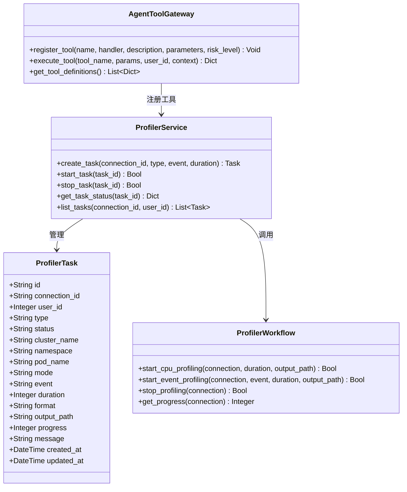
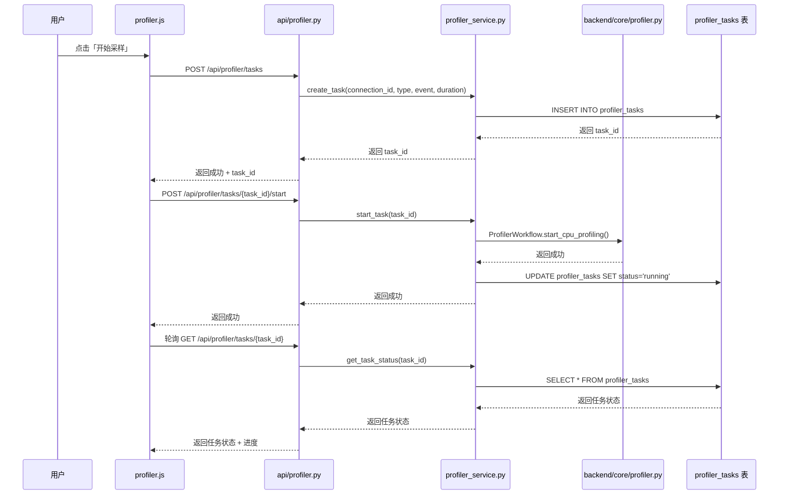
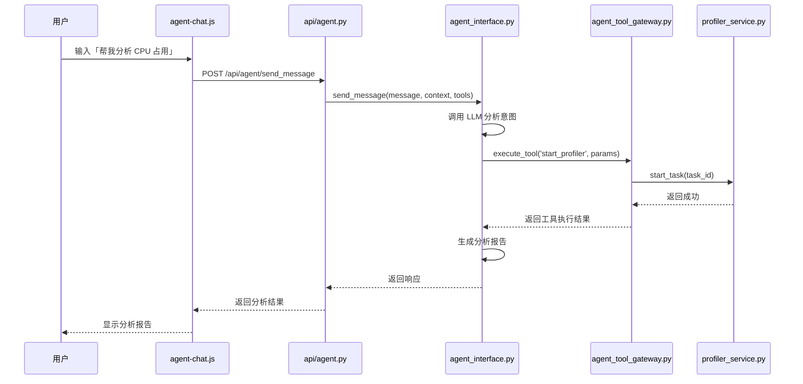
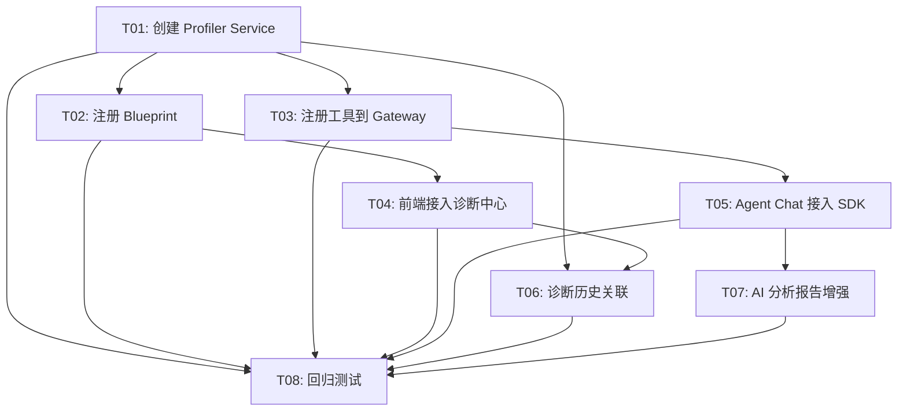

# Phase 7: 现有模块迁移 — 增量架构设计

> 版本：v1.0 | 日期：2026-05-25 | 架构师：高见远（Bob）
> 
> 本文档基于 Phase 7 增量 PRD，设计 4 个现有模块的迁移方案。

---

## 1. 实现方案

### 1.1 核心技术方案

| 技术难点 | 解决方案 | 框架/库 |
|----------|---------|----------|
| 性能诊断模块迁移 | 创建 `services/profiler_service.py` 作为服务层，封装 `backend/core/profiler.py` | Flask Blueprint |
| AI 工具接入 Agent SDK | `agent-chat.js` 通过 `services/agent_interface.py` 调用统一 Agent 接口 | AgentInterface 抽象 |
| MCP 工具注册 | 在 `agent_tool_gateway.py` 中注册 profiler 相关工具 | 白名单机制 |
| 采样工具类型扩展 | `profiler_tasks` 表已支持 type 字段，需扩展事件类型 | SQLite 枚举约束 |

### 1.2 架构模式

**保持现有架构**：
- 后端：Flask + 原生 JS（不引入 React/Vue）
- 服务模式：Service 层封装 Core 层
- 前端：原生 JS 组件化（IIFE + 事件总线）

**分层架构**：
```
┌─────────────────────────────────────────────┐
│  Frontend (static/js/components/)          │
│  - profiler.js                           │
│  - agent-chat.js                        │
│  - diagnosis-center.js                   │
└─────────────────────────────────────────────┘
                   ↓
┌─────────────────────────────────────────────┐
│  API Layer (api/)                         │
│  - performance_diagnose.py (已有)        │
│  - profiler.py (新增 Blueprint)           │
└─────────────────────────────────────────────┘
                   ↓
┌─────────────────────────────────────────────┐
│  Service Layer (services/)                 │
│  - profiler_service.py (新增)             │
│  - agent_tool_gateway.py (注册工具)       │
│  - agent_interface.py (已有)              │
└─────────────────────────────────────────────┘
                   ↓
┌─────────────────────────────────────────────┐
│  Core Layer (backend/core/)                │
│  - profiler.py (已有，不动)              │
│  - arthas_executor.py (已有)             │
└─────────────────────────────────────────────┘
                   ↓
┌─────────────────────────────────────────────┐
│  Data Layer (models/db.py)                │
│  - profiler_tasks 表 (已有)              │
└─────────────────────────────────────────────┘
```

### 1.3 最小化改动原则

1. **不重构已有代码**：`backend/core/profiler.py` 保持不变
2. **新增服务层**：`services/profiler_service.py` 封装调用
3. **兼容旧 API**：保留 `/api/profiler/*` 路由，转发到新接口
4. **渐进式迁移**：前端先保留独立页面，再逐步接入诊断中心

---

## 2. 文件列表

### 2.1 新增文件

| 文件路径 | 说明 | 优先级 |
|---------|------|--------|
| `services/profiler_service.py` | Profiler 服务层，封装 Core 层逻辑 | P0 |
| `api/profiler.py` | Profiler Blueprint，注册路由 | P0 |
| `static/js/components/profiler-task-manager.js` | Profiler 任务管理器（抽出通用逻辑） | P1 |
| `docs/phase7-architecture.md` | 本文档 | - |

### 2.2 修改文件

| 文件路径 | 修改内容 | 优先级 |
|---------|----------|--------|
| `server.py` | 注册 `api/profiler.py` Blueprint | P0 |
| `services/agent_tool_gateway.py` | 注册 profiler 相关工具（jfr/threaddump/heapdump） | P0 |
| `static/js/components/profiler.js` | 接入 `diagnosis-center.js`，支持从诊断中心发起 | P0 |
| `static/js/components/diagnosis-center.js` | 新增「性能采样」类型支持 | P0 |
| `static/js/components/agent-chat.js` | 接入 Agent SDK (`services/agent_interface.py`) | P0 |
| `static/js/components/diagnosis-history.js` | Profiler 任务完成后自动写入诊断历史 | P1 |
| `backend/core/profiler.py` | 扩展 `event` 参数支持 jfr/threaddump/heapdump | P0 |
| `models/db.py` | `profiler_tasks` 表增加索引（可选） | P2 |

### 2.3 保留文件（不修改）

- `backend/profiler_backend.py` - 兼容性层，继续保留
- `backend/core/profiler.py` - 核心逻辑，不动
- `static/profiler.html` - 独立页面，保留并增加「发送到诊断中心」按钮

---

## 3. 数据结构

### 3.1 现有 `profiler_tasks` 表结构

```sql
CREATE TABLE IF NOT EXISTS profiler_tasks (
    id TEXT PRIMARY KEY,
    connection_id TEXT NOT NULL,
    user_id INTEGER,
    type TEXT NOT NULL,              -- 'cpu' | 'jfr' | 'threaddump' | 'heapdump'
    status TEXT DEFAULT 'pending',    -- 'pending' | 'running' | 'completed' | 'failed'
    cluster_name TEXT,
    namespace TEXT,
    pod_name TEXT,
    mode TEXT,                      -- 'cpu' | 'event'
    event TEXT,                     -- 'cpu' | 'jfr' | 'threaddump' | 'heapdump'
    duration INTEGER,               -- 采样时长（秒）
    format TEXT,                   -- 'html' | 'jfr' | 'txt' | 'bin'
    output_path TEXT,              -- 输出文件路径
    progress INTEGER DEFAULT 0,    -- 进度（0-100）
    message TEXT,                  -- 状态消息
    created_at TIMESTAMP DEFAULT CURRENT_TIMESTAMP,
    updated_at TIMESTAMP DEFAULT CURRENT_TIMESTAMP,
    FOREIGN KEY (connection_id) REFERENCES connections(id) ON DELETE CASCADE,
    FOREIGN KEY (user_id) REFERENCES users(id) ON DELETE SET NULL
)
```

### 3.2 扩展说明

**现有实现已支持**：
- `type` 字段支持：`'cpu'`, `'jfr'`, `'threaddump'`, `'heapdump'`
- `event` 字段支持：`'cpu'`, `'jfr'`, `'threaddump'`, `'heapdump'`
- `format` 字段支持：`'html'` (cpu), `'jfr'` (jfr), `'txt'` (threaddump), `'bin'` (heapdump)

**需验证**：
- `backend/core/profiler.py` 的 `ProfilerWorkflow` 类是否已实现 jfr/threaddump/heapdump
- 如果未实现，需要在 Phase 7 补充

### 3.3 数据流图



---

## 4. API 接口设计

### 4.1 Profiler Service API（`api/profiler.py`）

#### 4.1.1 创建 Profiler 任务

```
POST /api/profiler/tasks
Content-Type: application/json

{
    "connection_id": "cluster1/ns1/pod1",
    "type": "cpu",                    // 'cpu' | 'jfr' | 'threaddump' | 'heapdump'
    "event": "cpu",                  // 'cpu' | 'jfr' | 'threaddump' | 'heapdump'
    "duration": 60,                  // 采样时长（秒）
    "format": "html"                 // 'html' | 'jfr' | 'txt' | 'bin'
}

Response:
{
    "success": true,
    "task_id": "prof-abc123",
    "message": "任务已创建"
}
```

#### 4.1.2 启动 Profiler 任务

```
POST /api/profiler/tasks/<task_id>/start

Response:
{
    "success": true,
    "message": "任务已启动"
}
```

#### 4.1.3 停止 Profiler 任务

```
POST /api/profiler/tasks/<task_id>/stop

Response:
{
    "success": true,
    "message": "任务已停止"
}
```

#### 4.1.4 查询任务状态

```
GET /api/profiler/tasks/<task_id>

Response:
{
    "success": true,
    "task": {
        "id": "prof-abc123",
        "connection_id": "cluster1/ns1/pod1",
        "type": "cpu",
        "status": "running",
        "progress": 45,
        "output_path": "/path/to/output.html",
        "message": "采样进行中...",
        "created_at": "2026-05-25T12:00:00",
        "updated_at": "2026-05-25T12:00:45"
    }
}
```

#### 4.1.5 列出任务列表

```
GET /api/profiler/tasks?connection_id=xxx&status=running

Response:
{
    "success": true,
    "tasks": [...]
}
```

#### 4.1.6 兼容旧 API（转发）

```
# 旧 API 保留，转发到新接口
POST /api/profile/start  →  /api/profiler/tasks + /start
POST /api/profile/stop   →  /api/profiler/tasks/<id>/stop
GET  /api/profile/status →  /api/profiler/tasks/<id>
```

### 4.2 Agent Tool Gateway 注册工具

在 `services/agent_tool_gateway.py` 的 `_register_default_tools()` 中新增：

```python
# 启动性能采样
self.register_tool(
    name="start_profiler",
    handler=self._start_profiler,
    description="启动性能采样（CPU/JFR/ThreadDump/HeapDump）",
    parameters={
        "type": "object",
        "properties": {
            "connection_id": {"type": "string", "description": "连接ID"},
            "type": {"type": "string", "enum": ["cpu", "jfr", "threaddump", "heapdump"]},
            "duration": {"type": "integer", "description": "采样时长（秒）", "default": 60}
        },
        "required": ["connection_id", "type"]
    },
    risk_level="medium"
)

# 停止性能采样
self.register_tool(
    name="stop_profiler",
    handler=self._stop_profiler,
    description="停止性能采样",
    parameters={
        "type": "object",
        "properties": {
            "task_id": {"type": "string", "description": "任务ID"}
        },
        "required": ["task_id"]
    },
    risk_level="low"
)

# 查询采样任务状态
self.register_tool(
    name="get_profiler_status",
    handler=self._get_profiler_status,
    description="查询性能采样任务状态",
    parameters={
        "type": "object",
        "properties": {
            "task_id": {"type": "string", "description": "任务ID"}
        },
        "required": ["task_id"]
    },
    risk_level="low"
)
```

### 4.3 Agent Chat 接口（已部分实现）

**现有实现**：`static/js/components/agent-chat.js` 直接调用 CodeBuddy API

**迁移目标**：通过 `services/agent_interface.py` 调用统一 Agent 接口

```javascript
// 旧实现（agent-chat.js）
async function sendToCodeBuddy(message) {
    const response = await fetch('/api/ai/chat', {
        method: 'POST',
        body: JSON.stringify({ message })
    });
    return response.json();
}

// 新实现（接入 Agent SDK）
async function sendToAgent(message) {
    const response = await fetch('/api/agent/send_message', {
        method: 'POST',
        body: JSON.stringify({
            message,
            session_id: currentSessionId,
            tools: getRegisteredTools()  // 从 agent_tool_gateway 获取
        })
    });
    return response.json();
}
```

---

## 5. 程序调用 flow

### 5.1 性能采样任务创建流程



### 5.2 AI Agent 调用工具流程



---

## 6. 任务分解（有序、含依赖关系）

### 6.1 任务列表

| 任务 ID | 任务名称 | 涉及文件 | 依赖 | 优先级 | 说明 |
|---------|----------|---------|------|--------|------|
| **T01** | 创建 Profiler Service 服务层 | `services/profiler_service.py` | - | P0 | 封装 `backend/core/profiler.py` |
| **T02** | 注册 Profiler Blueprint | `api/profiler.py`, `server.py` | T01 | P0 | 新增 API 路由 |
| **T03** | 注册 Profiler 工具到 Agent Tool Gateway | `services/agent_tool_gateway.py` | T01 | P0 | 支持 AI Agent 调用 |
| **T04** | 前端 Profiler 接入诊断中心 | `static/js/components/profiler.js`, `diagnosis-center.js` | T02 | P0 | 支持从诊断中心发起 |
| **T05** | Agent Chat 接入 Agent SDK | `static/js/components/agent-chat.js` | - | P0 | 替换直调 CodeBuddy |
| **T06** | 诊断历史关联 Profiler 任务 | `static/js/components/diagnosis-history.js` | T01, T04 | P1 | 自动写入诊断历史 |
| **T07** | AI 分析报告使用异常检测结果 | `services/anomaly_detector.py`, `agent-chat.js` | T05 | P1 | 关联异常事件 |
| **T08** | 回归测试 + 文档更新 | `tests/test_profiler_migration.py`, `docs/` | T01-T07 | P0 | 确保功能不受影响 |

### 6.2 任务依赖图



### 6.3 详细任务说明

#### T01: 创建 Profiler Service 服务层

**目标**：创建 `services/profiler_service.py`，封装 `backend/core/profiler.py`

**修改文件**：
- 新增 `services/profiler_service.py`

**关键代码**：
```python
class ProfilerService:
    def __init__(self):
        self.db = get_db()
        self.workflow = ProfilerWorkflow()

    def create_task(self, connection_id, type, event, duration, format='html'):
        """创建 Profiler 任务"""
        task_id = f"prof-{uuid.uuid4().hex[:8]}"
        self.db.insert('profiler_tasks', {
            'id': task_id,
            'connection_id': connection_id,
            'user_id': current_user.id,
            'type': type,
            'status': 'pending',
            'event': event,
            'duration': duration,
            'format': format
        })
        return task_id

    def start_task(self, task_id):
        """启动任务"""
        # 调用 backend/core/profiler.py
        pass
```

**验收标准**：
- [ ] `ProfilerService` 类创建成功
- [ ] `create_task` 方法正常插入数据库
- [ ] `start_task` 方法调用 `ProfilerWorkflow`

#### T02: 注册 Profiler Blueprint

**目标**：创建 `api/profiler.py`，注册路由到 `server.py`

**修改文件**：
- 新增 `api/profiler.py`
- 修改 `server.py`（注册 Blueprint）

**关键代码**：
```python
# api/profiler.py
profiler_bp = Blueprint('profiler', __name__)

@profiler_bp.route('/api/profiler/tasks', methods=['POST'])
@login_required
def create_task():
    service = ProfilerService()
    task_id = service.create_task(...)
    return jsonify({'success': True, 'task_id': task_id})

# server.py
from api.profiler import profiler_bp
app.register_blueprint(profiler_bp)
```

**验收标准**：
- [ ] Blueprint 注册成功
- [ ] `/api/profiler/tasks` 接口可访问
- [ ] 旧 API `/api/profile/*` 保留兼容

#### T03: 注册 Profiler 工具到 Agent Tool Gateway

**目标**：在 `agent_tool_gateway.py` 中注册 profiler 相关工具

**修改文件**：
- 修改 `services/agent_tool_gateway.py`

**关键代码**：
```python
# 在 _register_default_tools 中新增
self.register_tool(
    name="start_profiler",
    handler=self._start_profiler,
    description="启动性能采样",
    parameters={...},
    risk_level="medium"
)

def _start_profiler(self, params, context):
    service = ProfilerService()
    task_id = service.create_task(...)
    service.start_task(task_id)
    return {'task_id': task_id, 'status': 'running'}
```

**验收标准**：
- [ ] `start_profiler` 工具注册成功
- [ ] `stop_profiler` 工具注册成功
- [ ] `get_profiler_status` 工具注册成功
- [ ] Agent 可以调用这些工具

#### T04: 前端 Profiler 接入诊断中心

**目标**：`profiler.js` 支持从诊断中心发起，诊断中心支持「性能采样」类型

**修改文件**：
- 修改 `static/js/components/profiler.js`
- 修改 `static/js/components/diagnosis-center.js`

**关键代码**：
```javascript
// diagnosis-center.js
function dcShowProfilerDialog() {
    // 显示性能采样参数表单
    // 调用 /api/profiler/tasks
}

// profiler.js
function initProfilerFromDiagnosisCenter(connectionId) {
    // 从诊断中心发起采样
    currentConnectionId = connectionId;
    startProfiling();
}
```

**验收标准**：
- [ ] 诊断中心「新增诊断」支持选择「性能采样」
- [ ] `profiler.html` 保留独立页面
- [ ] `profiler.html` 新增「发送到诊断中心」按钮

#### T05: Agent Chat 接入 Agent SDK

**目标**：`agent-chat.js` 通过 `agent_interface.py` 调用统一 Agent 接口

**修改文件**：
- 修改 `static/js/components/agent-chat.js`

**关键代码**：
```javascript
// 旧实现
async function sendToCodeBuddy(message) {
    return fetch('/api/ai/chat', {...});
}

// 新实现
async function sendToAgent(message) {
    return fetch('/api/agent/send_message', {
        method: 'POST',
        body: JSON.stringify({
            message,
            session_id: currentSessionId,
            tools: await getToolDefinitions()
        })
    });
}
```

**验收标准**：
- [ ] `agent-chat.js` 调用 `/api/agent/send_message`
- [ ] 支持工具调用（tool_calls）
- [ ] 消息历史可回溯

#### T06: 诊断历史关联 Profiler 任务

**目标**：Profiler 任务完成后自动写入诊断历史

**修改文件**：
- 修改 `static/js/components/diagnosis-history.js`

**关键代码**：
```javascript
// 在 profiler.js 的任务完成回调中
function onProfilerTaskComplete(taskId) {
    // 写入诊断历史
    fetch('/api/diagnosis/history', {
        method: 'POST',
        body: JSON.stringify({
            type: 'performance_sampling',
            task_id: taskId,
            connection_id: currentConnectionId,
            result: taskResult
        })
    });
}
```

**验收标准**：
- [ ] Profiler 任务完成后自动写入诊断历史
- [ ] 诊断历史页面可查看 Profiler 任务记录
- [ ] 点击记录可跳转回放

#### T07: AI 分析报告使用异常检测结果

**目标**：AI 分析报告关联 Phase 6 的异常检测结果

**修改文件**：
- 修改 `services/anomaly_detector.py`
- 修改 `static/js/components/agent-chat.js`

**验收标准**：
- [ ] AI 分析报告包含异常检测结果
- [ ] 异常事件可点击查看详情

#### T08: 回归测试 + 文档更新

**目标**：确保 Phase 1-6 功能不受影响

**修改文件**：
- 新增 `tests/test_profiler_migration.py`
- 更新 `docs/`

**验收标准**：
- [ ] 所有现有测试通过
- [ ] 新增测试覆盖 Phase 7 功能
- [ ] 文档更新完成

---

## 7. 待明确事项

### 7.1 技术问题

| # | 问题 | 当前状态 | 建议方案 |
|---|------|---------|----------|
| 1 | `backend/core/profiler.py` 是否已实现 jfr/threaddump/heapdump？ | ✅ **已验证：已实现** | `ProfilerWorkflow` 类已完整实现 4 种模式，无需补充 |
| 2 | `profiler_backend.py` 是否继续保留？ | ✅ **已确认：保留** | 保留作为兼容性层，实际逻辑在 `services/profiler_service.py` |
| 3 | MCP 转发模块当前在哪里？ | ✅ **已确认** | `services/agent_tool_gateway.py` 已存在，只需注册工具 |
| 4 | 采样工具是否指 `profiler.js` 的 jfr/threaddump/heapdump？ | ✅ **已确认：是** | 已在本文档中覆盖 |

### 7.2 产品问题

| # | 问题 | 建议方案 |
|---|------|----------|
| 1 | 旧 API `/api/profile/*` 是否需要保留转发到新接口？ | ✅ **已确认：保留**，`server.py` 中旧路由继续工作，转发到 `/api/profiler/*` |
| 2 | 「发送到诊断中心」按钮的具体交互设计？ | 【待产品确认】弹窗选择诊断类型，或自动创建「性能采样」类型记录 |
| 3 | AI Agent 调用 Profiler 工具后的结果展示方式？ | 【待产品确认】建议在 Agent Chat 中显示任务状态 + 进度条，完成后显示下载链接 |

### 7.3 依赖和阻塞

- **无阻塞**：4 个模块可并行开发（T01/T03/T05 无依赖）
- **依赖关系**：
  - T02 依赖 T01
  - T04 依赖 T02
  - T06 依赖 T01/T04

---

## 8. 风险和缓解措施

| 风险 | 影响 | 缓解措施 |
|------|------|----------|
| `backend/core/profiler.py` 未实现 jfr/threaddump/heapdump | Profiler 功能不完整 | 在 T01 之前验证，如果未实现则补充 |
| Agent SDK 接口不稳定 | AI Agent 功能不可用 | 保留 fallback 到直调 CodeBuddy |
| 前端接入诊断中心改动量大 | 开发周期延长 | 分阶段：先保留独立页面，再逐步接入 |
| 回归测试覆盖不足 | 影响现有功能 | T08 必须完成，确保所有现有测试通过 |

---

## 9. 验收清单

- [x] T01: `services/profiler_service.py` 创建完成
- [x] T02: `api/profiler.py` 注册成功，路由可用
- [x] T03: Profiler 工具注册到 `agent_tool_gateway.py`
- [x] T04: 前端 Profiler 接入诊断中心
- [x] T05: Agent Chat 接入 Agent SDK
- [x] T06: 诊断历史关联 Profiler 任务（P1）
- [x] T07: AI 分析报告使用异常检测结果（P1）
- [x] T08: 回归测试通过，现有功能不受影响
- [x] 旧 API `/api/profile/*` 保留兼容
- [x] 文档更新完成

---

## 10. 附录

### 10.1 相关文档

- Phase 7 增量 PRD：`docs/prd/Phase7_Incremental_PRD.md`
- Phase 1-6 架构设计：`docs/phase1-6-architecture.md`（待确认是否存在）
- Flask 文档：`https://flask.palletsprojects.com/`
- SQLite 文档：`https://www.sqlite.org/docs.html`

### 10.2 关键代码片段

**`backend/core/profiler.py` 验证要点**：
```python
# 需验证是否已实现以下方法
class ProfilerWorkflow:
    def start_cpu_profiling(self, connection, duration, output_path):
        """CPU 采样"""
        pass

    def start_event_profiling(self, connection, event, duration, output_path):
        """事件采样（jfr/threaddump/heapdump）"""
        pass

    def stop_profiling(self, connection):
        """停止采样"""
        pass

    def get_progress(self, connection):
        """获取进度"""
        pass
```

**如果未实现，需在 T01 之前补充**。

---

**文档结束**

> 作者：高见远（Bob）- 架构师
> 
> 审核：许清楚（产品经理）- 待审核
> 
> 批准：主理人 - 待批准
