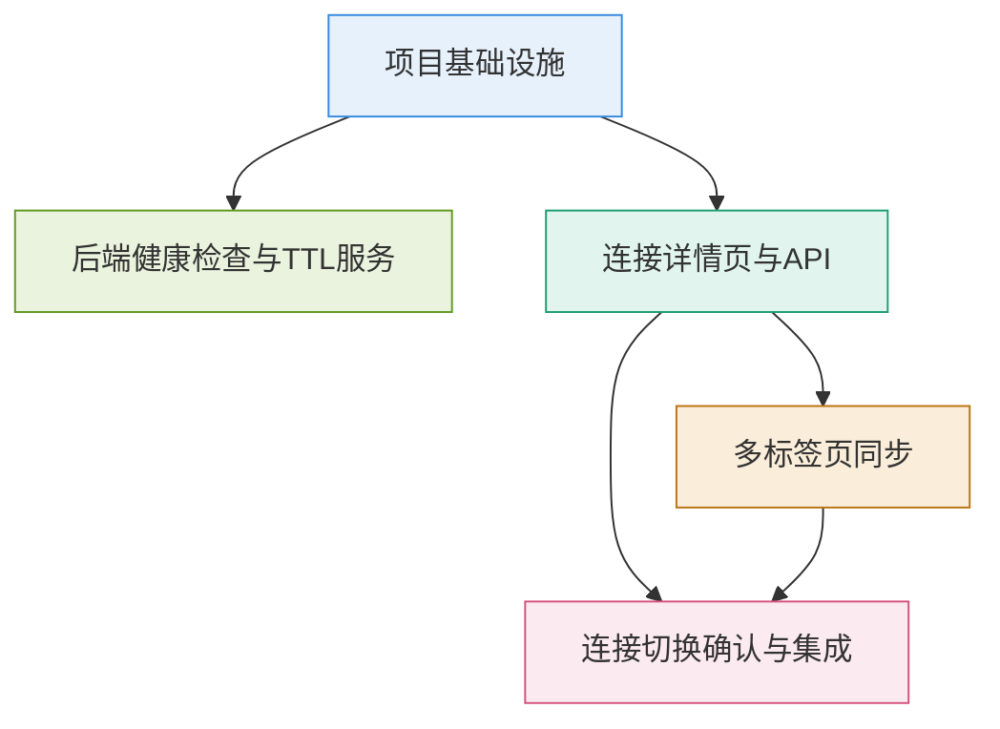

# K8s Arthas Tool Phase 5 增量架构设计

**文档版本**: v1.0  
**创建日期**: 2026-05-25  
**创建人**: 高见远（软件架构师）  
**状态**: 设计完成

---

## 1. 实现方案

### 1.1 核心技术挑战

| 挑战 | 描述 | 解决方案 |
|------|------|----------|
| **健康检查性能** | 大量连接同时检查可能影响系统性能 | 增量检查 + 批量处理 + 可配置间隔 |
| **状态一致性** | 多标签页状态同步可能不一致 | BroadcastChannel + sessionStorage 双重保障 |
| **服务重启恢复** | 重启后需要快速恢复连接状态 | 异步恢复 + 增量探活 + 状态降级 |
| **TTL清理准确性** | 确保过期连接被及时清理 | 定时扫描 + 状态标记 + 审计日志 |
| **连接切换安全性** | 避免用户意外丢失工作上下文 | 运行任务检测 + 确认弹窗 + 任务取消 |

### 1.2 框架选型

| 组件 | 技术选型 | 理由 |
|------|----------|------|
| **后端定时任务** | APScheduler | 已集成，支持多种调度方式，轻量级 |
| **健康检查** | requests + HTTP探活 | 通过Arthas HTTP端口检测可达性 |
| **状态管理** | ConnectionStateManager | 已有基础，扩展TTL和健康检查功能 |
| **前端同步** | BroadcastChannel API | 原生支持，无需额外库 |
| **前端状态** | sessionStorage | 标签页隔离，页面刷新保持 |
| **数据库** | SQLite + WAL模式 | 已有基础设施，适合单机部署 |

### 1.3 架构模式

```
┌─────────────────────────────────────────────────────────────┐
│                      前端层 (Frontend)                       │
├─────────────────────────────────────────────────────────────┤
│  连接详情页 │ 多标签页同步 │ 连接切换确认 │ TTL配置界面    │
├─────────────────────────────────────────────────────────────┤
│                      API层 (Flask)                          │
├─────────────────────────────────────────────────────────────┤
│  ConnectionDetailAPI │ HealthCheckAPI │ ConnectionSwitchAPI │
├─────────────────────────────────────────────────────────────┤
│                      服务层 (Services)                      │
├─────────────────────────────────────────────────────────────┤
│  HealthCheckService │ ConnectionRecoveryService │ TTLService│
├─────────────────────────────────────────────────────────────┤
│                      核心层 (Core)                          │
├─────────────────────────────────────────────────────────────┤
│  ConnectionStateManager │ AuditService │ Database          │
└─────────────────────────────────────────────────────────────┘
```

---

## 2. 文件列表

### 2.1 后端文件（新建）

| 文件路径 | 说明 | 优先级 |
|----------|------|--------|
| `services/health_check_service.py` | 健康检查服务 | P0 |
| `services/connection_recovery_service.py` | 连接恢复服务 | P1 |
| `services/connection_switch_service.py` | 连接切换服务 | P1 |
| `services/connection_ttl_config.py` | TTL配置服务 | P0 |
| `api/connection_detail.py` | 连接详情API | P0 |

### 2.2 后端文件（修改）

| 文件路径 | 修改内容 | 优先级 |
|----------|----------|--------|
| `models/db.py` | 新增health_check_logs表，修改connections表 | P0 |
| `backend/config.py` | 新增健康检查配置项 | P0 |
| `server.py` | 注册新蓝图，初始化服务 | P0 |
| `api/__init__.py` | 注册connection_detail蓝图 | P0 |
| `backend/core/connection_state.py` | 扩展TTL清理逻辑 | P0 |

### 2.3 前端文件（新建）

| 文件路径 | 说明 | 优先级 |
|----------|------|--------|
| `static/js/components/broadcast-channel-manager.js` | 多标签页同步管理器 | P1 |
| `static/js/components/connection-switch-confirm.js` | 连接切换确认组件 | P1 |
| `static/js/components/connection-ttl-config.js` | TTL配置组件 | P0 |

### 2.4 前端文件（修改）

| 文件路径 | 修改内容 | 优先级 |
|----------|----------|--------|
| `static/connection-detail.html` | 增强连接详情页UI | P0 |
| `static/js/page-connection-detail.js` | 扩展连接详情页逻辑 | P0 |
| `static/css/app.css` | 新增连接详情样式 | P0 |
| `static/index.html` | 集成多标签页同步 | P1 |

---

## 3. 数据结构和接口

### 3.1 数据库表结构

#### connections表新增字段
```sql
ALTER TABLE connections ADD COLUMN ttl_hours INTEGER DEFAULT 0;
ALTER TABLE connections ADD COLUMN last_active_at TIMESTAMP;
ALTER TABLE connections ADD COLUMN last_health_check TIMESTAMP;
ALTER TABLE connections ADD COLUMN health_status TEXT DEFAULT 'unknown';
```

#### health_check_logs表（新建）
```sql
CREATE TABLE health_check_logs (
    id INTEGER PRIMARY KEY AUTOINCREMENT,
    connection_id TEXT NOT NULL,
    status TEXT NOT NULL,
    latency_ms REAL,
    error_message TEXT,
    checked_at TIMESTAMP DEFAULT CURRENT_TIMESTAMP,
    FOREIGN KEY (connection_id) REFERENCES connections(id) ON DELETE CASCADE
);
```

### 3.2 API接口设计

#### 连接详情API
```python
# GET /api/connections/{connection_id}/detail
# 返回：连接详细信息、健康状态、可用操作

# GET /api/connections/{connection_id}/health
# 返回：健康检查状态、延迟、最后检查时间

# PUT /api/connections/{connection_id}/ttl
# 请求：{"ttl_hours": 8}
# 返回：更新后的TTL配置

# GET /api/connections/{connection_id}/running-tasks
# 返回：运行中的诊断任务列表

# POST /api/connections/{connection_id}/switch
# 请求：{"target_connection_id": "new_conn_id"}
# 返回：切换结果
```

### 3.3 前端接口设计

#### BroadcastChannel消息格式
```javascript
// 连接切换消息
{
    type: 'connection_switch',
    data: {
        old_connection_id: 'old_conn_id',
        new_connection_id: 'new_conn_id',
        timestamp: '2026-05-25T10:30:00Z'
    }
}

// 连接状态更新消息
{
    type: 'connection_status_update',
    data: {
        connection_id: 'conn_id',
        status: 'healthy|unhealthy|disconnected',
        timestamp: '2026-05-25T10:30:00Z'
    }
}
```

---

## 4. 程序调用流程

### 4.1 健康检查流程
1. HealthCheckService启动后台线程
2. 每30秒扫描活跃连接
3. 对每个连接执行HTTP探活
4. 更新健康状态缓存
5. 异常连接标记为disconnected
6. 记录健康检查日志

### 4.2 TTL清理流程
1. ConnectionStateManager启动TTL清理线程
2. 每30分钟扫描过期连接
3. 根据ttl_hours和last_active_at判断过期
4. 标记过期连接为disconnected
5. 记录审计日志

### 4.3 服务重启恢复流程
1. 服务启动时调用recover_connections_on_startup
2. 从数据库加载所有连接
3. 对ready状态连接进行HTTP探活
4. 探活成功恢复状态，失败降级到disconnected
5. 返回恢复结果统计

### 4.4 多标签页同步流程
1. 用户在标签页A切换连接
2. 通过BroadcastChannel发送切换消息
3. 其他标签页接收消息
4. 更新sessionStorage中的连接状态
5. 刷新UI显示

### 4.5 连接切换确认流程
1. 用户点击切换连接
2. 检查目标连接是否有运行中任务
3. 有任务时显示确认弹窗
4. 用户确认后取消任务
5. 执行连接切换
6. 广播切换消息到其他标签页

---

## 5. 任务列表

### T01: 项目基础设施
**优先级**: P0  
**依赖**: 无  
**包含文件**:
- `models/db.py` (修改)
- `backend/config.py` (修改)
- `api/__init__.py` (修改)
- `server.py` (修改)

**任务描述**:
1. 修改数据库模型，新增health_check_logs表，修改connections表添加新字段
2. 修改配置文件，新增健康检查、TTL清理相关配置项
3. 注册新的API蓝图
4. 初始化健康检查和TTL清理服务

### T02: 后端健康检查与TTL服务
**优先级**: P0  
**依赖**: T01  
**包含文件**:
- `services/health_check_service.py` (新建)
- `services/connection_ttl_config.py` (新建)
- `services/connection_recovery_service.py` (新建)
- `backend/core/connection_state.py` (修改)

**任务描述**:
1. 实现健康检查服务，包括后台检查线程和状态缓存
2. 实现TTL配置服务，提供TTL选项和验证
3. 实现连接恢复服务，服务重启时恢复连接状态
4. 扩展ConnectionStateManager，集成TTL清理逻辑

### T03: 连接详情页与API
**优先级**: P0  
**依赖**: T01  
**包含文件**:
- `api/connection_detail.py` (新建)
- `static/connection-detail.html` (修改)
- `static/js/page-connection-detail.js` (修改)
- `static/css/app.css` (修改)

**任务描述**:
1. 实现连接详情API，提供连接详细信息接口
2. 增强连接详情页UI，显示健康状态、可用操作、诊断能力入口
3. 扩展连接详情页逻辑，集成健康状态显示和操作按钮
4. 新增连接详情页样式

### T04: 多标签页同步
**优先级**: P1  
**依赖**: T03  
**包含文件**:
- `static/js/components/broadcast-channel-manager.js` (新建)
- `static/js/components/connection-ttl-config.js` (新建)
- `static/index.html` (修改)

**任务描述**:
1. 实现BroadcastChannel管理器，支持跨标签页状态同步
2. 实现TTL配置组件，提供TTL设置界面
3. 集成多标签页同步到主页面

### T05: 连接切换确认与集成
**优先级**: P1  
**依赖**: T03, T04  
**包含文件**:
- `static/js/components/connection-switch-confirm.js` (新建)
- `services/connection_switch_service.py` (新建)
- `static/js/page-connection-detail.js` (修改)

**任务描述**:
1. 实现连接切换确认组件，支持任务检测和确认弹窗
2. 实现连接切换服务，处理任务取消和状态切换
3. 集成连接切换功能到连接详情页

---

## 6. 依赖包列表

### 6.1 后端依赖
```txt
# 现有依赖
flask>=2.0.0
flask-cors>=3.0.0
flask-login>=0.5.0
apscheduler>=3.10.0
requests>=2.28.0

# 新增依赖（无需额外安装，已有）
sqlite3  # 内置
threading  # 内置
datetime  # 内置
```

### 6.2 前端依赖
```txt
# 无新增依赖，使用原生JavaScript API
- BroadcastChannel API (浏览器原生支持)
- sessionStorage API (浏览器原生支持)
- Fetch API (浏览器原生支持)
```

---

## 7. 共享知识

### 7.1 数据格式约定
```python
# API响应格式
{
    "code": 200,
    "data": {...},
    "message": "success"
}

# 错误响应格式
{
    "code": 400,
    "data": null,
    "message": "错误信息"
}
```

### 7.2 状态枚举值
```python
# 连接状态
CONNECTION_STATES = {
    "ready": "已连接",
    "disconnected": "已断开",
    "failed": "连接失败",
    "unknown": "未知状态"
}

# 健康状态
HEALTH_STATES = {
    "healthy": "健康",
    "unhealthy": "异常",
    "unknown": "未知"
}
```

### 7.3 时间格式
```python
# 所有时间使用ISO 8601格式
timestamp = "2026-05-25T10:30:00Z"

# 数据库时间格式
db_timestamp = "2026-05-25 10:30:00"
```

### 7.4 日志规范
```python
# 健康检查日志
log.info("[health_check] Connection %s status: %s, latency: %sms", conn_id, status, latency)

# TTL清理日志
log.info("[ttl_cleanup] Expired connection cleaned: %s", conn_id)

# 状态恢复日志
log.info("[recovery] Connection %s recovered: %s", conn_id, status)
```

### 7.5 错误处理
```python
# 服务层错误处理
try:
    # 业务逻辑
except Exception as e:
    log.error("Service error: %s", e, exc_info=True)
    return {"code": 500, "data": null, "message": str(e)}

# API层错误处理
try:
    result = service.do_something()
    return jsonify({"code": 200, "data": result, "message": "success"})
except ValueError as e:
    return jsonify({"code": 400, "data": null, "message": str(e)}), 400
```

---

## 8. 待明确事项

### 8.1 产品相关
1. **健康检查间隔**：默认30分钟是否合适？是否需要用户可配置？
2. **TTL默认值**：默认不过期（0小时）还是默认8小时？
3. **状态恢复策略**：服务重启后是否应该自动恢复所有连接？还是只恢复"ready"状态的连接？
4. **多标签页同步范围**：是否需要同步所有连接状态变化？还是只同步当前连接变化？

### 8.2 技术相关
1. **BroadcastChannel兼容性**：是否需要考虑不支持BroadcastChannel的浏览器降级方案？
2. **健康检查性能**：大量连接时健康检查对系统性能的影响？
3. **状态恢复时间**：服务重启后状态恢复的最大允许时间？
4. **数据库清理**：健康检查日志表的数据保留策略？

### 8.3 运营相关
1. **监控告警**：健康检查失败是否需要触发告警？
2. **用户通知**：连接被TTL清理时是否需要通知用户？
3. **日志级别**：健康检查和状态恢复的日志级别设置？

---

## 9. 任务依赖图



---

## 10. 实施建议

### 10.1 开发顺序
1. **T01**：先完成基础设施，确保数据库和配置就绪
2. **T02**：实现后端核心服务，为前端提供数据支持
3. **T03**：实现连接详情页，让用户能够查看连接状态
4. **T04**：实现多标签页同步，提升用户体验
5. **T05**：实现连接切换确认，完善功能

### 10.2 测试策略
1. **单元测试**：每个服务独立测试
2. **集成测试**：API接口测试
3. **端到端测试**：完整用户流程测试
4. **性能测试**：大量连接时的健康检查性能

### 10.3 部署考虑
1. **数据库迁移**：确保数据库表结构正确更新
2. **配置更新**：更新配置文件，启用新功能
3. **服务重启**：重启服务以加载新代码
4. **监控**：监控健康检查和TTL清理日志

---

**文档完成时间**: 2026-05-25 16:00  
**下一步**: 团队评审，确认技术方案和任务分解