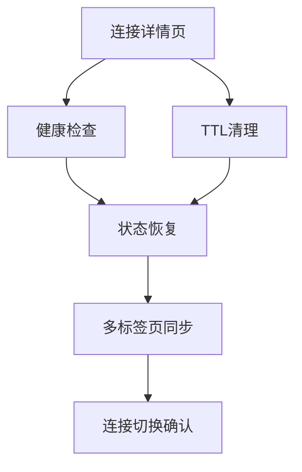

# K8s Arthas 智能诊断平台 — Phase 5: 连接中心增强 增量PRD

**文档版本**: v1.0
**创建日期**: 2026-05-24
**创建人**: 许清楚（产品经理）
**状态**: 草稿

---

## 1. 项目信息

| 项目 | 说明 |
|------|------|
| **Language** | 中文 |
| **Project Name** | k8s_arthas_tool |
| **Technology Stack** | Flask + SQLite + kubectl + Arthas + 原生 JavaScript + HTML + CSS |
| **原始需求** | 增强连接中心功能，实现连接详情页、健康检查、TTL清理、连接状态恢复、多标签页同步、连接切换确认 |

---

## 2. 产品目标

### 2.1 Phase 5 目标
Phase 5 目标是增强连接中心的稳定性、用户体验和运维能力，具体包括：
1. **提升连接可见性**：提供连接详情页面，让用户能够全面了解连接状态和可用能力
2. **增强连接可靠性**：实现健康检查、TTL清理和服务重启状态恢复，确保连接稳定可用
3. **改善多标签页体验**：通过BroadcastChannel实现跨标签页状态同步，提升多任务操作体验
4. **减少误操作**：连接切换时弹窗确认，避免用户意外丢失当前工作上下文

### 2.2 成功指标
| 指标 | 目标值 | 测量方法 |
|------|--------|----------|
| 连接详情页访问率 | >80%的活跃用户 | 页面访问日志 |
| 健康检查成功率 | >95% | 健康检查任务日志 |
| TTL清理准确率 | 100%过期连接被清理 | 数据库清理记录 |
| 状态恢复成功率 | >90%服务重启后恢复 | 重启后状态检查 |
| 多标签页同步延迟 | <1秒 | 前端埋点 |
| 连接切换确认率 | >95%用户确认 | 弹窗交互日志 |

---

## 3. 用户故事

### 3.1 连接详情页
**作为**运维工程师，**我想要**查看连接的详细信息（集群、命名空间、Pod、状态、层级、可用能力），**以便**快速了解连接上下文并进行后续操作。

### 3.2 健康检查
**作为**运维工程师，**我想要**系统自动定期检查连接健康状态，**以便**及时发现并处理连接异常，避免诊断任务失败。

### 3.3 TTL清理
**作为**运维工程师，**我想要**设置连接有效期，系统自动清理过期连接，**以便**释放资源并保持连接列表整洁。

### 3.4 连接状态恢复
**作为**运维工程师，**我想要**服务重启后自动恢复之前的连接状态，**以便**继续工作而不丢失上下文。

### 3.5 多标签页同步
**作为**运维工程师，**我想要**在一个标签页切换连接时，其他标签页自动同步更新，**以便**保持多任务操作的一致性。

### 3.6 连接切换确认
**作为**运维工程师，**我想要**在切换连接时收到确认提示，**以便**避免意外丢失当前工作上下文。

---

## 4. 需求池

### 4.1 P0 需求（必须实现）
| 需求ID | 需求名称 | 描述 | 验收标准 |
|--------|----------|------|----------|
| P0-01 | 连接详情页 | 创建连接详情页面，展示连接基本信息、状态、可用操作和诊断能力入口 | 1. 页面展示连接的集群、命名空间、Pod、状态、层级信息<br>2. 根据状态动态展示可用操作<br>3. 提供诊断能力入口（终端、监控、文件下载等） |
| P0-02 | 健康检查 | 实现定时健康检查机制，检测Arthas连接的HTTP端口可达性 | 1. 每30分钟执行一次健康检查<br>2. 检查失败时更新连接状态为disconnected<br>3. 提供健康检查日志 |
| P0-03 | TTL清理 | 实现连接有效期管理，到期后自动清理过期连接 | 1. 支持设置连接有效期（1/2/4/8/12/24小时）<br>2. 每30分钟检查一次过期连接<br>3. 自动标记过期连接为disconnected状态 |

### 4.2 P1 需求（应该实现）
| 需求ID | 需求名称 | 描述 | 验收标准 |
|--------|----------|------|----------|
| P1-01 | 连接状态恢复 | 实现服务重启后连接状态恢复机制 | 1. 服务重启时读取数据库中的连接状态<br>2. 对ready状态的Arthas连接进行HTTP探活<br>3. 探活成功则恢复，失败则降级到Pod连接 |
| P1-02 | 多标签页同步 | 使用BroadcastChannel实现跨标签页状态同步 | 1. 标签页切换连接时广播到其他标签页<br>2. 其他标签页自动更新当前连接状态<br>3. 使用sessionStorage存储每个标签页的连接状态 |
| P1-03 | 连接切换确认 | 连接切换时弹窗确认，避免误操作 | 1. 切换连接时检查是否有运行中的诊断任务<br>2. 有任务时弹窗提示确认<br>3. 用户确认后取消任务并切换连接 |

### 4.3 P2 需求（可以实现）
| 需求ID | 需求名称 | 描述 | 验收标准 |
|--------|----------|------|----------|
| P2-01 | 健康检查配置 | 支持自定义健康检查间隔和超时时间 | 1. 提供健康检查配置界面<br>2. 支持设置检查间隔（15/30/60分钟）<br>3. 支持设置超时时间（5/10/30秒） |
| P2-02 | 连接历史记录 | 记录连接状态变化历史，便于问题排查 | 1. 记录状态变化时间和原因<br>2. 提供历史记录查看界面<br>3. 支持按时间范围筛选 |
| P2-03 | 批量连接管理 | 支持批量选择和操作连接 | 1. 支持批量删除过期连接<br>2. 支持批量健康检查<br>3. 提供批量操作确认机制 |

---

## 5. UI设计稿

### 5.1 连接详情页布局
```
┌─────────────────────────────────────────────────────────┐
│ 连接详情                              [返回列表] [AI助手] │
├─────────────────────────────────────────────────────────┤
│ 连接信息                                                 │
│ ┌─────────────────────────────────────────────────────┐ │
│ │ 集群: production    命名空间: default               │ │
│ │ Pod: my-app-123456-abcde    状态: ✅ 已连接         │ │
│ │ 层级: Arthas        运行时: Java 11                 │ │
│ │ 最后检查: 2026-05-24 14:30:00                       │ │
│ └─────────────────────────────────────────────────────┘ │
│                                                         │
│ 操作区                                                   │
│ ┌─────────────────────────────────────────────────────┐ │
│ │ [健康检查] [重新连接] [删除连接]                      │ │
│ └─────────────────────────────────────────────────────┘ │
│                                                         │
│ 诊断能力                                                 │
│ ┌─────────────────────────────────────────────────────┐ │
│ │ 🖥️ 终端    📊 监控    📂 文件下载                   │ │
│ │ 🔬 性能诊断  ⚡ Arthas命令  🔥 采样工具              │ │
│ └─────────────────────────────────────────────────────┘ │
└─────────────────────────────────────────────────────────┘
```

### 5.2 健康检查状态指示
| 状态 | 图标 | 颜色 | 说明 |
|------|------|------|------|
| 正常 | ✅ | 绿色 | 连接健康，可正常使用 |
| 异常 | ⚠️ | 橙色 | 连接不稳定，建议检查 |
| 失效 | ❌ | 红色 | 连接已断开，需要重新连接 |

### 5.3 连接切换确认弹窗
```
┌─────────────────────────────────────────┐
│ 确认切换连接                              │
├─────────────────────────────────────────┤ │
│ 当前有运行中的诊断任务：                  │ │
│ • 性能诊断任务 #123 (运行中)              │ │
│ • Arthas命令任务 #124 (运行中)            │ │
│                                         │ │
│ 切换连接将取消这些任务，确认切换吗？        │ │
│                                         │ │
│              [取消]    [确认切换]         │ │
└─────────────────────────────────────────┘
```

---

## 6. 技术规范

### 6.1 后端实现要点
| 模块 | 实现要点 | 技术选型 |
|------|----------|----------|
| 健康检查 | 定时任务检查Arthas HTTP端口 | APScheduler + requests |
| TTL清理 | 定时扫描过期连接并标记 | APScheduler + SQLite |
| 状态恢复 | 服务启动时恢复连接状态 | Flask启动钩子 + HTTP探活 |
| 连接详情API | 提供连接详细信息接口 | Flask RESTful API |

### 6.2 前端实现要点
| 模块 | 实现要点 | 技术选型 |
|------|----------|----------|
| 连接详情页 | 创建独立HTML页面 | 原生HTML + CSS |
| 多标签页同步 | 使用BroadcastChannel API | 原生JavaScript |
| 切换确认 | 创建模态框组件 | 原生JavaScript |
| 状态同步 | sessionStorage存储 | 原生JavaScript |

### 6.3 数据库变更
| 表名 | 变更类型 | 字段 | 说明 |
|------|----------|------|------|
| connections | 新增 | ttl_hours | 连接有效期（小时） |
| connections | 新增 | last_active_at | 最后活跃时间 |
| connections | 新增 | last_health_check | 最后健康检查时间 |
| health_check_logs | 新增 | - | 健康检查日志表 |

---

## 7. 待确认问题

### 7.1 产品相关
1. **健康检查间隔**：默认30分钟是否合适？是否需要用户可配置？
2. **TTL默认值**：默认不过期（0小时）还是默认8小时？
3. **状态恢复策略**：服务重启后是否应该自动恢复所有连接？还是只恢复"ready"状态的连接？
4. **多标签页同步范围**：是否需要同步所有连接状态变化？还是只同步当前连接变化？

### 7.2 技术相关
1. **BroadcastChannel兼容性**：是否需要考虑不支持BroadcastChannel的浏览器降级方案？
2. **健康检查性能**：大量连接时健康检查对系统性能的影响？
3. **状态恢复时间**：服务重启后状态恢复的最大允许时间？
4. **数据库清理**：健康检查日志表的数据保留策略？

### 7.3 运营相关
1. **监控告警**：健康检查失败是否需要触发告警？
2. **用户通知**：连接被TTL清理时是否需要通知用户？
3. **日志级别**：健康检查和状态恢复的日志级别设置？

---

## 8. 实施计划

### 8.1 里程碑
| 里程碑 | 时间 | 交付物 | 负责人 |
|--------|------|--------|--------|
| M1: 连接详情页 | 第10周 | 详情页HTML/CSS/JS | 前端工程师 |
| M2: 健康检查 | 第10周 | 后端健康检查服务 | 后端工程师 |
| M3: TTL清理 | 第11周 | 后端TTL清理服务 | 后端工程师 |
| M4: 状态恢复 | 第11周 | 服务重启恢复机制 | 后端工程师 |
| M5: 多标签页同步 | 第11周 | 前端BroadcastChannel | 前端工程师 |
| M6: 切换确认 | 第11周 | 前端确认弹窗 | 前端工程师 |

### 8.2 依赖关系


---

## 9. 验收标准

### 9.1 功能验收
- [ ] 连接详情页正确展示所有连接信息
- [ ] 健康检查每30分钟自动执行
- [ ] TTL清理正确识别并清理过期连接
- [ ] 服务重启后连接状态成功恢复
- [ ] 多标签页状态同步延迟<1秒
- [ ] 连接切换确认弹窗正确显示和处理

### 9.2 性能验收
- [ ] 健康检查对系统CPU影响<5%
- [ ] 状态恢复时间<10秒
- [ ] 多标签页同步延迟<1秒
- [ ] 数据库查询响应时间<100ms

### 9.3 安全验收
- [ ] 健康检查不暴露敏感信息
- [ ] TTL清理不误删有效连接
- [ ] 状态恢复不泄露其他用户连接信息

---

## 10. 风险评估

| 风险 | 影响 | 概率 | 缓解措施 |
|------|------|------|----------|
| BroadcastChannel浏览器兼容性问题 | 中 | 低 | 提供localStorage降级方案 |
| 健康检查性能影响 | 中 | 中 | 实现增量检查和批量处理 |
| 状态恢复失败 | 高 | 低 | 提供手动重连机制和错误提示 |
| TTL清理误操作 | 高 | 低 | 实现清理前确认和日志记录 |

---

**文档版本**: v1.0
**最后更新**: 2026-05-24 15:50
**下一步**: 团队评审，确认需求优先级和技术方案