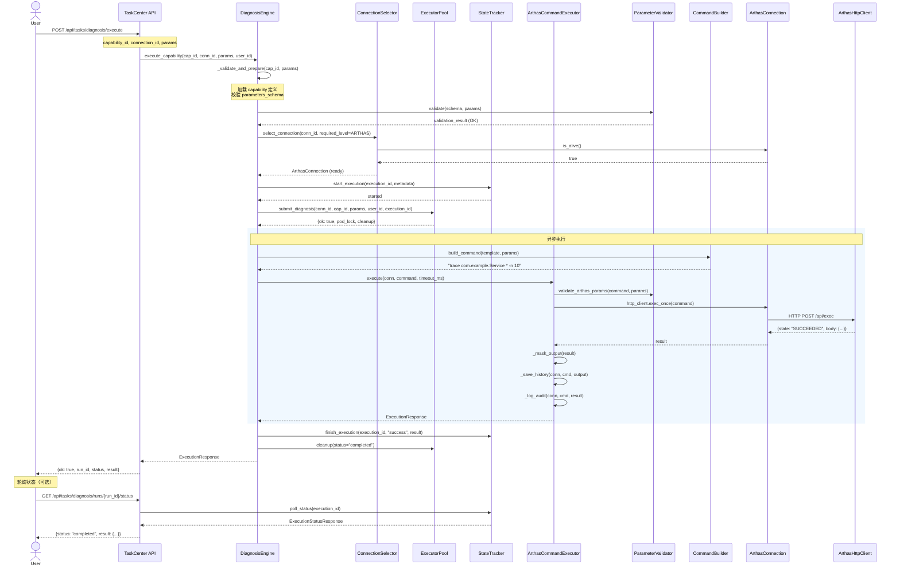
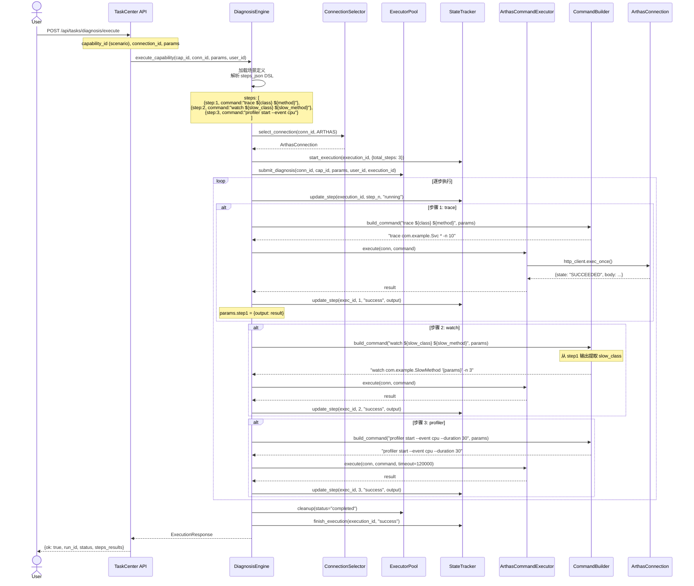
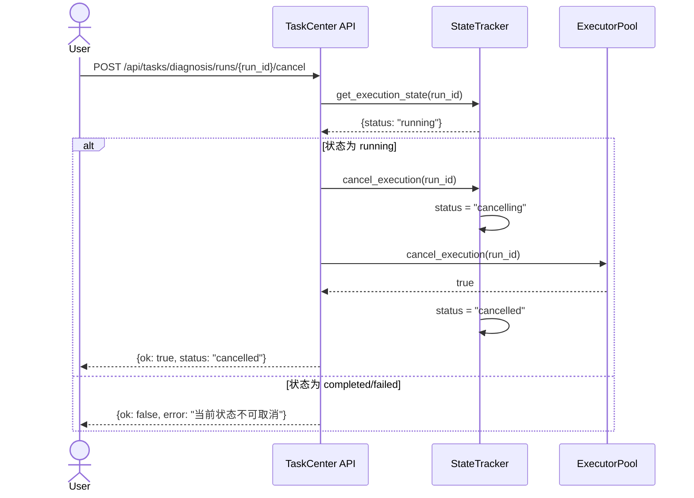

# Phase 2: 诊断能力执行引擎 — 架构设计文档

> **Author:** Gao (高见远) - Software Architect  
> **Date:** 2025-05-25  
> **Status:** 设计完成，待实施  
> **Dependencies:** Phase 0 (✅), Phase 1 (✅)

---

## 目录

1. [架构概述](#1-架构概述)
2. [模块划分与职责](#2-模块划分与职责)
3. [核心类设计（Class Diagram）](#3-核心类设计class-diagram)
4. [数据流与执行时序（Sequence Diagram）](#4-数据流与执行时序sequence-diagram)
5. [各模块详细设计](#5-各模块详细设计)
6. [数据库设计](#6-数据库设计)
7. [API 设计](#7-api-设计)
8. [安全机制](#8-安全机制)
9. [错误处理策略](#9-错误处理策略)
10. [实施建议与风险评估](#10-实施建议与风险评估)

---

## 1. 架构概述

### 1.1 设计目标

Phase 2 的核心目标是实现**诊断能力执行引擎**，将 Phase 0/1 中建立的 Skill Registry 和 Workflow Engine 与底层的 Arthas 执行能力打通，形成完整的诊断闭环。

具体目标：
- **统一执行入口**：所有 Arthas 命令执行都通过 `ArthasCommandExecutor` 完成
- **智能连接选择**：根据执行场景自动选择最优的连接路径（Pod 直连 vs Arthas HTTP）
- **状态实时感知**：执行状态可轮询、可取消、可追溯
- **参数安全**：参数替换经过白名单校验，防注入

### 1.2 架构全景

```
┌──────────────────────────────────────────────────────────────────────┐
│                        前端 / Agent SDK                              │
│                    (Phase 3/4 负责实现)                               │
└────────────────────────────┬─────────────────────────────────────────┘
                             │ HTTP API
┌────────────────────────────▼─────────────────────────────────────────┐
│                       API Layer (Flask)                               │
│  ┌─────────────────┐  ┌──────────────────┐  ┌─────────────────────┐  │
│  │ /api/diagnosis/ │  │ /api/tasks/      │  │ /api/skills/        │  │
│  │ execute         │  │ capabilities     │  │ orchestrator        │  │
│  │ status/cancel   │  │ diagnosis/       │  │ execute             │  │
│  └────────┬────────┘  └────────┬─────────┘  └──────────┬──────────┘  │
└───────────┼────────────────────┼───────────────────────┼─────────────┘
            │                    │                       │
┌───────────▼────────────────────▼───────────────────────▼─────────────┐
│                    Service Layer                                      │
│  ┌──────────────────┐  ┌─────────────────────┐  ┌─────────────────┐  │
│  │ DiagnosisEngine  │  │ WorkflowEngine      │  │ SkillRegistry   │  │
│  │ (Phase 2 新增)   │  │ (Phase 1 已完成)    │  │ (Phase 1 已完成) │  │
│  └────────┬─────────┘  └──────────┬──────────┘  └─────────────────┘  │
└───────────┼───────────────────────┼──────────────────────────────────┘
            │                       │
┌───────────▼───────────────────────▼──────────────────────────────────┐
│                    Core Layer (backend/core/)                         │
│  ┌───────────────────┐  ┌────────────────────┐  ┌─────────────────┐  │
│  │ ArthasCommand     │  │ ConnectionSelector │  │ DiagnosisExec   │  │
│  │ Executor          │  │ (新增)             │  │ utorPool        │  │
│  │ (Phase 2 增强)    │  │                    │  │ (Phase 1 已完成) │  │
│  └────────┬──────────┘  └──────────┬─────────┘  └─────────────────┘  │
│           │                        │                                  │
│  ┌────────▼──────────┐  ┌──────────▼─────────┐  ┌─────────────────┐  │
│  │ ParameterValidator│  │ ArthasConnection   │  │ ConnectionState │  │
│  │ + CommandBuilder  │  │ + PodConnection    │  │ Manager         │  │
│  └───────────────────┘  └────────────────────┘  └─────────────────┘  │
└──────────────────────────────────────────────────────────────────────┘
            │                       │
┌───────────▼───────────────────────▼──────────────────────────────────┐
│                    Infrastructure Layer                                │
│  ┌───────────────────┐  ┌────────────────────┐  ┌─────────────────┐  │
│  │ kubectl executor  │  │ Arthas Agent       │  │ Arthas HTTP     │  │
│  │ (port-forward)    │  │ Manager            │  │ Client          │  │
│  └───────────────────┘  └────────────────────┘  └─────────────────┘  │
└──────────────────────────────────────────────────────────────────────┘
```

### 1.3 技术选型

| 组件 | 选型 | 理由 |
|------|------|------|
| HTTP 框架 | Flask (已有) | 与 Phase 0/1 保持一致 |
| 数据库 | SQLite + WAL (已有) | 轻量级，满足单实例需求 |
| 并发控制 | ThreadPoolExecutor (已有) | Phase 1 DiagnosisExecutorPool 已验证 |
| 状态管理 | 内存 + DB 双写 (已有) | ConnectionStateManager 已实现 |
| 轮询机制 | HTTP Polling (P0) | 简单可靠，WebSocket 留到 Phase 4 |

---

## 2. 模块划分与职责

### 2.1 新增模块

| 模块 | 文件路径 | 职责 |
|------|---------|------|
| **DiagnosisEngine** | `services/diagnosis_engine.py` | 诊断执行引擎：统一调度 Arthas 执行、参数替换、状态管理 |
| **ConnectionSelector** | `backend/core/connection_selector.py` | 连接选择器：根据场景选择最优连接路径 |
| **ExecutionStateTracker** | `services/execution_state_tracker.py` | 执行状态追踪：内存状态 + DB 持久化 + 轮询支持 |

### 2.2 增强模块

| 模块 | 文件路径 | 增强内容 |
|------|---------|---------|
| **ArthasCommandExecutor** | `backend/core/arthas_executor.py` | 增加异步执行支持、连接感知、执行 ID 关联 |
| **CommandBuilder** | `backend/core/command_builder.py` | 增加安全白名单校验、OGNL 过滤 |
| **ParameterValidator** | `backend/core/parameter_validator.py` | 增加 Arthas 专用校验规则 |
| **WorkflowEngine** | `services/workflow_engine.py` | 集成真实 ArthasCommandExecutor（替换模拟实现） |
| **TaskCenter API** | `api/task_center.py` | 增加诊断能力执行 API 端点 |

### 2.3 不变模块

| 模块 | 理由 |
|------|------|
| DiagnosisExecutorPool | Phase 1 已实现，接口兼容 |
| ConnectionStateManager | Phase 0/1 已实现，状态机完整 |
| ArthasConnection | 连接生命周期管理已完成 |
| PodConnection | Pod 连接已完成 |

---

## 3. 核心类设计（Class Diagram）

```mermaid
classDiagram
    class DiagnosisEngine {
        <<Service Layer>>
        -execution_tracker: ExecutionStateTracker
        -connection_selector: ConnectionSelector
        -executor_pool: DiagnosisExecutorPool
        +execute_capability(capability_id, connection_id, params, user_id) ExecutionResult
        +execute_batch(capability_id, connection_id, steps, user_id) ExecutionResult
        +execute_ai_capability(capability_id, connection_id, params, user_id) ExecutionResult
        -_validate_and_prepare(capability_id, params) PreparedCapability
        -_resolve_connection(connection_id) ArthasConnection
        -_execute_single_command(connection, command, params) CommandResult
        -_execute_scenario_steps(connection, steps, params) StepResults
    }

    class ExecutionStateTracker {
        <<Service Layer>>
        -_active_executions: Dict~str, ExecutionState~
        -_lock: threading.Lock
        +start_execution(execution_id, metadata) void
        +update_step(execution_id, step_num, status, output) void
        +finish_execution(execution_id, status, result) void
        +get_execution_state(execution_id) ExecutionState
        +cancel_execution(execution_id) bool
        +poll_status(execution_id) ExecutionStatusResponse
        +cleanup_expired(max_age_seconds) int
    }

    class ConnectionSelector {
        <<Core Layer>>
        +select_connection(connection_id, required_level) SelectedConnection
        +validate_connection(connection) bool
        +get_connection_info(connection_id) ConnectionInfo
        -_find_arthas_connection(connection_id) ArthasConnection
        -_fallback_to_pod(connection_id) PodConnection
    }

    class ArthasCommandExecutor {
        <<Core Layer>>
        +execute(connection, command, timeout_ms, options) ExecutionResponse
        +execute_async(connection, command, options) str
        +execute_batch(connection, commands, options) List~ExecutionResponse~
        +get_status(execution_id) ExecutionStatus
        +cancel(execution_id) bool
        -_parse_command_name(command) str
        -_get_timeout(cmd_name) int
        -_mask_output(result) str
        -_save_history(connection, command, output) void
        -_log_audit(connection, command, result) void
    }

    class CommandBuilder {
        <<Core Layer>>
        +build_command(template, params, step_outputs) str
        +validate_command(command) ValidationResult
        +substitute_params(template, params) str
        +extract_nested_value(data, field_path) str
        -_check_ognl_injection(command) bool
        -_whitelist_check(command) bool
    }

    class ParameterValidator {
        <<Core Layer>>
        +validate(schema_str, params) Optional~str~
        +validate_arthas_params(command, params) ValidationResult
        +sanitize_param(value) str
        -_check_type(field_name, label, value, field_type) Optional~str~
        -_check_length(field_name, label, value, field) Optional~str~
        -_check_pattern(field_name, label, value, field) Optional~str~
        -_check_enum(field_name, label, value, field) Optional~str~
    }

    class DiagnosisExecutorPool {
        <<Core Layer>>
        -global_pool: ThreadPoolExecutor
        -pod_locks: Dict~str, Lock~
        -active_executions: Dict~str, Dict~
        +submit_diagnosis(connection_id, capability_id, params, user_id, execution_id) dict
        +get_active_count() int
        +cancel_execution(execution_id) bool
        +shutdown(wait) void
    }

    class WorkflowEngine {
        <<Service Layer>>
        +execute_skill(capability_id, params, connection_id, user_id) str
        +get_run_status(run_id) dict
        +cancel_run(run_id) bool
        -_execute_dsl(run_id, dsl, params, connection_id) void
        -_execute_command(run_id, command, params, connection_id) void
        -_substitute_params(template, params) str
    }

    class ArthasConnection {
        <<Core Layer>>
        -pod_conn: PodConnection
        -agent_mgr: ArthasAgentManager
        -client: ArthasHttpClient
        -local_port: int
        -_arthas_ready: bool
        +connect_pod(timeout) Tuple~bool, str~
        +connect_arthas(timeout) Tuple~bool, str~
        +connect(timeout, on_state_change) Tuple~bool, str~
        +is_alive() bool
        +disconnect() void
    }

    class ExecutionState {
        <<Data Model>>
        +execution_id: str
        +status: str
        +capability_id: int
        +connection_id: str
        +current_step: int
        +total_steps: int
        +started_at: datetime
        +finished_at: datetime
        +results: List~StepResult~
        +error: str
    }

    DiagnosisEngine --> ConnectionSelector
    DiagnosisEngine --> ExecutionStateTracker
    DiagnosisEngine --> ArthasCommandExecutor
    DiagnosisEngine --> ParameterValidator
    DiagnosisEngine --> DiagnosisExecutorPool
    ArthasCommandExecutor --> ArthasConnection
    WorkflowEngine --> ArthasCommandExecutor
    WorkflowEngine --> CommandBuilder
    ConnectionSelector --> ArthasConnection
    ExecutionStateTracker --> ExecutionState
    ArthasCommandExecutor --> CommandBuilder
```



---

## 4. 数据流与执行时序（Sequence Diagram）

### 4.1 即时诊断执行（单命令 Skill）



### 4.2 场景方案执行（多步骤 DSL）



### 4.3 执行取消流程



---

## 5. 各模块详细设计

### 5.1 DiagnosisEngine — 诊断执行引擎

**文件**: `services/diagnosis_engine.py`  
**职责**: 诊断执行的顶层调度器，协调所有子模块完成从参数校验到命令执行的全流程。

```python
class DiagnosisEngine:
    """诊断执行引擎 - 统一调度器"""
    
    def __init__(self):
        from services.execution_state_tracker import get_execution_state_tracker
        from backend.core.connection_selector import get_connection_selector
        from backend.core.diagnosis_executor_pool import get_diagnosis_executor_pool
        
        self.execution_tracker = get_execution_state_tracker()
        self.connection_selector = get_connection_selector()
        self.executor_pool = get_diagnosis_executor_pool()
    
    def execute_capability(
        self,
        capability_id: int,
        connection_id: str,
        params: dict,
        user_id: int,
        confirmed: bool = False,
    ) -> dict:
        """
        执行诊断能力
        
        Returns:
            {
                "run_id": str,
                "status": "running" | "success" | "failed" | "require_confirm",
                "message": str,
                "result": dict (completed时),
                "steps": list (场景方案时),
            }
        """
        # 1. 加载能力定义
        capability = self._load_capability(capability_id)
        if not capability:
            raise ValueError(f"能力 {capability_id} 不存在")
        
        # 2. 参数校验
        validation = self._validate_params(capability, params)
        if not validation.ok:
            raise ValueError(validation.error)
        
        # 3. 高危命令确认检查
        if capability.get('risk_level') == 'high' and not confirmed:
            return {
                "status": "require_confirm",
                "message": f"此能力 ({capability['name']}) 为高风险操作，需要二次确认",
                "risk_level": "high",
            }
        
        # 4. 选择连接
        connection = self.connection_selector.select_connection(
            connection_id, 
            required_level="arthas"
        )
        
        # 5. 创建执行记录
        run_id = self._create_run_record(capability, connection_id, params, user_id)
        
        # 6. 提交到线程池执行
        pool_result = self.executor_pool.submit_diagnosis(
            connection_id=connection_id,
            capability_id=capability_id,
            params=params,
            user_id=user_id,
            execution_id=run_id,
        )
        
        if not pool_result['ok']:
            raise ValueError(pool_result['error'])
        
        # 7. 启动异步执行
        import threading
        thread = threading.Thread(
            target=self._execute_async,
            args=(run_id, capability, connection, params, pool_result),
            daemon=True,
        )
        thread.start()
        
        return {
            "run_id": run_id,
            "status": "running",
            "message": "诊断已提交执行",
        }
    
    def _execute_async(self, run_id, capability, connection, params, pool_result):
        """异步执行（在线程池中运行）"""
        cleanup = pool_result['cleanup']
        try:
            category = capability.get('category', '')
            
            if category == 'scenario':
                # 场景方案：多步骤
                results = self._execute_scenario_steps(
                    connection, capability, params, run_id
                )
            elif capability.get('handler'):
                # AI 诊断：处理器
                results = self._execute_handler(
                    capability['handler'], params, connection
                )
            else:
                # 单命令执行
                command = CommandBuilder.build_command(
                    capability.get('arthas_command', ''), params
                )
                results = ArthasCommandExecutor.execute(
                    connection, command, skip_audit=False
                )
            
            self._update_run_record(run_id, "success", results)
            cleanup(status='completed')
            
        except Exception as e:
            self._update_run_record(run_id, "failed", error=str(e))
            cleanup(status='failed', error=str(e))
```

### 5.2 ConnectionSelector — 连接选择器

**文件**: `backend/core/connection_selector.py`  
**职责**: 根据诊断场景智能选择最优的连接路径。

```python
class ConnectionLevel(Enum):
    """连接级别"""
    POD = "pod"           # 仅 Pod 连接（kubectl exec）
    ARTHAS = "arthas"     # 完整 Arthas 连接（HTTP API）

@dataclass
class SelectedConnection:
    """选择结果"""
    level: ConnectionLevel
    connection_id: str
    arthas_connection: Optional[ArthasConnection] = None
    pod_connection: Optional[PodConnection] = None
    message: str = ""

class ConnectionSelector:
    """连接选择器 - 根据场景选择最优连接路径"""
    
    def select_connection(
        self,
        connection_id: str,
        required_level: ConnectionLevel = ConnectionLevel.ARTHAS,
    ) -> SelectedConnection:
        """
        选择连接
        
        优先级:
        1. 复用已有的 ArthasConnection（HTTP API 就绪）
        2. 如果仅需 Pod 连接，选择 PodConnection
        3. 如果 Arthas 连接不可用，尝试重建
        """
        # 1. 查找运行时 ArthasConnection
        arthas_conn = self._find_arthas_connection(connection_id)
        
        if arthas_conn and arthas_conn.is_alive():
            return SelectedConnection(
                level=ConnectionLevel.ARTHAS,
                connection_id=connection_id,
                arthas_connection=arthas_conn,
                message="复用已有 Arthas 连接"
            )
        
        # 2. 仅需 Pod 级别连接
        if required_level == ConnectionLevel.POD:
            pod_conn = self._find_pod_connection(connection_id)
            if pod_conn and pod_conn.is_alive():
                return SelectedConnection(
                    level=ConnectionLevel.POD,
                    connection_id=connection_id,
                    pod_connection=pod_conn,
                    message="使用 Pod 直连"
                )
        
        # 3. Arthas 连接不可用
        raise ConnectionError(
            f"Arthas 连接不可用 (connection_id={connection_id})，请重新建立连接"
        )
    
    def _find_arthas_connection(self, connection_id: str) -> Optional[ArthasConnection]:
        """从 server.py 运行时状态中查找 ArthasConnection"""
        import sys
        server_mod = sys.modules.get('server')
        if not server_mod:
            return None
        
        runtime_connections = getattr(server_mod, '_connections', None)
        if not runtime_connections:
            return None
        
        entry = runtime_connections.get(connection_id)
        if entry:
            conn = entry.get('conn')
            if conn and getattr(conn, 'http_client', None):
                return conn
        return None
```

### 5.3 ExecutionStateTracker — 执行状态追踪器

**文件**: `services/execution_state_tracker.py`  
**职责**: 内存状态管理 + DB 持久化 + 轮询接口。

```python
@dataclass
class StepResult:
    """步骤执行结果"""
    step_number: int
    command: str
    desc: str
    status: str  # running, success, failed, skipped
    output: str = ""
    error: str = ""
    duration_ms: int = 0

@dataclass
class ExecutionRecord:
    """执行记录"""
    execution_id: str
    status: str  # pending, running, success, failed, cancelled
    capability_id: int
    connection_id: str
    user_id: int
    current_step: int = 0
    total_steps: int = 1
    started_at: datetime = None
    finished_at: datetime = None
    results: List[StepResult] = field(default_factory=list)
    error: str = ""
    result_json: str = ""

class ExecutionStateTracker:
    """执行状态追踪器"""
    
    def __init__(self):
        self._active: Dict[str, ExecutionRecord] = {}
        self._lock = threading.Lock()
        self._max_ttl = 3600  # 1小时自动清理
    
    def start_execution(self, execution_id: str, metadata: dict):
        """启动执行"""
        record = ExecutionRecord(
            execution_id=execution_id,
            status="running",
            capability_id=metadata['capability_id'],
            connection_id=metadata['connection_id'],
            user_id=metadata['user_id'],
            total_steps=metadata.get('total_steps', 1),
            started_at=datetime.now(),
        )
        with self._lock:
            self._active[execution_id] = record
        
        # 持久化到 DB
        self._persist_to_db(record)
    
    def update_step(self, execution_id: str, step_number: int, 
                    status: str, output: str = "", error: str = "",
                    command: str = "", desc: str = "", duration_ms: int = 0):
        """更新步骤状态"""
        with self._lock:
            record = self._active.get(execution_id)
            if not record:
                return
            
            record.current_step = step_number
            # 更新或添加步骤结果
            for i, step in enumerate(record.results):
                if step.step_number == step_number:
                    record.results[i] = StepResult(
                        step_number=step_number,
                        command=command or step.command,
                        desc=desc or step.desc,
                        status=status,
                        output=output[:50000] if output else step.output,
                        error=error[:5000] if error else step.error,
                        duration_ms=duration_ms or step.duration_ms,
                    )
                    break
            else:
                record.results.append(StepResult(
                    step_number=step_number,
                    command=command,
                    desc=desc,
                    status=status,
                    output=output[:50000] if output else "",
                    error=error[:5000] if error else "",
                    duration_ms=duration_ms,
                ))
        
        # 持久化步骤日志
        self._persist_step_to_db(execution_id, step_number, status, output, error)
    
    def finish_execution(self, execution_id: str, status: str, 
                         result: dict = None, error: str = ""):
        """完成执行"""
        with self._lock:
            record = self._active.get(execution_id)
            if record:
                record.status = status
                record.finished_at = datetime.now()
                record.error = error
                if result:
                    record.result_json = json.dumps(result, ensure_ascii=False)[:100000]
        
        # 持久化
        self._persist_finish_to_db(execution_id, status, result, error)
    
    def poll_status(self, execution_id: str) -> dict:
        """轮询状态（前端调用）"""
        with self._lock:
            record = self._active.get(execution_id)
        
        if record:
            return self._record_to_response(record)
        
        # 从 DB 读取（已完成的执行）
        return self._read_from_db(execution_id)
```

### 5.4 ArthasCommandExecutor 增强

**文件**: `backend/core/arthas_executor.py`  
**增强内容**:

```python
# 新增执行选项
@dataclass
class ExecuteOptions:
    """执行选项"""
    timeout_ms: Optional[int] = None
    skip_audit: bool = False
    skip_history: bool = False
    confirmed: bool = False
    execution_id: Optional[str] = None  # 关联执行 ID

# 新增异步执行方法
@staticmethod
def execute_async(
    connection,
    command: str,
    options: ExecuteOptions = None,
) -> str:
    """异步执行命令，返回 execution_id
    
    适用于长耗时命令（profiler, heapdump 等）
    状态通过 ExecutionStateTracker 查询
    """
    if options is None:
        options = ExecuteOptions()
    
    execution_id = options.execution_id or str(uuid.uuid4())
    
    def _do_execute():
        result = ArthasCommandExecutor.execute(
            connection, command,
            timeout_ms=options.timeout_ms,
            skip_audit=options.skip_audit,
            skip_history=options.skip_history,
            confirmed=options.confirmed,
        )
        # 更新状态追踪器
        from services.execution_state_tracker import get_execution_state_tracker
        tracker = get_execution_state_tracker()
        status = "success" if result.get('state') in ('SUCCEEDED', 'succeeded') else "failed"
        tracker.update_step(
            execution_id, 0, status,
            output=json.dumps(result, ensure_ascii=False)[:50000],
            duration_ms=result.get('duration_ms', 0),
        )
    
    import threading
    threading.Thread(target=_do_execute, daemon=True).start()
    return execution_id

# 新增参数安全校验
@staticmethod
def validate_before_execute(command: str, params: dict) -> Optional[str]:
    """执行前安全校验
    
    Returns:
        None 表示通过, 否则返回错误信息
    """
    from backend.core.command_builder import CommandBuilder
    return CommandBuilder.validate_command(command)
```

### 5.5 CommandBuilder 安全增强

**文件**: `backend/core/command_builder.py`  
**增强内容**:

```python
# 命令白名单
_ALLOWED_COMMANDS = {
    # 快捷查询
    'dashboard', 'version', 'sysprop', 'sysenv', 'vmoption', 'jvm',
    # 线程分析
    'thread',
    # 方法诊断
    'trace', 'watch', 'stack', 'monitor', 'tt',
    # 类加载
    'sc', 'sm', 'jad', 'classloader',
    # 采样
    'profiler',
    # 堆Dump
    'heapdump', 'dump', 'jfr',
    # 日志
    'logger',
    # 热更新
    'redefine', 'retransform', 'mc',
    # OGNL
    'ognl',
    # 会话
    'session', 'stop', 'reset',
    # 其他
    'help', 'cat', 'base64', 'echo', 'tee', 'pwd', 'ls', 'pwd',
}

# OGNL 危险模式
_OGNL_DANGEROUS_PATTERNS = [
    r'Runtime\.getRuntime\(\)\.exec',
    r'ProcessBuilder',
    r'@java\.lang\.Runtime@',
    r'@java\.lang\.ProcessBuilder@',
    r'\.getRuntime\(\)',
    r'exec\(',
]

@staticmethod
def validate_command(command: str) -> Optional[str]:
    """校验 Arthas 命令安全性
    
    Returns:
        None 表示通过, 否则返回错误信息
    """
    from backend.core.arthas_executor import ArthasCommandExecutor
    
    # 1. 命令名称白名单
    cmd_name = ArthasCommandExecutor._parse_command_name(command)
    if cmd_name not in CommandBuilder._ALLOWED_COMMANDS:
        return f"不支持的命令: {cmd_name}"
    
    # 2. OGNL 注入检查
    for pattern in CommandBuilder._OGNL_DANGEROUS_PATTERNS:
        if re.search(pattern, command):
            return f"命令包含危险操作: {pattern}"
    
    # 3. Shell 注入检查
    if CommandBuilder._has_shell_metachars(command):
        return "命令包含非法字符"
    
    return None

@staticmethod
def _has_shell_metachars(command: str) -> bool:
    """检查 Shell 元字符"""
    dangerous_chars = set(';&|`$!(){}[]')
    for ch in command:
        if ch in dangerous_chars:
            return True
    return False
```

---

## 6. 数据库设计

### 6.1 现有表结构（Phase 0/1 已完成）

Phase 2 复用以下已有表，无需新增表：

| 表名 | 用途 | Phase 2 变化 |
|------|------|------------|
| `diagnosis_capabilities` | 诊断能力目录 | 无变化 |
| `task_logs` | 执行记录 | 新增 `execution_type='diagnosis'` 类型 |
| `step_logs` | 步骤日志 | 由 ExecutionStateTracker 写入 |
| `skill_registry` | Skill 注册表 | 无变化 |
| `arthas_commands` / `arthas_command_logs` | 命令历史 | 由 ArthasCommandExecutor 写入 |

### 6.2 ExecutionStateTracker 内存状态结构

```python
# 内存中的执行状态（不需要持久化到新表）
ExecutionRecord = {
    "execution_id": "exec-abc123",      # UUID
    "status": "running",                 # pending/running/success/failed/cancelled
    "capability_id": 5,                  # 关联能力
    "connection_id": "cluster/ns/pod",   # 关联连接
    "user_id": 1,                        # 用户
    "current_step": 2,                   # 当前步骤
    "total_steps": 3,                    # 总步骤数
    "started_at": "2025-05-25T10:00:00",
    "finished_at": None,
    "results": [
        {
            "step_number": 1,
            "command": "trace com.example.Svc * -n 10",
            "desc": "定位慢方法",
            "status": "success",
            "output": "...(截断到50KB)",
            "duration_ms": 2345,
        },
        ...
    ],
    "error": "",
    "result_json": "{...}",
}
```

---

## 7. API 设计

### 7.1 诊断执行 API

所有 API 端点均挂载在 `api/task_center.py` 的 `task_bp` Blueprint 下。

#### 7.1.1 执行诊断能力

```
POST /api/tasks/diagnosis/execute
```

**请求体**:
```json
{
    "capability_id": 5,
    "connection_id": "my-cluster/default/my-pod",
    "params": {
        "class": "com.example.UserService",
        "method": "getUser"
    },
    "confirmed": false
}
```

**响应** (异步提交):
```json
{
    "ok": true,
    "run_id": "exec-a1b2c3d4e5f6",
    "status": "running",
    "message": "诊断已提交执行"
}
```

**响应** (需要确认):
```json
{
    "ok": true,
    "status": "require_confirm",
    "message": "此能力为高风险操作，需要二次确认",
    "risk_level": "high",
    "capability_name": "OOM 内存泄漏排查"
}
```

**响应** (验证失败):
```json
{
    "ok": false,
    "error": "缺少必填参数: 类名"
}
```

#### 7.1.2 查询执行状态

```
GET /api/tasks/diagnosis/runs/{run_id}/status
```

**响应**:
```json
{
    "ok": true,
    "run_id": "exec-a1b2c3d4e5f6",
    "status": "running",
    "current_step": 2,
    "total_steps": 3,
    "started_at": "2025-05-25T10:00:00",
    "elapsed_ms": 5432,
    "steps": [
        {
            "step_number": 1,
            "desc": "定位慢方法",
            "status": "success",
            "duration_ms": 2345,
            "command": "trace com.example.UserService * -n 10"
        },
        {
            "step_number": 2,
            "desc": "观察入参返回值",
            "status": "running",
            "command": "watch com.example.UserService getUser '{params,returnObj}'"
        },
        {
            "step_number": 3,
            "desc": "CPU 采样分析",
            "status": "pending"
        }
    ]
}
```

#### 7.1.3 取消执行

```
POST /api/tasks/diagnosis/runs/{run_id}/cancel
```

**响应**:
```json
{
    "ok": true,
    "run_id": "exec-a1b2c3d4e5f6",
    "status": "cancelled"
}
```

#### 7.1.4 获取步骤日志

```
GET /api/tasks/diagnosis/runs/{run_id}/steps
```

**响应**:
```json
{
    "ok": true,
    "steps": [
        {
            "step_number": 1,
            "command": "trace com.example.UserService * -n 10",
            "status": "success",
            "output": "Trace 调用链分析结果...",
            "duration_ms": 2345
        },
        ...
    ]
}
```

#### 7.1.5 确认并执行高危能力

```
POST /api/tasks/diagnosis/execute
```

**请求体**:
```json
{
    "capability_id": 8,
    "connection_id": "my-cluster/default/my-pod",
    "params": {
        "dump_path": "/tmp/heapdump.hprof"
    },
    "confirmed": true
}
```

---

## 8. 安全机制

### 8.1 参数替换安全

```
用户输入 → ParameterValidator 校验 → CommandBuilder.build_command → ArthasCommandExecutor.execute
```

**校验层次**:
1. **Schema 校验**（ParameterValidator）: 必填、类型、正则、枚举、范围
2. **命令白名单**（CommandBuilder）: 只允许已知 Arthas 命令
3. **OGNL 注入防护**（CommandBuilder）: 拦截 Runtime.exec 等危险调用
4. **Shell 元字符检查**（CommandBuilder）: 拦截 `; | & $` 等
5. **输出脱敏**（SafetyService）: 自动脱敏密码、Token、IP 地址

### 8.2 参数值安全规则

| 规则 | 说明 | 示例 |
|------|------|------|
| 类名正则 | `^[A-Za-z_$][\w.$*]*$` | ✅ `com.example.*Service` ❌ `com.example;rm -rf` |
| 方法名正则 | `^[\w.*]*$` | ✅ `getUser` ❌ `getUser;echo` |
| 路径白名单 | 只允许 `/tmp/` 前缀 | ✅ `/tmp/dump.hprof` ❌ `/etc/passwd` |
| 数值范围 | 根据字段定义限制 | `thread -n` 限制 1-100 |

### 8.3 连接权限控制

- 诊断执行必须使用 `ArthasConnection`（HTTP API），不能用裸 Pod 连接
- 连接选择器会验证连接存活状态
- 连接断开时自动标记执行失败

---

## 9. 错误处理策略

### 9.1 错误分类

| 错误类型 | HTTP 状态码 | 处理方式 |
|---------|------------|---------|
| 参数校验失败 | 400 | 直接返回错误信息 |
| 连接不可用 | 502 | 返回重连提示 |
| 高危未确认 | 200 (status=require_confirm) | 返回确认提示 |
| 并发冲突 | 409 | 返回重试提示 |
| 执行超时 | 200 (status=failed) | 记录日志，返回超时信息 |
| Arthas 内部错误 | 200 (status=failed) | 记录 Arthas 错误信息 |
| RBAC 权限不足 | 403 | 返回权限提示 |

### 9.2 重试策略

| 场景 | 策略 |
|------|------|
| Arthas HTTP 超时 | WorkflowEngine 内置重试（最多3次） |
| 连接断开 | 不自动重试，返回错误 |
| Pod 锁冲突 | 返回 409，前端轮询 |
| 网络抖动 | ArthasHttpClient 内置重试 |

---

## 10. 实施建议与风险评估

### 10.1 实施优先级

| 优先级 | 模块 | 依赖 | 预估工时 |
|-------|------|------|---------|
| P0 | DiagnosisEngine 核心逻辑 | 无 | 1.5d |
| P0 | ExecutionStateTracker | 无 | 1d |
| P0 | ConnectionSelector | 无 | 0.5d |
| P0 | CommandBuilder 安全增强 | 无 | 0.5d |
| P0 | 诊断 API 端点 | DiagnosisEngine | 1d |
| P1 | ArthasCommandExecutor 增强 | 无 | 0.5d |
| P1 | WorkflowEngine 集成 | ArthasCommandExecutor | 0.5d |
| P1 | 集成测试 | 所有模块 | 1d |

### 10.2 关键风险

| 风险 | 影响 | 缓解措施 |
|------|------|---------|
| `server.py` 运行时状态耦合 | 连接选择器依赖 `server._connections` 全局变量 | ConnectionSelector 提供适配层，隔离耦合 |
| 长时间命令阻塞线程池 | profiler/heapdump 可能 120s+ | 使用 execute_async + 独立线程 |
| 并发执行同 Pod 命令 | 可能产生 Arthas 内部状态冲突 | DiagnosisExecutorPool 的 Pod 级别锁保证 |
| SQLite 写锁竞争 | 并发写入 task_logs 可能超时 | WAL 模式已启用，可接受 |

### 10.3 与现有代码的兼容性

| 现有模块 | 兼容性处理 |
|---------|-----------|
| `server.py` 的 `_connections` | ConnectionSelector 从这里读取运行时连接 |
| `api/task_center.py` 的 `_get_active_arthas_connection` | 保留原函数，新功能走 ConnectionSelector |
| `services/workflow_engine.py` 的 `_execute_arthas_command` | 替换模拟实现，接入真实 ArthasCommandExecutor |
| `backend/core/arthas_executor.py` 的静态方法 | 向后兼容，新增方法不破坏现有调用 |

### 10.4 文件变更清单

| 文件路径 | 操作 | 说明 |
|---------|------|------|
| `services/diagnosis_engine.py` | **新建** | 诊断执行引擎 |
| `services/execution_state_tracker.py` | **新建** | 执行状态追踪器 |
| `backend/core/connection_selector.py` | **新建** | 连接选择器 |
| `api/diagnosis.py` | **新建** | 诊断执行 API |
| `backend/core/arthas_executor.py` | 修改 | 增加异步执行、安全校验 |
| `backend/core/command_builder.py` | 修改 | 增加白名单、OGNL 防护 |
| `backend/core/parameter_validator.py` | 修改 | 增加 Arthas 专用规则 |
| `services/workflow_engine.py` | 修改 | 集成真实 ArthasCommandExecutor |
| `api/task_center.py` | 修改 | 注册诊断 API Blueprint |

---

## 附录 A: 共享知识

### A.1 命令超时配置（复用现有）

```python
# 来自 arthas_executor.py，已有完整配置
_COMMAND_TIMEOUT_CONFIG = {
    'dashboard': 15000, 'thread': 30000,
    'trace': 60000, 'watch': 60000, 'stack': 30000,
    'profiler': 120000, 'heapdump': 120000,
    'jad': 30000, 'sc': 10000, 'sm': 10000,
    # ... 其余复用
}
```

### A.2 命令风险分级（复用现有）

```python
# 来自 arthas_executor.py
_HIGH_RISK_COMMANDS = {'retransform', 'heapdump', 'profiler', 'logger', 'vmoption', 'stop'}
_READ_ONLY_COMMANDS = {'dashboard', 'thread', 'jvm', 'sc', 'sm', 'jad', 'version', ...}
```

### A.3 参数替换语法

```
${param}           → 用户参数
${param:-default}  → 带默认值
${step1.output}    → 引用步骤 1 输出
${step1.data.cpu}  → 引用嵌套字段
```
