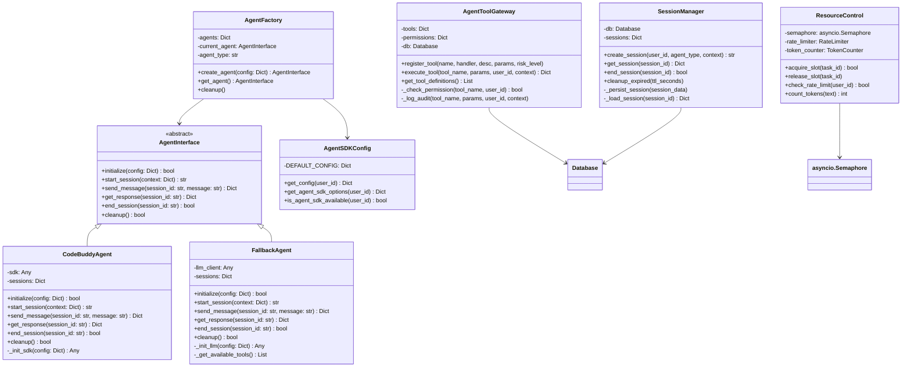
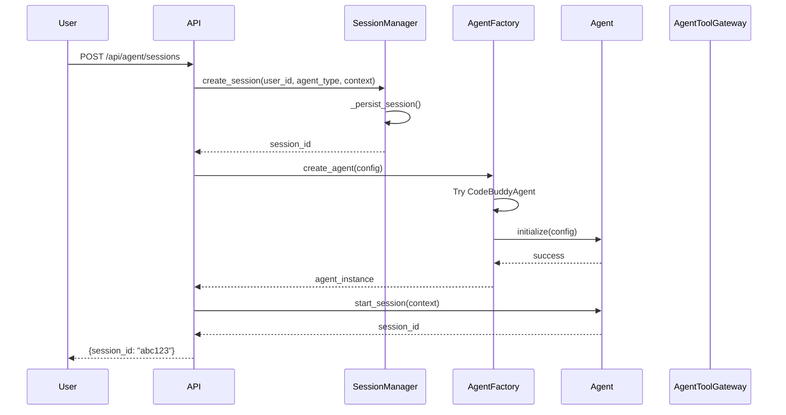
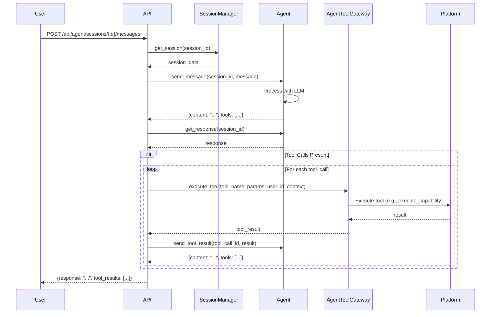
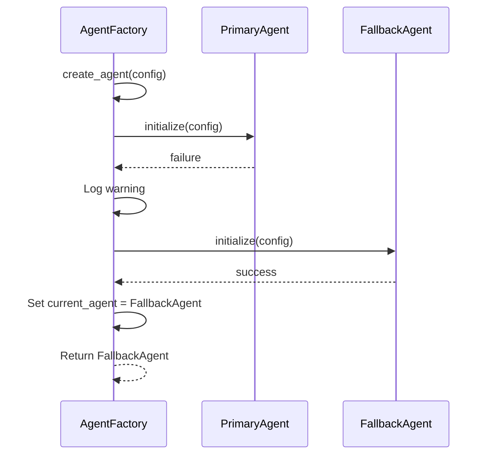
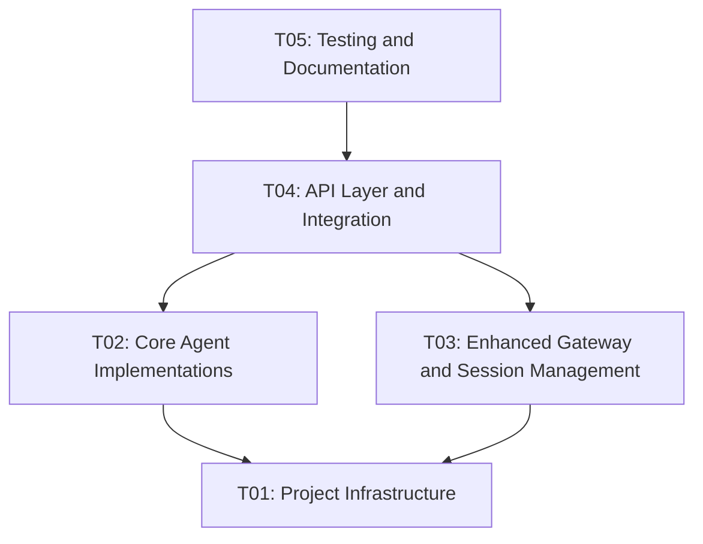

# Phase 3: Agent SDK Integration Architecture Design

> **Author:** Bob (Software Architect)
> **Date:** 2025-05-25
> **Version:** 1.0
> **Status:** Draft

## 1. Overview

Phase 3 focuses on integrating Agent SDK capabilities into the K8s Arthas intelligent diagnostic platform. This phase introduces a pluggable Agent abstraction layer that supports multiple AI Agent SDKs (CodeBuddy, OpenAI, etc.) with automatic fallback, session persistence, and resource control.

### 1.1 Objectives

1. Provide a unified Agent interface for AI-powered diagnostic capabilities
2. Support multiple Agent SDKs with seamless switching
3. Implement automatic degradation to fallback agents
4. Ensure session persistence and recovery
5. Control resource usage and prevent abuse
6. Integrate with existing Skill Registry and Workflow Engine

### 1.2 Key Requirements

- **Multi-SDK Support**: Support CodeBuddy Agent SDK, OpenAI-compatible APIs, and local LLM fallback
- **Automatic Fallback**: If primary Agent SDK fails, automatically switch to fallback
- **Session Persistence**: Maintain conversation history and context across restarts
- **Resource Control**: Limit concurrent sessions, request rates, and token usage
- **Security**: Validate tool calls, audit actions, and enforce permissions
- **Integration**: Work seamlessly with existing Skill Registry and Workflow Engine

## 2. Architecture Design

### 2.1 Module Structure

```
┌─────────────────────────────────────────────────────────────┐
│                     API Layer (Flask)                        │
│  /api/agent/* - Agent management endpoints                  │
│  /api/ai/* - Existing AI chat (to be enhanced)             │
└───────────────────────┬─────────────────────────────────────┘
                        │
┌───────────────────────▼─────────────────────────────────────┐
│                   Agent Core Layer                          │
│  ┌─────────────────┐  ┌─────────────────┐  ┌─────────────┐ │
│  │  AgentFactory   │  │ AgentToolGateway│  │SessionManager│ │
│  └─────────────────┘  └─────────────────┘  └─────────────┘ │
│  ┌─────────────────────────────────────────────────────────┐│
│  │              AgentInterface (Abstract)                 ││
│  └─────────────────────────────────────────────────────────┘│
│  ┌─────────────────┐  ┌─────────────────┐  ┌─────────────┐ │
│  │ CodeBuddyAgent  │  │  FallbackAgent  │  │ Future SDKs │ │
│  └─────────────────┘  └─────────────────┘  └─────────────┘ │
└───────────────────────┬─────────────────────────────────────┘
                        │
┌───────────────────────▼─────────────────────────────────────┐
│                  Supporting Services                        │
│  ┌─────────────────┐  ┌─────────────────┐  ┌─────────────┐ │
│  │ AgentSDKConfig  │  │  SkillRegistry  │  │WorkflowEngine│ │
│  └─────────────────┘  └─────────────────┘  └─────────────┘ │
└─────────────────────────────────────────────────────────────┘
```

### 2.2 Core Components

#### 2.2.1 AgentInterface (Abstract)
Defines the contract for all Agent implementations. Provides methods for initialization, session management, message handling, and cleanup.

#### 2.2.2 AgentFactory
Creates Agent instances based on configuration, implements automatic fallback logic, and manages Agent lifecycle.

#### 2.2.3 AgentToolGateway
Exposes platform tools to Agents with permission control, risk assessment, and audit logging.

#### 2.2.4 SessionManager
Manages Agent sessions with persistence to SQLite, handles session recovery, and implements cleanup policies.

#### 2.2.5 ResourceControl
Manages concurrent sessions, request rates, and token usage with configurable limits.

### 2.3 Data Flow

#### 2.3.1 Agent Session Flow
```
User → API → SessionManager → AgentFactory → Agent (CodeBuddy/Fallback)
                                                    ↓
                                            AgentToolGateway
                                                    ↓
                                            Platform Tools (execute_capability, etc.)
```

#### 2.3.2 Tool Execution Flow
```
Agent → AgentToolGateway → Permission Check → Tool Handler → Audit Log → Result
```

### 2.4 Integration with Existing Systems

- **Skill Registry**: Agent can query available skills and execute them via `execute_capability` tool
- **Workflow Engine**: Agent can trigger workflow execution through the gateway
- **AI Chat**: Existing AI chat can be enhanced to use Agent abstraction layer

## 3. Class Diagram



## 4. Sequence Diagrams

### 4.1 Agent Session Creation



### 4.2 Agent Message Flow



### 4.3 Automatic Fallback



## 5. Implementation Details

### 5.1 AgentInterface

The abstract interface defines the contract for all Agent implementations:

```python
from abc import ABC, abstractmethod
from typing import Dict, Any, List, Optional

class AgentInterface(ABC):
    """Agent 抽象接口"""
    
    @abstractmethod
    async def initialize(self, config: Dict[str, Any]) -> bool:
        """初始化 Agent"""
        pass
    
    @abstractmethod
    async def start_session(self, context: Dict[str, Any]) -> str:
        """开始会话"""
        pass
    
    @abstractmethod
    async def send_message(self, session_id: str, message: str) -> Dict[str, Any]:
        """发送消息"""
        pass
    
    @abstractmethod
    async def get_response(self, session_id: str) -> Dict[str, Any]:
        """获取响应"""
        pass
    
    @abstractmethod
    async def end_session(self, session_id: str) -> bool:
        """结束会话"""
        pass
    
    @abstractmethod
    async def cleanup(self) -> bool:
        """清理资源"""
        pass
```

### 5.2 CodeBuddyAgent

Implements AgentInterface for CodeBuddy SDK:

```python
class CodeBuddyAgent(AgentInterface):
    """CodeBuddy Agent 适配器"""
    
    def __init__(self):
        self.sdk = None
        self.sessions = {}
    
    async def initialize(self, config: Dict[str, Any]) -> bool:
        """初始化 CodeBuddy SDK"""
        try:
            self.sdk = await self._init_sdk(config)
            return True
        except Exception as e:
            logger.error(f"Initialize CodeBuddy failed: {e}")
            return False
    
    async def _init_sdk(self, config: Dict[str, Any]) -> Any:
        """初始化 SDK"""
        # Implementation depends on CodeBuddy SDK
        pass
```

### 5.3 FallbackAgent

Implements AgentInterface for direct LLM calls:

```python
class FallbackAgent(AgentInterface):
    """Fallback Agent 适配器（直接 LLM 调用）"""
    
    def __init__(self):
        self.llm_client = None
        self.sessions = {}
    
    async def initialize(self, config: Dict[str, Any]) -> bool:
        """初始化 LLM 客户端"""
        try:
            self.llm_client = await self._init_llm(config)
            return True
        except Exception as e:
            logger.error(f"Initialize FallbackAgent failed: {e}")
            return False
    
    def _get_available_tools(self) -> List[Dict[str, Any]]:
        """获取可用工具列表"""
        from services.agent_tool_gateway import get_agent_tool_gateway
        gateway = get_agent_tool_gateway()
        return gateway.get_tool_definitions()
```

### 5.4 AgentFactory

Creates Agent instances with automatic fallback:

```python
class AgentFactory:
    """Agent 工厂 - 自动降级"""
    
    def __init__(self):
        self.agents = {
            "codebuddy": CodeBuddyAgent,
            "fallback": FallbackAgent
        }
        self.current_agent = None
        self.agent_type = None
    
    async def create_agent(self, config: Dict[str, Any]) -> AgentInterface:
        """创建 Agent（自动降级）"""
        agent_type = config.get("agent_type", "codebuddy")
        
        # 尝试创建指定类型的 Agent
        for try_type in [agent_type, "fallback"]:
            try:
                agent_class = self.agents.get(try_type)
                if not agent_class:
                    continue
                
                agent = agent_class()
                success = await agent.initialize(config)
                
                if success:
                    self.current_agent = agent
                    self.agent_type = try_type
                    logger.info(f"Created agent: {try_type}")
                    return agent
                else:
                    logger.warning(f"Failed to create agent: {try_type}")
            except Exception as e:
                logger.error(f"Error creating agent {try_type}: {e}")
        
        raise RuntimeError("Failed to create any agent")
```

### 5.5 Enhanced AgentToolGateway

The existing AgentToolGateway needs enhancements:

1. **Async Support**: Convert to async for non-blocking operations
2. **Permission System**: Implement role-based access control
3. **Risk Assessment**: Dynamic risk level evaluation
4. **Circuit Breaker**: Handle tool failures gracefully

### 5.6 SessionManager

Handles session persistence and recovery:

```python
class SessionManager:
    """会话管理器 - 持久化"""
    
    def __init__(self):
        from models.db import get_db
        self.db = get_db()
        self.sessions = {}  # In-memory cache
    
    async def create_session(self, user_id: int, agent_type: str,
                             context: Dict[str, Any]) -> str:
        """创建会话"""
        session_id = f"sess-{uuid.uuid4().hex[:12]}"
        
        # Persist to database
        self.db.insert('agent_sessions', {
            'id': session_id,
            'user_id': user_id,
            'agent_type': agent_type,
            'context': json.dumps(context),
            'status': 'active',
            'created_at': datetime.now().isoformat()
        })
        
        # Cache in memory
        self.sessions[session_id] = {
            "user_id": user_id,
            "agent_type": agent_type,
            "context": context,
            "status": "active",
            "created_at": datetime.now()
        }
        
        return session_id
```

### 5.7 ResourceControl

Manages concurrent sessions and rate limiting:

```python
class ResourceControl:
    """资源控制 - 并发限制、速率限制"""
    
    def __init__(self, max_concurrent: int = 10, rate_limit_per_minute: int = 60):
        self.max_concurrent = max_concurrent
        self.rate_limit_per_minute = rate_limit_per_minute
        self.semaphore = asyncio.Semaphore(max_concurrent)
        self.rate_limiter = {}  # user_id -> [timestamps]
    
    async def acquire_slot(self, task_id: str) -> bool:
        """获取执行槽位"""
        return await self.semaphore.acquire()
    
    def release_slot(self):
        """释放执行槽位"""
        self.semaphore.release()
    
    def check_rate_limit(self, user_id: int) -> bool:
        """检查速率限制"""
        now = time.time()
        if user_id not in self.rate_limiter:
            self.rate_limiter[user_id] = []
        
        # Remove old timestamps
        self.rate_limiter[user_id] = [
            ts for ts in self.rate_limiter[user_id] 
            if now - ts < 60
        ]
        
        if len(self.rate_limiter[user_id]) >= self.rate_limit_per_minute:
            return False
        
        self.rate_limiter[user_id].append(now)
        return True
```

## 6. Database Schema

### 6.1 New Tables

```sql
-- Agent sessions table
CREATE TABLE IF NOT EXISTS agent_sessions (
    id TEXT PRIMARY KEY,
    user_id INTEGER NOT NULL,
    agent_type TEXT NOT NULL,
    context TEXT DEFAULT '{}',
    status TEXT DEFAULT 'active',
    created_at TIMESTAMP DEFAULT CURRENT_TIMESTAMP,
    updated_at TIMESTAMP DEFAULT CURRENT_TIMESTAMP,
    FOREIGN KEY (user_id) REFERENCES users(id) ON DELETE CASCADE
);

-- Agent session messages table
CREATE TABLE IF NOT EXISTS agent_session_messages (
    id INTEGER PRIMARY KEY AUTOINCREMENT,
    session_id TEXT NOT NULL,
    role TEXT NOT NULL,  -- 'user', 'assistant', 'system', 'tool'
    content TEXT,
    tool_calls TEXT,  -- JSON array of tool calls
    tool_call_id TEXT,  -- For tool results
    created_at TIMESTAMP DEFAULT CURRENT_TIMESTAMP,
    FOREIGN KEY (session_id) REFERENCES agent_sessions(id) ON DELETE CASCADE
);

-- Agent resource usage table
CREATE TABLE IF NOT EXISTS agent_resource_usage (
    id INTEGER PRIMARY KEY AUTOINCREMENT,
    user_id INTEGER NOT NULL,
    session_id TEXT,
    tokens_used INTEGER DEFAULT 0,
    api_calls INTEGER DEFAULT 0,
    created_at TIMESTAMP DEFAULT CURRENT_TIMESTAMP,
    FOREIGN KEY (user_id) REFERENCES users(id) ON DELETE CASCADE,
    FOREIGN KEY (session_id) REFERENCES agent_sessions(id) ON DELETE SET NULL
);
```

### 6.2 Migration Script

Add to `models/db.py` initialize method:

```python
# Phase 3: Agent SDK Integration tables
cursor.execute('''
    CREATE TABLE IF NOT EXISTS agent_sessions (
        id TEXT PRIMARY KEY,
        user_id INTEGER NOT NULL,
        agent_type TEXT NOT NULL,
        context TEXT DEFAULT '{}',
        status TEXT DEFAULT 'active',
        created_at TIMESTAMP DEFAULT CURRENT_TIMESTAMP,
        updated_at TIMESTAMP DEFAULT CURRENT_TIMESTAMP,
        FOREIGN KEY (user_id) REFERENCES users(id) ON DELETE CASCADE
    )
''')

cursor.execute('''
    CREATE TABLE IF NOT EXISTS agent_session_messages (
        id INTEGER PRIMARY KEY AUTOINCREMENT,
        session_id TEXT NOT NULL,
        role TEXT NOT NULL,
        content TEXT,
        tool_calls TEXT,
        tool_call_id TEXT,
        created_at TIMESTAMP DEFAULT CURRENT_TIMESTAMP,
        FOREIGN KEY (session_id) REFERENCES agent_sessions(id) ON DELETE CASCADE
    )
''')

cursor.execute('''
    CREATE TABLE IF NOT EXISTS agent_resource_usage (
        id INTEGER PRIMARY KEY AUTOINCREMENT,
        user_id INTEGER NOT NULL,
        session_id TEXT,
        tokens_used INTEGER DEFAULT 0,
        api_calls INTEGER DEFAULT 0,
        created_at TIMESTAMP DEFAULT CURRENT_TIMESTAMP,
        FOREIGN KEY (user_id) REFERENCES users(id) ON DELETE CASCADE,
        FOREIGN KEY (session_id) REFERENCES agent_sessions(id) ON DELETE SET NULL
    )
''')
```

## 7. API Design

### 7.1 Agent Session APIs

```python
# POST /api/agent/sessions - Create new session
# GET /api/agent/sessions/<session_id> - Get session details
# POST /api/agent/sessions/<session_id>/messages - Send message
# GET /api/agent/sessions/<session_id>/messages - Get message history
# DELETE /api/agent/sessions/<session_id> - End session
```

### 7.2 Agent Management APIs

```python
# GET /api/agent/config - Get agent configuration
# POST /api/agent/config - Update agent configuration
# GET /api/agent/status - Get agent status and statistics
```

### 7.3 Tool APIs

```python
# GET /api/agent/tools - List available tools
# POST /api/agent/tools/<tool_name>/execute - Execute tool directly
```

## 8. Implementation Plan

### 8.1 Task Decomposition

**T01: Project Infrastructure**
- Create `services/agents/` directory structure
- Create `services/agent_interface.py`
- Create `services/agent_factory.py`
- Create `services/session_manager.py`
- Create `services/resource_control.py`
- Create `api/agent.py`
- Update `server.py` to register new blueprint

**T02: Core Agent Implementations**
- Implement `CodeBuddyAgent` in `services/agents/codebuddy_agent.py`
- Implement `FallbackAgent` in `services/agents/fallback_agent.py`
- Create `services/agents/__init__.py`
- Implement `AgentFactory` with fallback logic

**T03: Enhanced Gateway and Session Management**
- Enhance `services/agent_tool_gateway.py` with async support
- Implement `SessionManager` with database persistence
- Create database migration script
- Implement `ResourceControl` with concurrency limits

**T04: API Layer and Integration**
- Implement `api/agent.py` endpoints
- Integrate with existing AI chat endpoints
- Add API documentation
- Create integration tests

**T05: Testing and Documentation**
- Write unit tests for all components
- Write integration tests
- Create API documentation
- Update project documentation

### 8.2 Dependencies



## 9. Shared Knowledge

1. **API Response Format**: All API responses use `{code, data, message}` format
2. **Authentication**: Use JWT tokens from existing auth system
3. **Database**: Use existing SQLite database with new tables
4. **Error Handling**: Use standard error codes and messages
5. **Logging**: Use Python logging with structured context
6. **Async Support**: Use asyncio for non-blocking operations
7. **Configuration**: Reuse `AgentSDKConfig` for Agent configuration

## 10. Risks and Mitigations

| Risk | Impact | Mitigation |
|------|--------|------------|
| Agent SDK instability | High | Automatic fallback to FallbackAgent |
| Session state loss | Medium | Persist to database with regular backups |
| Resource exhaustion | Medium | Implement concurrency limits and rate limiting |
| LLM API timeouts | Medium | Implement timeout controls and retry logic |
| Security vulnerabilities | High | Validate all tool calls, audit all actions |
| Integration complexity | Medium | Use adapter pattern, maintain backward compatibility |

## 11. Future Enhancements

### 11.1 P1 Enhancements
- Multi-Agent collaboration
- Agent learning from interactions
- Advanced tool orchestration

### 11.2 P2 Enhancements
- Distributed Agent deployment
- Agent marketplace
- Advanced analytics and monitoring

## 12. Appendices

### 12.1 Configuration Examples

```yaml
# Agent SDK Configuration
agent:
  type: "codebuddy"  # or "fallback"
  fallback_type: "fallback"
  max_sessions_per_user: 5
  session_ttl_hours: 24
  
  codebuddy:
    model: "deepseek-v3.1"
    permission_mode: "bypassPermissions"
    max_turns: 50
    
  fallback:
    model: "gpt-4"
    api_key: "${OPENAI_API_KEY}"
    base_url: "https://api.openai.com/v1"
```

### 12.2 Monitoring Metrics

- Active sessions count
- Tool execution success rate
- Agent SDK availability
- Resource usage per user
- Error rates and types

---

**Document End**