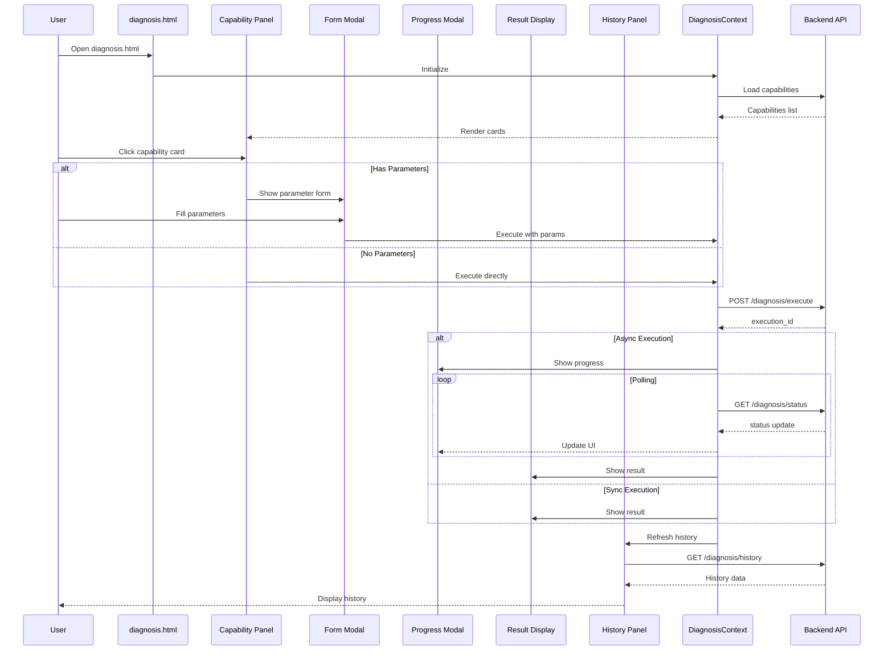
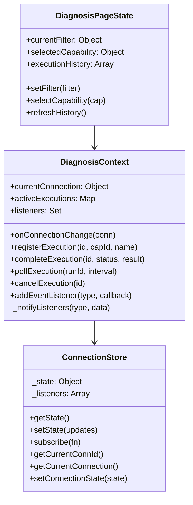
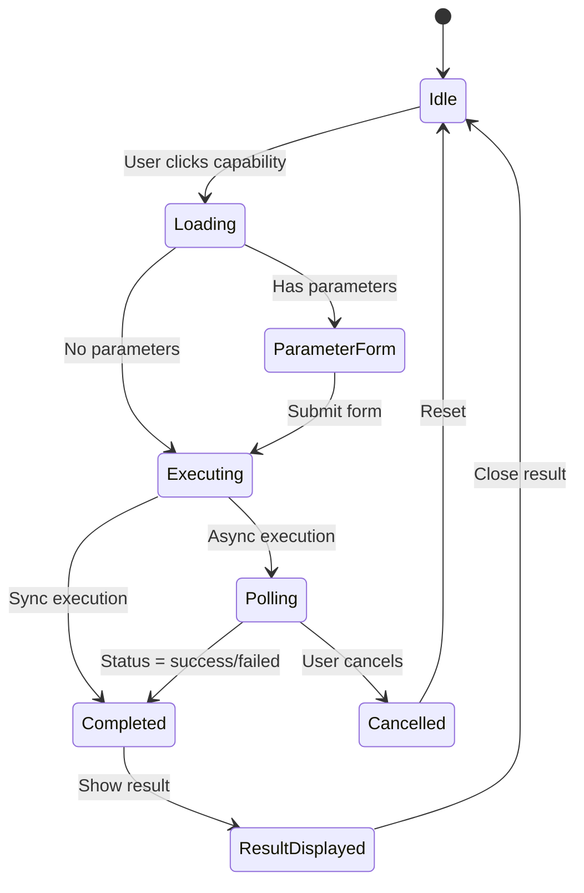

# Phase 4: 诊断能力前端架构设计

> **Author:** Bob (Software Architect)
> **Date:** 2025-05-25
> **Version:** 1.0
> **Status:** Draft

## 1. Overview

Phase 4 focuses on implementing the diagnosis capability frontend interface for the K8s Arthas intelligent diagnostic platform. This phase builds upon the existing vanilla JavaScript + HTML + CSS architecture established in earlier phases, creating a cohesive, interactive diagnosis experience.

### 1.1 Objectives

1. Create a dedicated diagnosis center page (`diagnosis.html`)
2. Integrate existing diagnosis components into a unified UI
3. Implement real-time execution progress tracking
4. Provide comprehensive diagnostic report viewing
5. Ensure responsive design across devices

### 1.2 Current State Analysis

**Existing Components:**
- `diagnosis.js` - Capability cards list and execution
- `diagnosis-form.js` - Dynamic parameter form generation
- `diagnosis-execution.js` - Execution context tracking
- `diagnosis-progress.js` - Multi-step scenario progress
- `diagnosis-result.js` - Result display
- `diagnosis-renderer.js` - Smart result rendering (table/file/markdown)
- `diagnosis-history.js` - Historical records
- `diagnosis-context.js` - Global state management

**Existing APIs:**
- `POST /api/diagnosis/execute` - Execute diagnosis
- `GET /api/diagnosis/status/<exec_id>` - Poll execution status
- `POST /api/diagnosis/cancel/<exec_id>` - Cancel execution

**Missing Pieces:**
- Dedicated `diagnosis.html` page
- Unified layout for all diagnosis components
- History panel integration
- Real-time progress sidebar

## 2. Architecture Design

### 2.1 Page Architecture

```
┌─────────────────────────────────────────────────────────────────────────────┐
│                           diagnosis.html                                    │
│  ┌───────────────────────────────────────────────────────────────────────┐  │
│  │                      Page Shell (Navigation + Context Bar)            │  │
│  └───────────────────────────────────────────────────────────────────────┘  │
│                                                                             │
│  ┌───────────────────────────────────────────────────────────────────────┐  │
│  │                                                                       │  │
│  │  ┌──────────────────────┐  ┌─────────────────────────────────────┐   │  │
│  │  │                      │  │                                     │   │  │
│  │  │  Capability Panel    │  │      Execution Panel                │   │  │
│  │  │  ┌────────────────┐  │  │  ┌─────────────────────────────┐   │   │  │
│  │  │  │ Filter Tabs    │  │  │  │  Parameter Form Modal       │   │   │  │
│  │  │  │ [All][L1][L2]  │  │  │  │  (diagnosis-form.js)        │   │   │  │
│  │  │  │ [L3][L4]       │  │  │  └─────────────────────────────┘   │   │  │
│  │  │  └────────────────┘  │  │                                     │   │  │
│  │  │                      │  │  ┌─────────────────────────────┐   │   │  │
│  │  │  ┌────────────────┐  │  │  │  Progress Modal             │   │   │  │
│  │  │  │ Capability     │  │  │  │  (diagnosis-progress.js)    │   │   │  │
│  │  │  │ Cards Grid     │  │  │  └─────────────────────────────┘   │   │  │
│  │  │  │ (diagnosis.js) │  │  │                                     │   │  │
│  │  │  │                │  │  │  ┌─────────────────────────────┐   │   │  │
│  │  │  │ ┌────┐ ┌────┐  │  │  │  │  Result Display             │   │   │  │
│  │  │  │ │Card│ │Card│  │  │  │  │  (diagnosis-result.js)      │   │   │  │
│  │  │  │ └────┘ └────┘  │  │  │  │  + diagnosis-renderer.js    │   │   │  │
│  │  │  │ ┌────┐ ┌────┐  │  │  │  └─────────────────────────────┘   │   │  │
│  │  │  │ │Card│ │Card│  │  │  │                                     │   │  │
│  │  │  │ └────┘ └────┘  │  │  └─────────────────────────────────────┘   │  │
│  │  │  └────────────────┘  │                                             │  │
│  │  │                      │                                             │  │
│  │  └──────────────────────┘                                             │  │
│  │                                                                       │  │
│  └───────────────────────────────────────────────────────────────────────┘  │
│                                                                             │
│  ┌───────────────────────────────────────────────────────────────────────┐  │
│  │                      Execution Indicator Bar                          │  │
│  │  [⟳ 2 个诊断执行中] [查看详情]                                        │  │
│  └───────────────────────────────────────────────────────────────────────┘  │
│                                                                             │
│  ┌───────────────────────────────────────────────────────────────────────┐  │
│  │                      History Panel (Bottom Drawer)                    │  │
│  │  [历史记录表格 + 分页] (diagnosis-history.js)                         │  │
│  └───────────────────────────────────────────────────────────────────────┘  │
└─────────────────────────────────────────────────────────────────────────────┘
```

### 2.2 Component Integration Diagram

```mermaid
graph TB
    subgraph "diagnosis.html"
        A[Page Shell]
        B[Capability Panel]
        C[Execution Panel]
        D[History Panel]
        E[Execution Indicator]
    end
    
    subgraph "Components"
        F[diagnosis.js]
        G[diagnosis-form.js]
        H[diagnosis-execution.js]
        I[diagnosis-progress.js]
        J[diagnosis-result.js]
        K[diagnosis-renderer.js]
        L[diagnosis-history.js]
    end
    
    subgraph "Core"
        M[diagnosis-context.js]
        N[connection-store.js]
    end
    
    subgraph "API"
        O[/api/diagnosis/execute]
        P[/api/diagnosis/status/]
        Q[/api/tasks/diagnosis/history]
    end
    
    A --> F
    B --> F
    C --> G
    C --> I
    C --> J
    C --> K
    D --> L
    E --> H
    
    F --> M
    G --> F
    H --> M
    I --> M
    J --> K
    
    F --> O
    H --> P
    L --> Q
    
    M --> N
```

### 2.3 Data Flow



## 3. File Structure

### 3.1 New Files

```
static/
├── diagnosis.html                    # NEW: Diagnosis center page
└── js/
    └── diagnosis-page.js             # NEW: Page initialization logic
```

### 3.2 Modified Files

```
static/
├── index.html                        # MODIFY: Add diagnosis nav link
├── css/
│   └── app.css                       # MODIFY: Add diagnosis styles
└── js/
    └── app-ui.js                     # MODIFY: Add diagnosis tab support
```

### 3.3 Existing Files (No Changes)

```
static/js/
├── components/
│   ├── diagnosis.js                  # Capability cards (EXISTING)
│   ├── diagnosis-form.js             # Parameter form (EXISTING)
│   ├── diagnosis-execution.js        # Execution tracking (EXISTING)
│   ├── diagnosis-progress.js         # Progress display (EXISTING)
│   ├── diagnosis-result.js           # Result display (EXISTING)
│   ├── diagnosis-renderer.js         # Smart rendering (EXISTING)
│   └── diagnosis-history.js          # History records (EXISTING)
├── core/
│   ├── diagnosis-context.js          # State management (EXISTING)
│   └── connection-store.js           # Connection state (EXISTING)
└── components/
    └── conn-status-bar.js            # Connection status bar (EXISTING)
```

## 4. Component Design

### 4.1 Page Layout Structure

```html
<!-- diagnosis.html -->
<div id="diagnosis-page" class="page-container">
    <!-- Top Navigation (shared) -->
    <header class="page-header">
        <nav class="main-nav">...</nav>
        <div class="connection-context-bar">...</div>
    </header>
    
    <!-- Main Content -->
    <main class="page-content">
        <!-- Left Panel: Capabilities -->
        <section class="capability-panel">
            <div class="panel-header">
                <h2>诊断能力</h2>
                <div class="filter-tabs">...</div>
            </div>
            <div id="diagnosisCapList" class="capability-grid"></div>
        </section>
        
        <!-- Right Panel: Execution Area -->
        <section class="execution-panel">
            <div id="diagResultContainer" class="result-container"></div>
            <div id="diagHistoryContainer" class="history-container"></div>
        </section>
    </main>
    
    <!-- Bottom Execution Indicator -->
    <div id="executionIndicator" class="execution-indicator"></div>
    
    <!-- Modals -->
    <div id="diagFormModal" class="modal-overlay"></div>
    <div id="diagProgressModal" class="modal-overlay"></div>
    <div id="diagLoadingOverlay" class="loading-overlay"></div>
</div>
```

### 4.2 Component Integration Points

| Component | Integration Method | Trigger |
|-----------|-------------------|---------|
| `diagnosis.js` | `diagCapInit()` | Page load |
| `diagnosis-form.js` | `diagShowParameterForm(capId)` | Card click |
| `diagnosis-execution.js` | Auto | Execution registered |
| `diagnosis-progress.js` | `diagShowProgress(name, steps)` | Scenario execution |
| `diagnosis-result.js` | `diagRenderResult(result, cap)` | Execution complete |
| `diagnosis-renderer.js` | `renderDiagnosisResult(result, cap)` | Result display |
| `diagnosis-history.js` | `diagHistoryInit()` | Tab switch / refresh |

## 5. State Management

### 5.1 State Architecture



### 5.2 Event Flow



## 6. API Integration

### 6.1 API Endpoints

| Endpoint | Method | Purpose |
|----------|--------|---------|
| `/api/tasks/capabilities` | GET | List capabilities |
| `/api/tasks/capabilities/:id` | GET | Get capability detail |
| `/api/diagnosis/execute` | POST | Execute diagnosis |
| `/api/diagnosis/status/:id` | GET | Poll execution status |
| `/api/diagnosis/cancel/:id` | POST | Cancel execution |
| `/api/tasks/diagnosis/history` | GET | Get history records |
| `/api/tasks/runs/:id/logs` | GET | Get run logs |

### 6.2 API Response Format

```javascript
// Success
{
    "ok": true,
    "data": { ... }
}

// Error
{
    "ok": false,
    "error": "Error message"
}
```

### 6.3 Polling Strategy

| Scenario | Polling Interval | Max Attempts |
|----------|-----------------|--------------|
| Execution status | 2000ms | 150 |
| Connection health | 30000ms | ∞ |

## 7. UI/UX Design

### 7.1 Page Layout

```
┌─────────────────────────────────────────────────────────────────────────────┐
│  🏠 K8s Arthas │ 🔗 连接 │ 🧠 诊断 │ 📦 任务 │ 🛠 工具 │ 👤 admin         │
├─────────────────────────────────────────────────────────────────────────────┤
│  cluster: dev │ namespace: default │ pod: my-app-xxx │ Status: Arthas Ready│
├─────────────────────────────────────────────────────────────────────────────┤
│                                                                             │
│  ┌───────────────────────────────────────────────────────────────────────┐  │
│  │  诊断能力                                                             │  │
│  │  ┌─────┐ ┌─────┐ ┌─────┐ ┌─────┐                                    │  │
│  │  │ 全部 │ │ L1  │ │ L2  │ │ L3  │                                    │  │
│  │  └─────┘ └─────┘ └─────┘ └─────┘                                    │  │
│  └───────────────────────────────────────────────────────────────────────┘  │
│                                                                             │
│  ┌──────────────────────┐  ┌────────────────────────────────────────────┐  │
│  │                      │  │                                            │  │
│  │  L1 - 快速工具       │  │  [诊断结果区域]                            │  │
│  │  ┌────────────────┐  │  │                                            │  │
│  │  │ jstack         │  │  │  执行结果: xxxxx                           │  │
│  │  │ [执行诊断]     │  │  │  命令: jstack <pid>                        │  │
│  │  └────────────────┘  │  │  耗时: 2.5s                               │  │
│  │  ┌────────────────┐  │  │                                            │  │
│  │  │ jmap           │  │  │  [下载结果] [关闭]                         │  │
│  │  │ [配置参数]     │  │  │                                            │  │
│  │  └────────────────┘  │  └────────────────────────────────────────────┘  │
│  │                      │                                                │  │
│  │  L2 - 诊断工具       │  ┌────────────────────────────────────────────┐  │
│  │  ┌────────────────┐  │  │                                            │  │
│  │  │ trace          │  │  │  历史记录                                  │  │
│  │  │ [配置参数]     │  │  │  ┌──────┬──────┬──────┬──────┐           │  │
│  │  └────────────────┘  │  │  │ 任务 │ 状态 │ 时间 │ 操作 │           │  │
│  │                      │  │  ├──────┼──────┼──────┼──────┤           │  │
│  │                      │  │  │ jstack│ 成功 │ 10s  │ 查看 │           │  │
│  │                      │  │  └──────┴──────┴──────┴──────┘           │  │
│  └──────────────────────┘  └────────────────────────────────────────────┘  │
│                                                                             │
├─────────────────────────────────────────────────────────────────────────────┤
│  [⟳ 1 个诊断执行中] [查看详情]                                              │
└─────────────────────────────────────────────────────────────────────────────┘
```

### 7.2 Responsive Design

| Breakpoint | Layout | Capability Grid |
|------------|--------|-----------------|
| Desktop (>992px) | 2-column | 4 cards/row |
| Tablet (768-992px) | 2-column | 3 cards/row |
| Mobile (<768px) | 1-column | 2 cards/row |

## 8. Task Decomposition

### 8.1 Task List

| Task ID | Task Name | Files | Dependencies | Priority |
|---------|-----------|-------|--------------|----------|
| T01 | Project Infrastructure | diagnosis.html, diagnosis-page.js, app.css | None | P0 |
| T02 | Page Layout and Navigation | diagnosis.html, app-ui.js, conn-status-bar.js | T01 | P0 |
| T03 | Capability Panel Integration | diagnosis.js, diagnosis-form.js | T02 | P0 |
| T04 | Execution and Result Display | diagnosis-execution.js, diagnosis-progress.js, diagnosis-result.js | T03 | P0 |
| T05 | History Panel and Polish | diagnosis-history.js, app.css | T04 | P1 |

### 8.2 Task Details

#### T01: Project Infrastructure
- Create `static/diagnosis.html` with basic HTML structure
- Create `static/js/diagnosis-page.js` for page initialization
- Add diagnosis styles to `static/css/app.css`

#### T02: Page Layout and Navigation
- Implement page shell with navigation
- Integrate connection context bar
- Add tab switching support

#### T03: Capability Panel Integration
- Initialize `diagnosis.js` on page load
- Connect capability cards to form and execution
- Implement filter functionality

#### T04: Execution and Result Display
- Connect `diagnosis-execution.js` to UI
- Implement progress modal display
- Integrate result rendering

#### T05: History Panel and Polish
- Initialize `diagnosis-history.js`
- Add history refresh on execution complete
- Final styling and responsive adjustments

## 9. Implementation Guidelines

### 9.1 Script Loading Order

```html
<!-- Core modules -->
<script src="/js/core/connection-store.js"></script>
<script src="/js/core/diagnosis-context.js"></script>

<!-- Components -->
<script src="/js/components/diagnosis.js"></script>
<script src="/js/components/diagnosis-form.js"></script>
<script src="/js/components/diagnosis-execution.js"></script>
<script src="/js/components/diagnosis-progress.js"></script>
<script src="/js/components/diagnosis-result.js"></script>
<script src="/js/components/diagnosis-renderer.js"></script>
<script src="/js/components/diagnosis-history.js"></script>

<!-- Page initialization -->
<script src="/js/diagnosis-page.js"></script>
```

### 9.2 Initialization Sequence

```javascript
// diagnosis-page.js
document.addEventListener('DOMContentLoaded', async () => {
    // 1. Initialize connection store
    ConnectionStore.init();
    
    // 2. Load current connection
    await loadCurrentConnection();
    
    // 3. Initialize diagnosis context
    DiagnosisContext.onConnectionChange(ConnectionStore.getCurrentConnection());
    
    // 4. Initialize capability panel
    await diagCapInit();
    
    // 5. Initialize history panel
    await diagHistoryInit();
    
    // 6. Set up event listeners
    setupEventListeners();
});
```

### 9.3 Error Handling

```javascript
// Global error handler for diagnosis operations
window.addEventListener('unhandledrejection', (event) => {
    console.error('Unhandled promise rejection:', event.reason);
    showErrorNotification('操作失败，请重试');
});
```

## 10. Shared Knowledge

1. **API Response Format**: All API responses use `{ok, data/error}` format
2. **Authentication**: Uses JWT tokens from existing auth system
3. **State Management**: DiagnosisContext for execution state, ConnectionStore for connection state
4. **Component Communication**: Global functions (window.diagXxx) for inter-component communication
5. **Error Display**: Use `showErrorNotification()` or `alert()` for errors
6. **Loading States**: Use `showLoading()` / `hideLoading()` for async operations

## 11. Risks and Mitigations

| Risk | Impact | Mitigation |
|------|--------|------------|
| Component conflicts | Medium | Use IIFE pattern, unique function names |
| State synchronization | Medium | Centralized state management |
| Polling performance | Low | Debounce polling, limit concurrent requests |
| Mobile responsiveness | Low | Use CSS Grid/Flexbox, test on devices |

## 12. Future Enhancements

### 12.1 P1 Enhancements
- WebSocket for real-time updates
- Offline capability caching
- Keyboard shortcuts

### 12.2 P2 Enhancements
- Custom dashboard layout
- Export capabilities
- Advanced filtering

---

**Document End**
