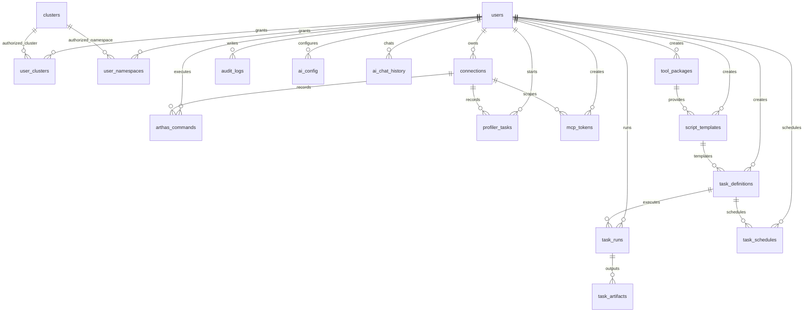

# K8s Arthas Tool 数据库表设计

| 项目 | 内容 |
|---|---|
| 数据库 | SQLite |
| 默认文件 | `arthas.db` |
| 当前依据 | `models/db.py`、`api/ai_chat.py`、`api/mcp_proxy.py`、`api/task_center.py`、`server.py` |
| 更新时间 | 2026-05-02 |

## 1. 总览

当前工程的数据库表由四类初始化入口共同维护：

| 初始化入口 | 主要职责 | 相关表 |
|---|---|---|
| `models/db.py::Database.initialize()` | 用户、授权、集群、连接、命令、采样任务、审计核心表 | `users`、`user_clusters`、`user_namespaces`、`clusters`、`connections`、`arthas_commands`、`profiler_tasks`、`audit_logs` |
| `api/ai_chat.py::init_ai_tables()` | AI 配置和聊天记录 | `ai_config`、`ai_chat_history` |
| `api/mcp_proxy.py::init_mcp_tables()` | MCP 访问令牌 | `mcp_tokens` |
| `api/task_center.py::init_task_tables()` | 工具包、脚本模板、任务定义、任务运行、产物、调度 | `tool_packages`、`script_templates`、`task_definitions`、`task_runs`、`task_artifacts`、`task_schedules` |

> 注意：旧文档中的 `profiler_logs` 已不再作为当前代码初始化表。当前采样日志/进度主要保存在 `profiler_tasks.message` 和 `profiler_tasks.progress` 中；`server.py` 中仍保留兼容性的日志接口名称。

## 2. 核心实体关系



## 3. 认证、授权与集群

### 3.1 `users`

用户账号表，由 `models/db.py` 初始化。

| 字段 | 类型 | 约束/默认值 | 说明 |
|---|---|---|---|
| `id` | INTEGER | PRIMARY KEY AUTOINCREMENT | 用户 ID |
| `username` | TEXT | UNIQUE NOT NULL | 登录名 |
| `password_hash` | TEXT | NOT NULL | bcrypt 密码哈希 |
| `role` | TEXT | DEFAULT `'user'` | 角色：`admin` / `user` |
| `status` | TEXT | DEFAULT `'active'` | 状态：`active` / 禁用态 |
| `created_at` | TIMESTAMP | DEFAULT CURRENT_TIMESTAMP | 创建时间 |
| `updated_at` | TIMESTAMP | DEFAULT CURRENT_TIMESTAMP | 更新时间 |

初始化行为：首次初始化且用户数为 0 时创建默认管理员 `admin/admin123`。

### 3.2 `clusters`

集群配置表，由 `models/db.py` 初始化，数据可从 `clusters.json` 同步。

| 字段 | 类型 | 约束/默认值 | 说明 |
|---|---|---|---|
| `id` | TEXT | PRIMARY KEY | 集群唯一标识 |
| `name` | TEXT | NOT NULL | 集群显示名 |
| `kubeconfig` | TEXT | NULL | kubeconfig 内容或路径引用 |
| `context` | TEXT | NULL | kubectl context |
| `created_at` | TIMESTAMP | DEFAULT CURRENT_TIMESTAMP | 创建时间 |

### 3.3 `user_clusters`

用户到集群的授权表，由 `models/db.py` 初始化。

| 字段 | 类型 | 约束/默认值 | 说明 |
|---|---|---|---|
| `id` | INTEGER | PRIMARY KEY AUTOINCREMENT | 授权记录 ID |
| `user_id` | INTEGER | NOT NULL, FK → `users.id` ON DELETE CASCADE | 用户 ID |
| `cluster_id` | TEXT | NOT NULL | 集群 ID |
| `created_at` | TIMESTAMP | DEFAULT CURRENT_TIMESTAMP | 创建时间 |

唯一约束：`UNIQUE(user_id, cluster_id)`。

兼容说明：已有旧库可能缺少 `created_at` 字段，因为当前代码没有为该字段提供迁移逻辑。

### 3.4 `user_namespaces`

用户到集群命名空间的精细授权表，由 `models/db.py` 初始化。

| 字段 | 类型 | 约束/默认值 | 说明 |
|---|---|---|---|
| `id` | INTEGER | PRIMARY KEY AUTOINCREMENT | 授权记录 ID |
| `user_id` | INTEGER | NOT NULL, FK → `users.id` ON DELETE CASCADE | 用户 ID |
| `cluster_id` | TEXT | NOT NULL | 集群 ID |
| `namespace` | TEXT | NOT NULL | 命名空间 |
| `created_at` | TIMESTAMP | DEFAULT CURRENT_TIMESTAMP | 创建时间 |

唯一约束：`UNIQUE(user_id, cluster_id, namespace)`。

使用位置：`services/authorization_service.py`、`api/users.py`。

## 4. Arthas 连接与诊断

### 4.1 `connections`

Pod / Arthas 连接记录表，由 `models/db.py` 初始化。

| 字段 | 类型 | 约束/默认值 | 说明 |
|---|---|---|---|
| `id` | TEXT | PRIMARY KEY | 连接 ID，通常为 `{cluster}/{namespace}/{pod}` |
| `cluster_name` | TEXT | NOT NULL | 集群名称/ID |
| `namespace` | TEXT | NOT NULL | 命名空间 |
| `pod_name` | TEXT | NOT NULL | Pod 名称 |
| `level` | TEXT | NOT NULL DEFAULT `'arthas'` | 连接层级：`pod` / `arthas` |
| `local_port` | INTEGER | NULL | 本地 port-forward 端口 |
| `user_id` | INTEGER | FK → `users.id` ON DELETE SET NULL | 连接所属用户 |
| `updated_at` | TIMESTAMP | DEFAULT CURRENT_TIMESTAMP | 更新时间 |

迁移逻辑：若旧表缺少 `level`，启动时执行 `ALTER TABLE connections ADD COLUMN level TEXT NOT NULL DEFAULT 'arthas'`。

兼容说明：已有旧库可能保留 `created_at` 字段；当前 `CREATE TABLE` 语句不再声明该字段。

设计规划：`connections.level` 已存在，用于区分 `pod` / `arthas` 连接层级；`user_id` 已存在，用于连接归属。连接健康检查和连接列表只需要在现有字段基础上补充 `container_name`、`java_pid`、`arthas_version`、`last_ping_at`、`status` 等字段，并增加以下索引：

```sql
CREATE INDEX idx_connections_user ON connections(user_id, last_ping_at DESC);
CREATE INDEX idx_connections_status ON connections(cluster_name, namespace, pod_name, status);
```

### 4.2 `arthas_commands`

Arthas 命令执行历史表，由 `models/db.py` 初始化。

| 字段 | 类型 | 约束/默认值 | 说明 |
|---|---|---|---|
| `id` | INTEGER | PRIMARY KEY AUTOINCREMENT | 命令记录 ID |
| `connection_id` | TEXT | NOT NULL, FK → `connections.id` ON DELETE CASCADE | 连接 ID |
| `user_id` | INTEGER | FK → `users.id` ON DELETE SET NULL | 执行用户 |
| `command` | TEXT | NOT NULL | Arthas 命令 |
| `output` | TEXT | NULL | 命令输出 |
| `error` | TEXT | NULL | 错误信息 |
| `timestamp` | TIMESTAMP | DEFAULT CURRENT_TIMESTAMP | 执行时间 |

使用位置：`server.py` 的 Arthas 执行和命令历史接口。

### 4.3 `profiler_tasks`

采样和 dump 任务表，由 `models/db.py` 初始化。

| 字段 | 类型 | 约束/默认值 | 说明 |
|---|---|---|---|
| `id` | TEXT | PRIMARY KEY | 任务 ID |
| `connection_id` | TEXT | NOT NULL, FK → `connections.id` ON DELETE CASCADE | 连接 ID |
| `user_id` | INTEGER | FK → `users.id` ON DELETE SET NULL | 发起用户 |
| `type` | TEXT | NOT NULL | 任务类型，如 `cpu`、`jfr`、`thread`、`heap` |
| `status` | TEXT | DEFAULT `'pending'` | 状态：`pending`、`running`、`completed`、`failed`、`stopped` 等 |
| `cluster_name` | TEXT | NULL | 集群名称/ID |
| `namespace` | TEXT | NULL | 命名空间 |
| `pod_name` | TEXT | NULL | Pod 名称 |
| `mode` | TEXT | NULL | profiler 模式 |
| `event` | TEXT | NULL | profiler 事件 |
| `duration` | INTEGER | NULL | 采样时长，单位秒 |
| `format` | TEXT | NULL | 输出格式 |
| `output_path` | TEXT | NULL | 本地产物路径 |
| `progress` | INTEGER | DEFAULT 0 | 进度百分比 |
| `message` | TEXT | NULL | 当前任务消息/日志摘要 |
| `created_at` | TIMESTAMP | DEFAULT CURRENT_TIMESTAMP | 创建时间 |
| `updated_at` | TIMESTAMP | DEFAULT CURRENT_TIMESTAMP | 更新时间 |

日志设计：当前代码不再依赖独立 `profiler_logs` 表，任务轮询接口直接从 `message` 和 `progress` 读取状态。

### 4.4 `audit_logs`

审计日志表，由 `models/db.py` 初始化。

| 字段 | 类型 | 约束/默认值 | 说明 |
|---|---|---|---|
| `id` | INTEGER | PRIMARY KEY AUTOINCREMENT | 审计 ID |
| `user_id` | INTEGER | FK → `users.id` ON DELETE SET NULL | 操作用户 |
| `action` | TEXT | NOT NULL | 动作类型 |
| `resource_type` | TEXT | NULL | 资源类型 |
| `resource_id` | TEXT | NULL | 资源 ID |
| `details` | TEXT | NULL | JSON 或文本详情 |
| `ip_address` | TEXT | NULL | 客户端 IP |
| `user_agent` | TEXT | NULL | User-Agent |
| `timestamp` | TIMESTAMP | DEFAULT CURRENT_TIMESTAMP | 操作时间 |

使用位置：`services/audit_service.py`。

## 5. AI 与 MCP

### 5.1 `ai_config`

用户级 AI 配置表，由 `api/ai_chat.py::init_ai_tables()` 初始化。

| 字段 | 类型 | 约束/默认值 | 说明 |
|---|---|---|---|
| `id` | INTEGER | PRIMARY KEY AUTOINCREMENT | 配置 ID |
| `user_id` | INTEGER | NOT NULL UNIQUE, FK → `users.id` ON DELETE CASCADE | 用户 ID |
| `api_key` | TEXT | NOT NULL DEFAULT `''` | API Key，Ollama 等本地模型可为空字符串 |
| `base_url` | TEXT | NOT NULL | 服务地址 |
| `model` | TEXT | NOT NULL | 模型名称 |
| `provider` | TEXT | DEFAULT `'openai'` | 提供商 |
| `system_prompt` | TEXT | NULL | 系统提示词 |
| `created_at` | TIMESTAMP | DEFAULT CURRENT_TIMESTAMP | 创建时间 |
| `updated_at` | TIMESTAMP | DEFAULT CURRENT_TIMESTAMP | 更新时间 |

索引：`idx_ai_config_user(user_id)`。

迁移逻辑：旧表缺少 `provider` 时执行 `ALTER TABLE ai_config ADD COLUMN provider TEXT DEFAULT 'openai'`。

### 5.2 `ai_chat_history`

AI 对话历史表，由 `api/ai_chat.py::init_ai_tables()` 初始化。

| 字段 | 类型 | 约束/默认值 | 说明 |
|---|---|---|---|
| `id` | INTEGER | PRIMARY KEY AUTOINCREMENT | 记录 ID |
| `user_id` | INTEGER | NOT NULL, FK → `users.id` ON DELETE CASCADE | 用户 ID |
| `role` | TEXT | NOT NULL | 消息角色：`user` / `assistant` 等 |
| `content` | TEXT | NOT NULL | 消息内容 |
| `created_at` | TIMESTAMP | DEFAULT CURRENT_TIMESTAMP | 创建时间 |

索引：`idx_ai_chat_user(user_id, created_at)`。

### 5.3 `mcp_tokens`

MCP 访问令牌表，由 `api/mcp_proxy.py::init_mcp_tables()` 初始化。

| 字段 | 类型 | 约束/默认值 | 说明 |
|---|---|---|---|
| `id` | INTEGER | PRIMARY KEY AUTOINCREMENT | Token 记录 ID |
| `token` | TEXT | UNIQUE NOT NULL | 访问令牌 |
| `name` | TEXT | NOT NULL | Token 名称 |
| `user_id` | INTEGER | NOT NULL, FK → `users.id` ON DELETE CASCADE | 创建用户 |
| `connection_id` | TEXT | NOT NULL, FK → `connections.id` ON DELETE CASCADE | 绑定连接 |
| `is_active` | INTEGER | DEFAULT 1 | 是否启用，1 表示启用 |
| `created_at` | TIMESTAMP | DEFAULT CURRENT_TIMESTAMP | 创建时间 |
| `last_used_at` | TIMESTAMP | NULL | 最近使用时间 |

索引：`idx_mcp_tokens_token(token)`、`idx_mcp_tokens_user(user_id)`。

## 6. 任务中心与工具箱

### 6.0 产品边界说明

- **工具箱中心**负责登记工具包（toolbox packages）：工具类型、版本、来源地址、本地缓存、安装路径、校验信息和启停状态。
- **扩展能力工作台**负责脚本来源、模板库、大编辑器、参数 Schema、渲染预览、预检、试运行和发布。
- **任务中心**负责执行工具和扩展能力：把工具分发到本机或 Pod，执行诊断/验证/采样脚本，记录运行状态、stdout/stderr、耗时、失败原因和产物。
- **jattach 分发任务**建议落在 `task_runs`：目标写入 `target_json`，分发日志写入 `stdout/stderr`，验证结果写入 `stdout`，二进制路径或校验报告写入 `task_artifacts`。

### 6.1 `tool_packages`

工具包表，由 `api/task_center.py::init_task_tables()` 初始化。

当前代码已支持 `tool_type` 为 `arthas`、`async-profiler`、`jattach`、`generic`。规划中的工具箱中心继续复用该表承载 Arthas Boot、Arthas Tunnel Server、jattach 等工具包；其中 jattach 默认纳入 `v2.2`，并按 x86_64/arm64 两种架构分别登记下载源和本地缓存。

| 字段 | 类型 | 约束/默认值 | 说明 |
|---|---|---|---|
| `id` | INTEGER | PRIMARY KEY AUTOINCREMENT | 工具包 ID |
| `name` | TEXT | NOT NULL UNIQUE | 工具包名称 |
| `description` | TEXT | NULL | 描述 |
| `source_type` | TEXT | DEFAULT `'local'` | 来源类型 |
| `source_url` | TEXT | NULL | 来源 URL |
| `version` | TEXT | NULL | 版本 |
| `checksum` | TEXT | NULL | 兼容旧字段的校验值 |
| `tool_type` | TEXT | DEFAULT `'generic'` | 工具类型 |
| `file_path` | TEXT | NULL | 本地文件路径 |
| `file_name` | TEXT | NULL | 文件名 |
| `file_size` | INTEGER | DEFAULT 0 | 文件大小 |
| `sha256` | TEXT | NULL | SHA-256 |
| `install_path` | TEXT | NULL | 安装路径 |
| `is_builtin` | INTEGER | DEFAULT 0 | 是否内置工具 |
| `last_verified_at` | TIMESTAMP | NULL | 最近校验时间 |
| `status` | TEXT | DEFAULT `'active'` | 状态 |
| `created_by` | INTEGER | FK → `users.id` ON DELETE SET NULL | 创建用户 |
| `created_at` | TIMESTAMP | DEFAULT CURRENT_TIMESTAMP | 创建时间 |
| `updated_at` | TIMESTAMP | DEFAULT CURRENT_TIMESTAMP | 更新时间 |

迁移逻辑：`tool_type`、`file_path`、`file_name`、`file_size`、`sha256`、`install_path`、`is_builtin`、`last_verified_at` 缺失时逐列 `ALTER TABLE` 补齐。

工具箱中心产品化时，建议继续补充兼容性与健康检查字段：

| 建议字段 | 类型 | 说明 |
|---|---|---|
| `min_jdk_version` | TEXT | 最低兼容 JDK 主版本，例如 `8` |
| `max_jdk_version` | TEXT | 最高兼容 JDK 主版本，可为空表示不限制 |
| `arch` | TEXT | `noarch` / `x86_64` / `arm64`，用于自动选择工具包 |
| `package_format` | TEXT | `jar` / `tgz` / `zip` / `bin` / `file` |
| `download_url` | TEXT | 官方源、内网源或上传源的实际下载地址；可与旧 `source_url` 兼容 |
| `last_sync_at` | TIMESTAMP | 最近同步下载源时间 |
| `is_latest` | INTEGER | 是否为当前工具类型下最新版本 |
| `compatibility_notes` | TEXT | 兼容性说明和已知问题 |
| `health_status` | TEXT | `unknown` / `healthy` / `failed` / `deprecated` |

工具包健康检查至少包含本地文件存在性、SHA256 校验、JDK 版本匹配、架构匹配和最近同步状态；分发失败摘要可写入任务运行日志，不建议在该表保存大文本日志。

#### jattach 工具包登记建议

| 字段 | x86_64 建议值 | arm64 建议值 |
|---|---|---|
| `name` | `jattach-v2.2-linux-x64` | `jattach-v2.2-linux-arm64` |
| `tool_type` | `jattach` | `jattach` |
| `version` | `v2.2` | `v2.2` |
| `source_type` | `download` | `download` |
| `source_url` | `https://github.com/jattach/jattach/releases/download/v2.2/jattach-linux-x64.tgz` | `https://github.com/jattach/jattach/releases/download/v2.2/jattach-linux-arm64.tgz` |
| `file_name` | `jattach-linux-x64.tgz` | `jattach-linux-arm64.tgz` |
| `install_path` | `/tmp/arthas-tools/jattach` | `/tmp/arthas-tools/jattach` |
| `status` | `active` | `active` |

当前代码表结构还没有独立的 `extracted_path`、`is_default` 字段。近期实现可以先把架构写入 `name` 或 `description`，并用 `tool_type='jattach' + version + name` 区分；后续工具箱中心产品化时建议补充以下字段：

| 建议字段 | 类型 | 说明 |
|---|---|---|
| `extracted_path` | TEXT | 解压后的可执行文件或目录路径，例如 jattach 二进制缓存路径 |
| `is_default` | INTEGER | 同一 `tool_type + arch` 下默认版本标记 |

### 6.2 `script_templates`

脚本模板表，由 `api/task_center.py::init_task_tables()` 初始化。

现有表可以继续作为扩展能力模板表使用，但需要从“脚本存储”升级为“可执行模板”。内置模板必须有参数 Schema、执行位置、风险级别和使用说明，前端才能直接生成可运行表单，而不是只展示不可用脚本文本。

| 字段 | 类型 | 约束/默认值 | 说明 |
|---|---|---|---|
| `id` | INTEGER | PRIMARY KEY AUTOINCREMENT | 模板 ID |
| `name` | TEXT | NOT NULL | 模板名称 |
| `runtime` | TEXT | NOT NULL DEFAULT `'python'` | 运行时 |
| `script_body` | TEXT | NOT NULL | 脚本内容 |
| `default_timeout` | INTEGER | DEFAULT 60 | 默认超时秒数 |
| `description` | TEXT | NULL | 描述 |
| `parameters_schema` | TEXT | DEFAULT `'{}'` | 参数 JSON Schema |
| `tool_package_id` | INTEGER | FK → `tool_packages.id` ON DELETE SET NULL | 关联工具包 |
| `created_by` | INTEGER | FK → `users.id` ON DELETE SET NULL | 创建用户 |
| `created_at` | TIMESTAMP | DEFAULT CURRENT_TIMESTAMP | 创建时间 |
| `updated_at` | TIMESTAMP | DEFAULT CURRENT_TIMESTAMP | 更新时间 |

#### 扩展能力模板字段规划

| 建议字段 | 类型 | 说明 |
|---|---|---|
| `template_type` | TEXT | `diagnosis` / `tool-distribution` / `online-fix` / `inspection` / `ai-analysis` / `file-operation` |
| `source_type` | TEXT | `builtin` / `custom` / `copied` / `uploaded` / `saved-from-run` / `git-url` |
| `source_ref` | TEXT | 原始模板 ID、上传文件名、URL 或历史运行 ID |
| `version` | TEXT | 模板版本，用于内置模板升级和任务快照追踪 |
| `risk_level` | TEXT | `low` / `medium` / `high` |
| `execution_target` | TEXT | `node` / `pod` / `arthas-session` / `mixed` |
| `example_params_json` | TEXT | 示例参数，模板卡片和试运行默认值使用 |
| `help_markdown` | TEXT | 使用说明、适用场景、失败建议 |
| `is_builtin` | INTEGER | 是否内置模板；内置模板只读，可复制编辑 |
| `is_published` | INTEGER | 是否发布到模板库，草稿不对普通用户展示 |

#### 任务定义/运行字段规划

| 表 | 建议字段 | 说明 |
|---|---|---|
| `task_definitions` | `template_version` | 创建任务时引用的模板版本 |
| `task_definitions` | `risk_level` | 执行前确认和审计使用 |
| `task_definitions` | `rendered_preview` | 参数渲染后的脚本快照，执行前展示 |
| `task_definitions` | `precheck_result_json` | 授权、目标、工具包、路径、超时等预检结果 |
| `task_runs` | `run_type` | 区分普通任务、扩展模板运行、工具分发、在线修复验证 |
| `task_runs` | `template_snapshot` | 运行时模板快照，避免模板后续修改影响历史审计 |
| `task_runs` | `log_path` | 长日志文件路径，SQLite 仅保存摘要 |

#### 在线修复记录方式

当前阶段不设计专用热更新任务表。在线修复复用现有表和文件产物：

| 记录对象 | 存储位置 | 说明 |
|---|---|---|
| `jad` / `mc` / `redefine` 命令 | `arthas_commands` | 保存命令、输出摘要、错误、执行用户和连接 ID |
| 源码与上传文件 | 本地受控目录 | 例如 `profiler_output/hotfix/{connection_id}/{timestamp}/` |
| 编译输出与 redefine 输出 | 本地受控目录 + 命令历史摘要 | 大文本落文件，数据库只保存摘要 |
| 可选任务化展示 | `task_runs` / `task_artifacts` | 如果后续要在任务中心展示，可复用通用任务表，不新增专用热更新表 |

### 6.3 `task_definitions`

任务定义表，由 `api/task_center.py::init_task_tables()` 初始化。

| 字段 | 类型 | 约束/默认值 | 说明 |
|---|---|---|---|
| `id` | INTEGER | PRIMARY KEY AUTOINCREMENT | 任务定义 ID |
| `name` | TEXT | NOT NULL | 任务名称 |
| `execution_mode` | TEXT | NOT NULL DEFAULT `'node'` | 执行模式 |
| `template_id` | INTEGER | FK → `script_templates.id` ON DELETE SET NULL | 模板 ID |
| `runtime` | TEXT | NULL | 运行时覆盖值 |
| `script_body` | TEXT | NULL | 脚本覆盖内容 |
| `timeout_seconds` | INTEGER | DEFAULT 60 | 超时秒数 |
| `params_json` | TEXT | DEFAULT `'{}'` | 参数 JSON |
| `target_json` | TEXT | DEFAULT `'{}'` | 目标 JSON |
| `status` | TEXT | DEFAULT `'active'` | 状态 |
| `created_by` | INTEGER | FK → `users.id` ON DELETE SET NULL | 创建用户 |
| `created_at` | TIMESTAMP | DEFAULT CURRENT_TIMESTAMP | 创建时间 |
| `updated_at` | TIMESTAMP | DEFAULT CURRENT_TIMESTAMP | 更新时间 |

### 6.4 `task_runs`

任务运行记录表，由 `api/task_center.py::init_task_tables()` 初始化。

| 字段 | 类型 | 约束/默认值 | 说明 |
|---|---|---|---|
| `id` | TEXT | PRIMARY KEY | 运行 ID |
| `task_id` | INTEGER | FK → `task_definitions.id` ON DELETE SET NULL | 任务定义 ID |
| `user_id` | INTEGER | FK → `users.id` ON DELETE SET NULL | 执行用户 |
| `status` | TEXT | NOT NULL DEFAULT `'pending'` | 运行状态 |
| `execution_mode` | TEXT | NOT NULL | 执行模式 |
| `target_json` | TEXT | DEFAULT `'{}'` | 执行目标 JSON |
| `stdout` | TEXT | NULL | 标准输出 |
| `stderr` | TEXT | NULL | 标准错误 |
| `exit_code` | INTEGER | NULL | 退出码 |
| `duration_ms` | INTEGER | NULL | 执行耗时毫秒 |
| `started_at` | TIMESTAMP | NULL | 开始时间 |
| `finished_at` | TIMESTAMP | NULL | 结束时间 |
| `error_message` | TEXT | NULL | 错误信息 |
| `work_dir` | TEXT | NULL | 工作目录 |
| `created_at` | TIMESTAMP | DEFAULT CURRENT_TIMESTAMP | 创建时间 |

### 6.5 `task_artifacts`

任务产物表，由 `api/task_center.py::init_task_tables()` 初始化。

| 字段 | 类型 | 约束/默认值 | 说明 |
|---|---|---|---|
| `id` | INTEGER | PRIMARY KEY AUTOINCREMENT | 产物 ID |
| `run_id` | TEXT | NOT NULL, FK → `task_runs.id` ON DELETE CASCADE | 运行 ID |
| `name` | TEXT | NOT NULL | 产物名称 |
| `path` | TEXT | NOT NULL | 产物路径 |
| `size` | INTEGER | DEFAULT 0 | 产物大小 |
| `created_at` | TIMESTAMP | DEFAULT CURRENT_TIMESTAMP | 创建时间 |

### 6.6 `task_schedules`

任务调度表，由 `api/task_center.py::init_task_tables()` 初始化。

| 字段 | 类型 | 约束/默认值 | 说明 |
|---|---|---|---|
| `id` | INTEGER | PRIMARY KEY AUTOINCREMENT | 调度 ID |
| `task_id` | INTEGER | NOT NULL, FK → `task_definitions.id` ON DELETE CASCADE | 任务定义 ID |
| `user_id` | INTEGER | FK → `users.id` ON DELETE SET NULL | 创建用户 |
| `name` | TEXT | NOT NULL | 调度名称 |
| `schedule_type` | TEXT | NOT NULL DEFAULT `'interval'` | 调度类型 |
| `interval_seconds` | INTEGER | NOT NULL DEFAULT 3600 | 间隔秒数 |
| `schedule_config_json` | TEXT | DEFAULT `'{}'` | 调度配置 JSON |
| `status` | TEXT | DEFAULT `'active'` | 状态 |
| `last_run_at` | TIMESTAMP | NULL | 上次运行时间 |
| `next_run_at` | TIMESTAMP | NULL | 下次运行时间 |
| `created_at` | TIMESTAMP | DEFAULT CURRENT_TIMESTAMP | 创建时间 |
| `updated_at` | TIMESTAMP | DEFAULT CURRENT_TIMESTAMP | 更新时间 |

### 6.7 `tool_runtime_processes`

规划表，用于记录工具箱中本地运行的工具进程，例如 `arthas-tunnel-server.jar`。该表不替代操作系统进程管理，只保存平台启动进程的元数据和健康状态。

| 字段 | 类型 | 约束/默认值 | 说明 |
|---|---|---|---|
| `id` | INTEGER | PRIMARY KEY AUTOINCREMENT | 运行进程 ID |
| `tool_package_id` | INTEGER | FK → `tool_packages.id` ON DELETE SET NULL | 工具包 ID |
| `tool_type` | TEXT | NOT NULL | 工具类型，例如 `arthas-tunnel-server` |
| `pid` | INTEGER | NOT NULL | 本地进程 PID |
| `bind_host` | TEXT | DEFAULT `'127.0.0.1'` | 绑定地址 |
| `http_port` | INTEGER | NOT NULL | HTTP 端口 |
| `agent_host` | TEXT | NULL | Pod/Agent 可访问注册地址 |
| `agent_port` | INTEGER | NULL | Agent 注册端口 |
| `status` | TEXT | DEFAULT `'running'` | `running` / `stopped` / `failed` |
| `log_path` | TEXT | NULL | 本地日志路径，日志按 10MB × 5 轮转 |
| `last_health_at` | TIMESTAMP | NULL | 最近健康检查时间 |
| `last_error` | TEXT | NULL | 最近错误摘要 |
| `started_by` | INTEGER | FK → `users.id` ON DELETE SET NULL | 启动用户 |
| `started_at` | TIMESTAMP | DEFAULT CURRENT_TIMESTAMP | 启动时间 |
| `stopped_at` | TIMESTAMP | NULL | 停止时间 |

建议索引：`idx_tool_runtime_type_status(tool_type, status)`。同一平台实例默认只允许一个 `arthas-tunnel-server` 处于 `running`，再次启动时优先复用现有进程。

### 6.8 `external_menu_links`

规划表，用于管理员动态添加外部系统入口。分组信息保存在同一张表中，不再设计独立分组表。

| 字段 | 类型 | 约束/默认值 | 说明 |
|---|---|---|---|
| `id` | INTEGER | PRIMARY KEY AUTOINCREMENT | 链接 ID |
| `group_name` | TEXT | NOT NULL | 分组名称，如“监控平台” |
| `group_code` | TEXT | NOT NULL | 分组编码，如 `monitoring` |
| `group_icon` | TEXT | NULL | 分组图标 |
| `group_sort_order` | INTEGER | DEFAULT 100 | 分组排序 |
| `name` | TEXT | NOT NULL | 链接名称 |
| `url` | TEXT | NOT NULL | 外部链接 URL，可包含连接上下文占位符 |
| `context_mode` | TEXT | DEFAULT `'static'` | `static` / `append` / `requires_context` |
| `open_mode` | TEXT | DEFAULT `'new_tab'` | `new_tab` / `iframe` |
| `icon` | TEXT | NULL | 链接图标 |
| `description` | TEXT | NULL | 链接说明 |
| `sort_order` | INTEGER | DEFAULT 100 | 链接排序 |
| `status` | TEXT | DEFAULT `'active'` | `active` / `disabled` |
| `created_by` | INTEGER | FK → `users.id` ON DELETE SET NULL | 创建管理员 |
| `created_at` | TIMESTAMP | DEFAULT CURRENT_TIMESTAMP | 创建时间 |
| `updated_at` | TIMESTAMP | DEFAULT CURRENT_TIMESTAMP | 更新时间 |

建议索引：`idx_external_menu_group(group_sort_order, group_code, sort_order)`、`idx_external_menu_status(status)`。上下文占位符包括 `{cluster}`、`{namespace}`、`{pod}`、`{container}`、`{java_pid}`，前端替换时必须 URL 编码；同名 query 参数冲突时追加 `{key}_from_arthas`。

### 6.9 `schema_version`

规划表，用于记录增量迁移执行状态，支撑现有 `arthas.db` 平滑升级。

| 字段 | 类型 | 约束/默认值 | 说明 |
|---|---|---|---|
| `version` | TEXT | PRIMARY KEY | 迁移版本，例如 `V002` |
| `filename` | TEXT | NOT NULL | 迁移文件名 |
| `checksum` | TEXT | NOT NULL | 迁移脚本 SHA256 |
| `status` | TEXT | DEFAULT `'success'` | `success` / `failed` |
| `duration_ms` | INTEGER | DEFAULT 0 | 执行耗时 |
| `error_message` | TEXT | NULL | 失败摘要 |
| `applied_at` | TIMESTAMP | DEFAULT CURRENT_TIMESTAMP | 应用时间 |

迁移策略：迁移文件命名为 `migrations/V{version}__{description}.sql`；执行前备份 `arthas.db`，失败时停止初始化并提示恢复备份；新增字段必须有 `DEFAULT` 或允许 `NULL`，索引使用 `IF NOT EXISTS`。

## 7. 已废弃或历史兼容表

### 7.1 `profiler_logs`

旧版文档曾定义 `profiler_logs` 用于保存采样日志。当前代码不再创建该表，采样日志聚合到 `profiler_tasks.message` 和 `profiler_tasks.progress`。

兼容风险：`server.py` 的 `DELETE /api/profile/logs/<connection_id>` 仍尝试删除 `profiler_logs`，如果数据库中没有历史表，该接口可能返回数据库错误。若要彻底移除该风险，应将清理逻辑改为更新 `profiler_tasks.message/progress` 或先检测表是否存在。

## 8. 当前代码中的索引和唯一约束

| 表 | 索引/约束 | 来源 |
|---|---|---|
| `users` | `username UNIQUE` | `CREATE TABLE` |
| `user_clusters` | `UNIQUE(user_id, cluster_id)` | `CREATE TABLE` |
| `user_namespaces` | `UNIQUE(user_id, cluster_id, namespace)` | `CREATE TABLE` |
| `clusters` | `id PRIMARY KEY` | `CREATE TABLE` |
| `connections` | `id PRIMARY KEY` | `CREATE TABLE` |
| `ai_config` | `user_id UNIQUE`、`idx_ai_config_user(user_id)` | `CREATE TABLE` / `CREATE INDEX` |
| `ai_chat_history` | `idx_ai_chat_user(user_id, created_at)` | `CREATE INDEX` |
| `mcp_tokens` | `token UNIQUE`、`idx_mcp_tokens_token(token)`、`idx_mcp_tokens_user(user_id)` | `CREATE TABLE` / `CREATE INDEX` |
| `tool_packages` | `name UNIQUE` | `CREATE TABLE` |
| `task_runs` | `id PRIMARY KEY` | `CREATE TABLE` |

规划约束：工具箱中心产品化后，建议增加 `tool_packages(tool_type, arch, is_default)` 的条件唯一索引，保证同一工具类型和架构只有一个默认版本；当前代码未创建该索引，实现前需先补充 `arch/is_default` 字段。

## 9. 维护建议

### 9.1 清理历史数据

```sql
-- 清理 30 天前 Arthas 命令历史
DELETE FROM arthas_commands
WHERE timestamp < datetime('now', '-30 days');

-- 清理 30 天前采样任务记录
DELETE FROM profiler_tasks
WHERE created_at < datetime('now', '-30 days');

-- 清理 90 天前审计日志
DELETE FROM audit_logs
WHERE timestamp < datetime('now', '-90 days');

-- 清理 30 天前任务运行记录和级联产物
DELETE FROM task_runs
WHERE created_at < datetime('now', '-30 days');
```

### 9.2 SQLite 运行建议

- `Database.connection()` 当前使用 `sqlite3.connect(timeout=10)` 并启用 `row_factory=sqlite3.Row`。
- 如果任务中心和审计写入变多，建议在初始化时启用 WAL：`PRAGMA journal_mode=WAL;`，并设置 `busy_timeout=5000ms`、`wal_autocheckpoint=1000`、`synchronous=NORMAL`。
- 单机 SQLite 模式建议并发写入不超过 10；超过阈值时长输出落文件，任务状态短事务入库，必要时对任务创建做本地排队或返回“系统繁忙”。
- 长文本输出优先落文件，数据库保存摘要和路径，避免 `stdout`、`stderr`、`output` 无限膨胀。
- 对高频查询字段可补充索引：`arthas_commands(connection_id, timestamp)`、`profiler_tasks(connection_id, created_at)`、`audit_logs(user_id, timestamp)`。

## 10. 版本历史

| 日期 | 版本 | 变更 |
|---|---|---|
| 2026-05-02 | v2.5 | 补充工具箱兼容/健康字段、`tool_runtime_processes`、`external_menu_links` 单表分组和 `schema_version` 迁移策略 |
| 2026-05-02 | v2.4 | 确认 `connections.level/user_id` 为现有字段，修正连接规划索引；完成“工具箱”术语统一 |
| 2026-05-02 | v2.3 | 根据系统设计评审补充连接索引、SQLite 并发指标；在线修复不新增专用热更新表 |
| 2026-05-02 | v2.2 | 补充扩展能力工作台、脚本模板可执行化、参数 Schema、预检和任务快照字段规划 |
| 2026-05-02 | v2.1 | 补充 jattach v2.2 x86_64/arm64 工具包登记建议，明确任务中心与工具箱中心边界 |
| 2026-05-02 | v2.0 | 根据当前代码同步完整表设计；新增用户/授权、AI、MCP、任务中心表；标记 `profiler_logs` 为废弃 |
| 2026-03-26 | v1.2 | 旧版新增 `profiler_logs` 表说明 |
| 2026-03-26 | v1.1 | 旧版新增 `profiler_tasks` 表说明 |
| 2026-03-26 | v1.0 | 初始版本，包含 `connections` 和 `arthas_commands` 表 |
