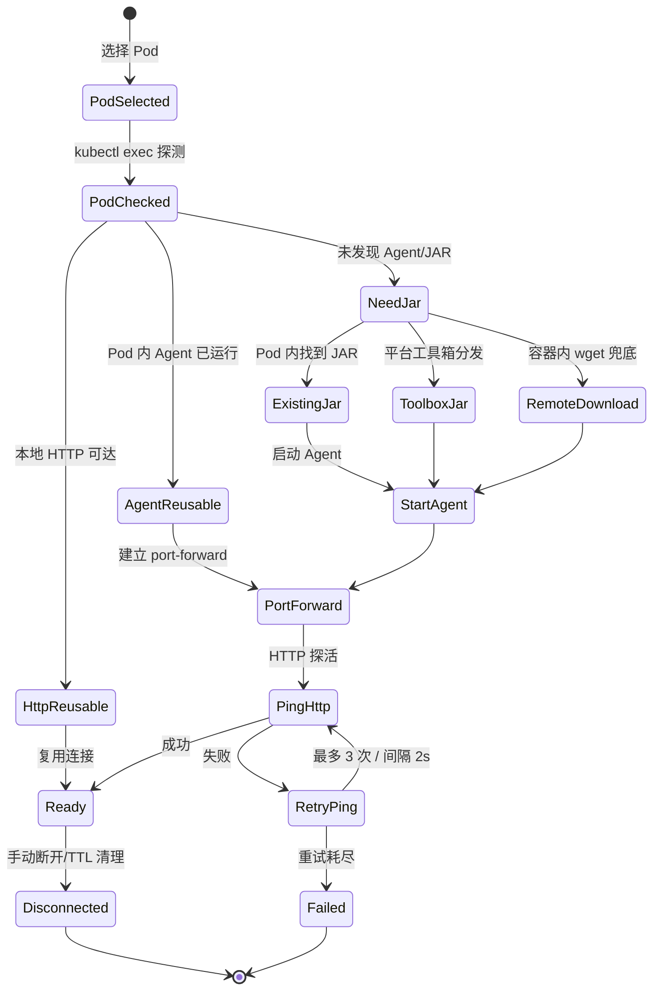

# K8s Arthas 智能诊断平台 — 连接中心设计


**文档版本**: v1.0
**创建日期**: 2026-05-23
**状态**: 设计完成

---

## 目录

1. [设计目标](#1-设计目标)
2. [分层连接模型](#2-分层连接模型)
3. [连接状态机](#3-连接状态机)
4. [状态与数据库映射](#4-状态与数据库映射)
5. [短路复用策略](#5-短路复用策略)
6. [状态管理器与执行器协作](#6-状态管理器与执行器协作)
7. [连接页面设计](#7-连接页面设计)
8. [连接上下文条](#8-连接上下文条)
9. [连接有效期（TTL）](#9-连接有效期ttl)
10. [关键约束](#10-关键约束)

---

## 1. 设计目标

连接中心是所有诊断能力的基础。它回答三个核心问题：

1. 当前有哪些可用连接？
2. 每个连接的状态和层级是什么？
3. 从连接能进入哪些诊断能力？

### 设计原则

**原则 1：连接是工作上下文，不是普通列表项**

该项目中的连接不是简单记录项，而是所有诊断能力的上下文入口。因此连接应升级为独立模块，而不是附着在 sidebar 的组件。

**原则 2：管理和使用分开**

- 连接详情页负责"管理"
- 监控、终端、性能诊断、Arthas 命令、采样、文件下载负责"使用"

不把所有能力塞进详情页，避免形成新的超级页面。

**原则 3：全局菜单只放系统级页面**

模型配置、历史记录、用户管理、审计日志等页面与具体连接无关，因此适合作为一级菜单。

**原则 4：连接相关能力必须挂在连接上下文下**

Pod 监控、终端、文件下载、性能诊断、Arthas 命令、采样工具都依赖当前连接上下文，不应与系统级页面并列。

**原则 5：AI 助手是全局辅助层，不是普通能力页**

AI 助手应随处可打开，并感知当前连接与层级，而不是要求用户先进入某个连接页面才能使用。

---

## 2. 分层连接模型

平台明确区分 Pod 级连接和 Arthas 级连接：

| 连接层级 | `connections.level` | 依赖 | 典型能力 | 生命周期 |
|----------|---------------------|------|----------|----------|
| Pod 连接 | `pod` | kubeconfig、kubectl、Pod 可访问 | exec、文件浏览、日志、GC 日志、Pod 监控 | 随用户选择 Pod 建立，可长期复用 |
| Arthas 连接 | `arthas` | Pod 连接 + Java PID + Arthas Agent + port-forward + HTTP API | trace、watch、profiler、jad、redefine | 按需建立，支持健康检查和 TTL 清理 |

---

## 3. 连接状态机



---

## 4. 状态与数据库映射

| 状态机状态 | `connections.status` | `connections.level` | 前端颜色 |
|-----------|---------------------|---------------------|----------|
| `PodSelected` | `connecting` | `pod` | 蓝色 |
| `PodChecked` | `connecting` | `pod` | 绿色 |
| `HttpReusable` | `ready` | `arthas` | 绿色 |
| `AgentReusable` | `connecting` | `arthas` | 黄色 |
| `NeedJar` | `waiting_user` | `arthas` | 橙色 |
| `StartAgent` | `connecting` | `arthas` | 橙色 |
| `PortForward` / `PingHttp` / `RetryPing` | `connecting` | `arthas` | 黄色 |
| `Ready` | `ready` | `arthas` | 绿色 |
| `Failed` | `failed` | `arthas` | 红色 |
| `Disconnected` | `disconnected` | `pod` 或 `arthas` | 灰色 |

---

## 5. 短路复用策略

```text
优先级 1: HTTP 已可达 → 直接复用（0 额外开销）
优先级 2: Agent 已运行 → 仅补建 port-forward
优先级 3: Pod 内有 JAR → 启动 Agent + port-forward + HTTP 探活
优先级 4: 平台工具箱分发 JAR → 启动 Agent + port-forward + HTTP 探活
优先级 5: 容器内 wget 官方 JAR → 启动 Agent + port-forward + HTTP 探活
```

---

## 6. 状态管理器与执行器协作

| 组件 | 职责 | 不做什么 |
|------|------|---------|
| `ConnectionStateManager` | 状态元数据管理、状态转换校验、TTL 清理调度、重连触发 | 不持有连接实例、不执行 kubectl/HTTP 操作 |
| `PodConnection` | Pod 级连接操作（exec/cp/文件/日志） | 不管理 Arthas Agent |
| `ArthasConnection` | Arthas 级连接操作（Agent 启动/HTTP API/命令执行） | 不管理 TTL |
| `KubectlExecutor` | kubectl 命令执行封装 | 不感知连接状态 |

**调用关系**：

```python
# 状态管理器仅编排状态，不执行实际操作
class ConnectionStateManager:
    def get_connection_state(connection_id) -> ConnectionState
    def transition_state(connection_id, from_state, to_state)
    def schedule_ttl_cleanup()
    def request_reconnect(connection_id)

# 执行器负责实际操作，通过回调通知状态变化
class ArthasConnection:
    def connect(on_state_change)  # Agent + port-forward + ping
    def disconnect(on_state_change)  # 释放 port-forward
    def ping() -> bool  # HTTP 探活
```

**状态更新策略**：

- **中间状态**（PodSelected/StartAgent/PortForward/PingHttp）：仅内存缓存 + 轮询实时推送
- **稳定状态**（Ready/Failed/Disconnected）：写入数据库
- **等待用户状态**（NeedJar）：写入数据库，等待用户确认

### 6.1 状态丢失场景分析

| 场景 | 连接位置 | 数据库记录 | 用户刷新后 |
|------|---------|-----------|-----------|
| **服务重启 + Ready状态** | 内存丢失 | 有记录 | 自动恢复（HTTP探活） |
| **服务重启 + PortForward状态** | 内存丢失 | 无记录 | **连接丢失，需重新建立** |
| **服务重启 + NeedJar状态** | 内存丢失 | 有记录 | 显示"等待用户确认" |
| **页面刷新 + 任何状态** | 内存丢失 | 取决于状态 | 从数据库恢复或重新选择 |

### 6.2 PortForward状态丢失处理

**问题**：服务在PortForward状态重启，连接既不在内存中，数据库中也没有记录。

**解决方案**：

```
用户发起连接
    │
    ▼
写入数据库（status='pending'）
    │
    ▼
开始建立连接（PortForward状态）
    │
    ├── 服务重启
    │       │
    │       ▼
    │   数据库中 status='pending' 的记录
    │       │
    │       ▼
    │   启动时清理 pending 状态的记录
    │   或 尝试恢复连接
    │
    └── 连接成功
            │
            ▼
        更新数据库（status='ready'）
```

**关键设计**：在连接建立的**第一步**就写入数据库（status='pending'），而不是等到连接成功后才写入。

```python
def start_connection(pod_name, namespace, cluster_name):
    """开始建立连接"""
    
    # 1. 立即写入数据库（pending状态）
    connection_id = db.insert('connections', {
        'cluster_name': cluster_name,
        'namespace': namespace,
        'pod_name': pod_name,
        'status': 'pending',  # 关键：立即写入
        'level': 'pod',
        'created_at': datetime.now()
    })
    
    # 2. 返回connection_id给前端
    return connection_id
    
    # 3. 后台异步建立连接
    # （前端通过轮询查询状态）
```

### 6.3 前端状态恢复策略

```javascript
// 页面加载时检查连接状态
async function restoreConnection() {
    const savedId = sessionStorage.getItem('currentConnectionId');
    
    if (!savedId) {
        // 无保存的连接，显示连接列表
        showConnectionList();
        return;
    }
    
    // 查询服务器端状态
    const response = await fetch(`/api/arthas/connections/${savedId}/status`);
    const data = await response.json();
    
    if (data.status === 'ready') {
        // 连接正常，恢复状态
        restoreConnectionState(data);
    } else if (data.status === 'pending') {
        // 连接正在建立中，显示进度
        showConnectionProgress(savedId);
    } else if (data.status === 'failed') {
        // 连接失败，显示错误
        showConnectionError(savedId);
    } else {
        // 连接不存在或已断开，清除状态
        localStorage.removeItem('currentConnectionId');
        showConnectionList();
    }
}
```

---

## 7. 连接页面设计

### 7.1 连接列表页

用于查看全部连接、筛选、新建、清理失效连接、进入连接详情。

| 字段 | 作用 |
|------|------|
| Pod | 主标识 |
| Namespace | 基础定位 |
| 集群 | 所属集群 |
| 连接层级 | Pod / Arthas |
| 状态 | 正常 / 异常 / 失效 |
| 运行时 | Java / Node / Python |
| 最近检查 | 最后健康检查时间 |
| 操作 | 查看详情、健康检查、删除 |

### 7.2 连接详情页

连接详情页回答：这个连接是谁、当前状态如何、当前层级、可用能力、下一步操作。

**操作区根据状态动态展示**：

| 状态 | 可用操作 |
|------|---------|
| 未连接 | 建立 Pod 连接 |
| Pod 已连接 + Java | 升级到 Arthas、健康检查、删除 |
| Pod 已连接 + 非 Java | 健康检查、删除 |
| Arthas 已连接 | 健康检查、重新连接、删除 |

**能力入口区**（连接详情页底部）：

- 基础操作：🖥️ 终端、📊 Pod 监控、📂 文件下载
- 诊断分析：🔬 性能诊断、⚡ Arthas 命令、🔥 采样工具

### 7.3 独立工作页

这些页面只承载实际工作流，不再承担连接管理本身：

- Pod 监控页
- 终端页
- 文件下载页
- 性能诊断页
- Arthas 命令页
- 采样工具页

每个页面顶部建议统一显示：

- 当前连接名称
- 当前层级
- 返回连接详情

这样工作页不会丢失上下文。

---

## 8. 连接上下文条

全局顶部轻量展示：

- 当前连接：cluster / namespace / pod
- 当前层级：未连接 / Pod / Arthas
- runtime 摘要
- 查看详情按钮

不做批量操作、升级主入口、删除或复杂状态解释。

---

## 9. 连接有效期（TTL）

用户建连时可指定连接有效期（按小时），到期后自动断开释放资源。

| 字段 | 含义 | 默认值 |
|------|------|--------|
| `connections.ttl_hours` | 连接有效期（小时） | `0`（不自动过期） |
| `connections.last_active_at` | 最后活跃时间（每次执行命令时更新） | 建连时写入 |

**TTL 清理逻辑**（`ConnectionStateManager._run_ttl_cleanup`，每 30 分钟执行一次）：
- `ttl_hours = 0`：不清理，连接保持到手动断开
- `ttl_hours > 0`：当 `now > last_active_at + ttl_hours` 时自动标记为 `disconnected`

**前端交互**：建连表单增加"连接有效期"下拉框，选项：不限 / 1小时 / 2小时 / 4小时 / 8小时 / 12小时 / 24小时。

---

## 10. 连接复用与状态恢复

### 10.1 问题场景

| 场景 | 问题 | 影响 |
|------|------|------|
| **服务重启** | 内存中的Arthas连接状态丢失 | 用户需要重新建立Arthas连接 |
| **页面刷新** | 前端状态重置 | 连接层级退回到Pod连接 |
| **多标签页** | 状态不同步 | 不同标签页显示不同状态 |

### 10.2 状态持久化策略

```
┌─────────────────────────────────────────────────────────────────┐
│                    状态持久化层级                                 │
├─────────────────────────────────────────────────────────────────┤
│                                                                 │
│  1. 数据库持久化（必须）                                        │
│     ┌─────────────────────────────────────────────────────┐   │
│     │  connections 表                                       │   │
│     │  - level: pod/arthas                                 │   │
│     │  - status: ready/connecting/failed/disconnected      │   │
│     │  - port_forward_port: 本地端口号                      │   │
│     │  - last_active_at: 最后活跃时间                       │   │
│     └─────────────────────────────────────────────────────┘   │
│                                                                 │
│  2. 内存缓存（加速）                                            │
│     ┌─────────────────────────────────────────────────────┐   │
│     │  _connections dict                                    │   │
│     │  - ArthasConnection 实例                              │   │
│     │  - PodConnection 实例                                 │   │
│     │  - 端口转发进程                                       │   │
│     └─────────────────────────────────────────────────────┘   │
│                                                                 │
│  3. 前端状态（UI）                                              │
│     ┌─────────────────────────────────────────────────────┐   │
│     │  localStorage / sessionStorage                       │   │
│     │  - currentConnectionId                               │   │
│     │  - connectionLevel                                   │   │
│     └─────────────────────────────────────────────────────┘   │
│                                                                 │
└─────────────────────────────────────────────────────────────────┘
```

### 10.3 服务重启恢复流程

```text
服务启动
    │
    ▼
读取数据库 connections 表
    │
    ├── status = 'ready' 且 level = 'arthas'
    │       │
    │       ▼
    │   尝试恢复 Arthas 连接
    │       │
    │       ├── HTTP 探活成功 → 恢复到 Ready 状态
    │       │
    │       └── HTTP 探活失败 → 标记为 disconnected，降级到 Pod 连接
    │
    ├── status = 'ready' 且 level = 'pod'
    │       │
    │       ▼
    │   保持 Pod 连接状态
    │
    └── status = 'connecting'（中间状态）
            │
            ▼
        重置为最近的稳定状态
            │
            ├── 有 port_forward_port 记录 → 尝试恢复端口转发
            │       │
            │       ├── 恢复成功 → 继续连接流程
            │       │
            │       └── 恢复失败 → 重置为 Pod 连接
            │
            └── 无 port_forward_port 记录 → 重置为 Pod 连接
```

### 10.3.1 中间状态处理策略

| 数据库状态 | 处理方式 | 说明 |
|-----------|---------|------|
| `ready` + `arthas` | 尝试HTTP探活 | 成功则恢复，失败则降级 |
| `ready` + `pod` | 保持状态 | Pod连接无需恢复 |
| `connecting` + 有port | 尝试恢复端口转发 | 成功则继续，失败则重置 |
| `connecting` + 无port | 重置为Pod连接 | 无法恢复的中间状态 |
| `failed` | 保持失败状态 | 等待用户手动重试 |
| `disconnected` | 保持断开状态 | 等待用户重新连接 |

### 10.3.2 连接建立过程中的幂等性

```python
# 连接建立过程应该是幂等的
# 服务重启后可以安全地重新执行

def ensure_connection(connection_id: str):
    """确保连接可用（幂等操作）"""
    
    conn = db.fetch_one(
        "SELECT * FROM connections WHERE id = ?",
        (connection_id,)
    )
    
    if not conn:
        return {"error": "Connection not found"}
    
    # 1. 如果已经是ready状态，直接返回
    if conn['status'] == 'ready':
        return {"status": "ready", "level": conn['level']}
    
    # 2. 如果是connecting状态，尝试恢复
    if conn['status'] == 'connecting':
        if conn.get('port_forward_port'):
            # 尝试恢复端口转发
            if restore_port_forward(connection_id):
                # 继续连接流程
                return continue_connection_flow(connection_id)
            else:
                # 恢复失败，重置为Pod连接
                reset_to_pod_connection(connection_id)
        else:
            # 无端口记录，重置为Pod连接
            reset_to_pod_connection(connection_id)
    
    # 3. 如果是failed状态，保持等待用户重试
    if conn['status'] == 'failed':
        return {"status": "failed", "message": "连接失败，请手动重试"}
    
    # 4. 如果是disconnected状态，保持断开
    if conn['status'] == 'disconnected':
        return {"status": "disconnected", "message": "连接已断开"}
```

### 10.3.3 用户看到的场景

| 场景 | 用户看到什么 | 系统行为 |
|------|------------|---------|
| **服务重启 + 连接已ready** | 连接状态正常 | 自动恢复，用户无感知 |
| **服务重启 + 连接connecting** | 连接状态异常，显示"重新连接"按钮 | 自动重置为Pod连接 |
| **服务重启 + 无连接记录** | 连接列表为空 | 用户需要重新选择Pod |
| **页面刷新 + 连接已ready** | 连接状态正常 | 从数据库恢复 |
| **页面刷新 + 连接connecting** | 连接状态异常 | 清除localStorage，显示连接列表 |
| **页面刷新 + 无连接记录** | 连接列表为空 | 用户需要重新选择Pod |

### 10.4 连接切换时诊断任务处理策略

#### 10.4.1 问题场景

| 场景 | 问题 | 需要决策 |
|------|------|---------|
| **Pod-A执行中切换到Pod-B** | 正在执行的诊断任务如何处理？ | 取消语义 |
| **切换回Pod-A** | 之前未完成的任务如何恢复？ | 状态恢复 |
| **页面刷新** | activeExecutions Map丢失 | 生命周期管理 |

#### 10.4.2 取消语义设计

**推荐方案：C（弹窗提示）+ B（调用后端终止）**

```
用户切换连接
    │
    ▼
检查是否有运行中的诊断
    │
    ├── 无运行中诊断
    │       │
    │       └── 直接切换
    │
    └── 有运行中诊断
            │
            ▼
        弹窗提示："有运行中的诊断，确认切换？"
            │
            ├── 用户确认
            │       │
            │       ▼
            │   1. 前端停止轮询
            │   2. 调用 POST /api/diagnosis/runs/{run_id}/cancel
            │   3. 后端终止执行
            │   4. 记录诊断为"已取消"
            │   5. 切换到新连接
            │
            └── 用户取消
                    │
                    └── 保持当前连接
```

**为什么选择方案C+B**：
- **方案A（静默丢弃）**：用户不知道任务还在运行，可能造成资源浪费
- **方案B（直接终止）**：太激进，用户可能不想终止任务
- **方案C（弹窗提示）**：给用户选择权，尊重用户意图
- **方案B（调用后端终止）**：确保任务真正停止，不浪费资源

#### 10.4.3 状态恢复设计

**推荐方案：B（显示在"运行中诊断"区域）**

```
用户切换回Pod-A
    │
    ▼
检查是否有未完成的任务
    │
    ├── 任务已完成
    │       │
    │       └── 显示在"诊断历史"中
    │
    ├── 任务已取消
    │       │
    │       └── 显示在"诊断历史"中，标记为"已取消"
    │
    └── 任务仍在运行
            │
            ├── 自动恢复轮询
            │       │
            │       └── 显示在"运行中诊断"区域
            │
            └── 任务已丢失（服务重启）
                    │
                    └── 显示在"诊断历史"中，标记为"未知"
```

**为什么选择方案B**：
- **方案A（不恢复）**：用户可能还想查看任务结果
- **方案B（显示在运行中）**：给用户选择权，可以手动恢复或放弃
- **方案C（自动恢复）**：太激进，可能不必要

#### 10.4.4 activeExecutions生命周期管理

```javascript
// static/js/core/diagnosis-store.js

class DiagnosisStore {
    constructor() {
        // 活跃执行任务
        this.activeExecutions = new Map();  // runId -> ExecutionInfo
        
        // 页面加载时恢复状态
        this.restoreActiveExecutions();
    }
    
    async restoreActiveExecutions() {
        // 从服务器获取正在运行的任务
        const response = await fetch('/api/diagnosis/runs?status=running');
        const data = await response.json();
        
        for (const run of data.runs) {
            if (run.connection_id === this.currentConnectionId) {
                // 当前连接的任务，恢复轮询
                this.startPolling(run.run_id);
            }
            // 所有任务都记录到activeExecutions
            this.activeExecutions.set(run.run_id, {
                run_id: run.run_id,
                connection_id: run.connection_id,
                skill_name: run.skill_name,
                status: run.status,
                progress: run.progress,
                started_at: run.started_at
            });
        }
    }
    
    startPolling(runId) {
        // 开始轮询任务状态
        const pollInterval = setInterval(async () => {
            const response = await fetch(`/api/diagnosis/runs/${runId}/status`);
            const data = await response.json();
            
            this.updateExecution(runId, data);
            
            if (data.status === 'completed' || data.status === 'failed' || data.status === 'cancelled') {
                this.stopPolling(runId);
                this.moveToHistory(runId);
            }
        }, 2000);
        
        this.pollIntervals.set(runId, pollInterval);
    }
    
    updateExecution(runId, data) {
        const execution = this.activeExecutions.get(runId);
        if (execution) {
            execution.status = data.status;
            execution.progress = data.progress;
            execution.current_step = data.current_step;
            // 触发UI更新
            this.notifyListeners('execution_updated', { runId, data });
        }
    }
    
    moveToHistory(runId) {
        const execution = this.activeExecutions.get(runId);
        if (execution) {
            // 移动到历史记录
            this.diagnosisHistory.unshift(execution);
            // 从活跃列表移除
            this.activeExecutions.delete(runId);
            // 触发UI更新
            this.notifyListeners('execution_moved_to_history', { runId });
        }
    }
    
    cancelExecution(runId) {
        // 调用后端取消任务
        fetch(`/api/diagnosis/runs/${runId}/cancel`, { method: 'POST' });
        // 停止轮询
        this.stopPolling(runId);
        // 更新状态
        this.updateExecution(runId, { status: 'cancelled' });
        // 移动到历史记录
        this.moveToHistory(runId);
    }
    
    stopPolling(runId) {
        const interval = this.pollIntervals.get(runId);
        if (interval) {
            clearInterval(interval);
            this.pollIntervals.delete(runId);
        }
    }
}
```

#### 10.4.5 页面刷新恢复流程

```
页面加载
    │
    ▼
恢复activeExecutions
    │
    ├── 从服务器获取running状态的任务
    │       │
    │       ├── 任务属于当前连接
    │       │       │
    │       │       └── 自动恢复轮询
    │       │
    │       └── 任务属于其他连接
    │               │
    │               └── 记录但不轮询
    │
    └── 从服务器获取completed/failed/cancelled的任务
            │
            └── 显示在"诊断历史"中
```

#### 10.4.6 用户体验总结

| 场景 | 用户看到什么 | 系统行为 |
|------|------------|---------|
| **切换连接 + 有运行中任务** | 弹窗提示 | 用户确认后取消任务并切换 |
| **切换回连接 + 任务仍在运行** | "运行中诊断"区域显示 | 自动恢复轮询 |
| **页面刷新 + 有运行中任务** | "运行中诊断"区域显示 | 自动恢复轮询 |
| **任务完成/取消** | 移动到"诊断历史" | 停止轮询，更新状态 |

### 10.5 前端多标签页同步方案

#### 10.4.1 问题场景

| 场景 | 问题 | 影响 |
|------|------|------|
| **多标签页** | 标签页A连接Pod-1，标签页B连接Pod-2 | localStorage共享导致状态混乱 |
| **状态一致性** | 后端连接状态变化，前端未同步 | 前端显示过期状态 |
| **内存泄漏** | ConnectionStore无清理机制 | 长期使用后内存积累 |

#### 10.4.2 解决方案：BroadcastChannel

```javascript
// static/js/core/connection-store.js

class ConnectionStore {
    constructor() {
        this.connections = new Map();
        this.currentConnectionId = null;
        this.tabId = this._generateTabId();  // 每个标签页唯一ID
        
        // 使用BroadcastChannel同步多标签页状态
        this.channel = new BroadcastChannel('connection_sync');
        this.channel.onmessage = (event) => this._handleBroadcast(event.data);
        
        // 页面加载时恢复状态
        this.restoreState();
        
        // 定期清理过期连接
        this.startCleanupTimer();
    }
    
    _generateTabId() {
        // 生成唯一标签页ID
        return `tab_${Date.now()}_${Math.random().toString(36).substr(2, 9)}`;
    }
    
    _handleBroadcast(data) {
        // 处理其他标签页的状态同步
        switch (data.type) {
            case 'connection_changed':
                // 其他标签页切换了连接
                if (data.tabId !== this.tabId) {
                    this.syncConnection(data.connectionId);
                }
                break;
            case 'connection_disconnected':
                // 其他标签页断开了连接
                if (data.connectionId === this.currentConnectionId) {
                    this.clearConnection();
                }
                break;
            case 'state_updated':
                // 后端状态更新
                this.updateConnectionStatus(data.connectionId, data.status);
                break;
        }
    }
    
    setCurrentConnection(connectionId) {
        this.currentConnectionId = connectionId;
        
        // 1. 存储到sessionStorage（每个标签页独立）
        sessionStorage.setItem('currentConnectionId', connectionId);
        
        // 2. 广播到其他标签页
        this.channel.postMessage({
            type: 'connection_changed',
            tabId: this.tabId,
            connectionId: connectionId
        });
        
        // 3. 验证连接状态
        this.validateConnection(connectionId);
    }
    
    async validateConnection(connectionId) {
        // 验证连接是否仍然有效
        const response = await fetch(`/api/arthas/connections/${connectionId}/status`);
        const data = await response.json();
        
        if (data.status !== 'ready') {
            // 连接已断开，清除状态
            this.clearConnection();
            this.showConnectionLostNotification();
        }
    }
    
    clearConnection() {
        this.currentConnectionId = null;
        sessionStorage.removeItem('currentConnectionId');
        
        // 广播到其他标签页
        this.channel.postMessage({
            type: 'connection_disconnected',
            tabId: this.tabId,
            connectionId: this.currentConnectionId
        });
    }
    
    startCleanupTimer() {
        // 每5分钟清理过期连接
        setInterval(() => this.cleanup(), 5 * 60 * 1000);
    }
    
    cleanup() {
        // 清理超过30分钟未使用的连接数据
        const now = Date.now();
        const maxAge = 30 * 60 * 1000;  // 30分钟
        
        for (const [id, data] of this.connections) {
            if (now - data.lastAccess > maxAge) {
                this.connections.delete(id);
            }
        }
    }
    
    restoreState() {
        // 从sessionStorage恢复（每个标签页独立）
        const savedId = sessionStorage.getItem('currentConnectionId');
        if (savedId) {
            this.currentConnectionId = savedId;
            this.validateConnection(savedId);
        }
    }
}
```

#### 10.4.3 localStorage vs sessionStorage

| 存储方式 | 作用域 | 适用场景 |
|---------|--------|---------|
| **localStorage** | 跨标签页共享 | 用户偏好、全局设置 |
| **sessionStorage** | 单标签页 | 连接状态、当前上下文 |

**建议**：
- 连接状态使用 `sessionStorage`（每个标签页独立）
- 用户偏好使用 `localStorage`（跨标签页共享）

#### 10.4.4 状态同步流程

```
标签页A切换连接
    │
    ▼
更新sessionStorage
    │
    ▼
广播到其他标签页
    │
    ▼
标签页B收到广播
    │
    ▼
验证连接状态
    │
    ├── 有效 → 同步显示
    └── 无效 → 清除状态
```

### 10.5 前端页面刷新恢复流程

```text
页面加载
    │
    ▼
读取 sessionStorage
    │
    ├── currentConnectionId 存在
    │       │
    │       ▼
    │   调用 GET /api/arthas/connections/{id}/status
    │       │
    │       ├── 连接存在且状态正常
    │       │       │
    │       │       ▼
    │       │   恢复到之前的连接层级
    │       │
    │       └── 连接不存在或状态异常
    │               │
    │               ▼
    │           清除 localStorage，显示连接列表
    │
    └── currentConnectionId 不存在
            │
            ▼
        显示连接列表，等待用户选择
```

### 10.5 Arthas连接恢复检查

```python
# backend/core/connection_state.py

def restore_arthas_connections():
    """服务启动时恢复Arthas连接"""
    
    # 1. 查询所有状态为ready的Arthas连接
    connections = db.fetch_all(
        "SELECT * FROM connections WHERE status = 'ready' AND level = 'arthas'"
    )
    
    for conn in connections:
        # 2. 尝试HTTP探活
        if ping_arthas_http(conn['id'], conn['port_forward_port']):
            # 3a. 探活成功，恢复连接
            log.info(f"Arthas connection restored: {conn['id']}")
            restore_connection_in_memory(conn['id'])
        else:
            # 3b. 探活失败，降级到Pod连接
            log.warning(f"Arthas connection failed, downgrading to pod: {conn['id']}")
            downgrade_to_pod_connection(conn['id'])
```

### 10.6 端口转发恢复

```python
# 服务重启后，需要恢复端口转发

def restore_port_forward(connection_id):
    """恢复端口转发"""
    
    conn = db.fetch_one(
        "SELECT * FROM connections WHERE id = ? AND level = 'arthas'",
        (connection_id,)
    )
    
    if not conn or not conn.get('port_forward_port'):
        return False
    
    # 检查端口是否已被占用
    if is_port_in_use(conn['port_forward_port']):
        # 端口被占用，释放旧端口
        release_port(conn['port_forward_port'])
    
    # 重新建立端口转发
    new_port = create_port_forward(
        conn['cluster_name'],
        conn['namespace'],
        conn['pod_name'],
        conn['container_name']
    )
    
    # 更新数据库中的端口
    db.update('connections', 
              {'port_forward_port': new_port},
              'id = ?', (connection_id,))
    
    return True
```

### 10.7 前端状态同步

```javascript
// static/js/core/connection-store.js

class ConnectionStore {
    constructor() {
        this.connections = new Map();
        this.currentConnectionId = null;
        
        // 页面加载时恢复状态
        this.restoreState();
    }
    
    restoreState() {
        // 从sessionStorage恢复（每个标签页独立）
        const savedId = sessionStorage.getItem('currentConnectionId');
        if (savedId) {
            this.loadConnection(savedId);
        }
    }
    
    async loadConnection(connectionId) {
        // 从服务器获取最新状态
        const response = await fetch(`/api/arthas/connections/${connectionId}/status`);
        const data = await response.json();
        
        if (data.status === 'ready') {
            // 连接正常，恢复状态
            this.currentConnectionId = connectionId;
            this.connections.set(connectionId, data);
            this.emit('connectionRestored', data);
        } else {
            // 连接异常，清除状态
            sessionStorage.removeItem('currentConnectionId');
            this.emit('connectionLost', connectionId);
        }
    }
    
    setCurrentConnection(connectionId) {
        this.currentConnectionId = connectionId;
        sessionStorage.setItem('currentConnectionId', connectionId);
    }
}
```

---

## 11. 关键约束

- 同一用户同一 Pod 允许复用连接；多用户并发互斥策略作为 P2 TODO。
- port-forward 端口使用本地动态分配，必须释放已断开端口。
- Agent 启动日志通过 `/tmp/arthas_start.log` 暴露为排障入口。
- Arthas JAR 分发顺序：Pod 内已有 → 平台工具箱分发 → 容器内 wget 兜底。
- 分发前先执行 `java -version`，按 JDK 版本选择兼容工具包。
- 容器内远程下载兜底命令：`kubectl exec -it <pod> --container <c> -- /bin/bash -c "wget https://arthas.aliyun.com/arthas-boot.jar && java -jar arthas-boot.jar"`
- **Arthas连接状态必须持久化到数据库**，服务重启后可恢复。
- **前端页面刷新后应恢复到之前的连接层级**，不退回到Pod连接。