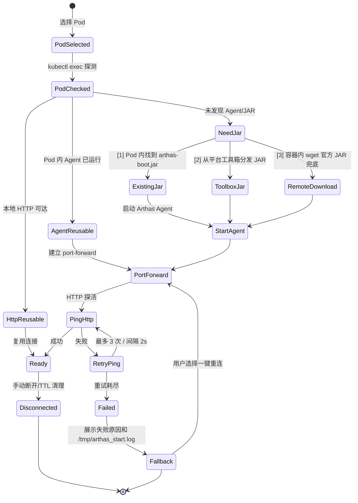
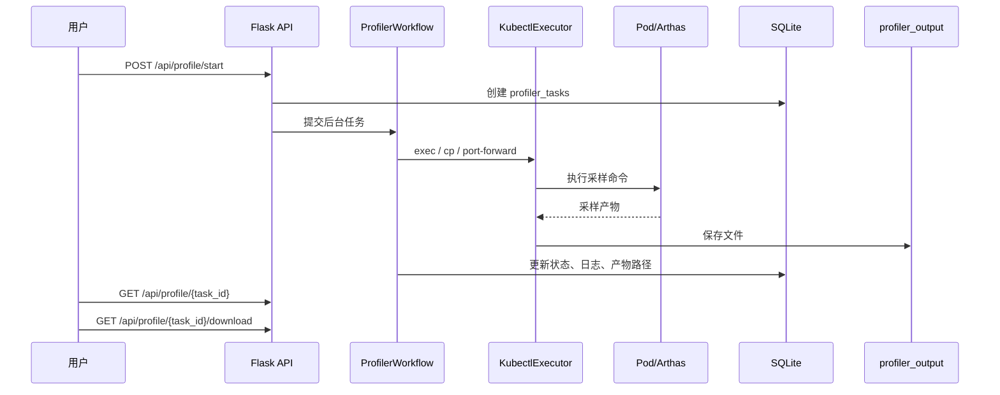

# Arthas on Kubernetes 智能运维调试平台系统设计

| 项目 | 内容 |
|---|---|
| 文档版本 | 1.2 |
| 日期 | 2026-05-02 |
| 依据 | 已整合旧版 PRD 内容、评审意见、设计评审报告和 Arthas issue #537，并以 2026-05-02 系统设计为准 |
| 当前技术栈 | Python 3.10+ / Flask / SQLite / kubectl / 原生 HTML+CSS+JavaScript |
| 设计目标 | 形成唯一产品与系统设计文档，在现有架构上补齐 Kubernetes Java 在线诊断、采样、审计与多用户协作能力 |

## 1. 背景与目标

### 1.1 背景

Java 服务运行在 Kubernetes Pod 中后，线上性能诊断通常面临以下问题：

- 直接进入 Pod 执行 `jstack`、`jmap`、`jstat`、Arthas 命令门槛高，且缺少审计与权限控制。
- 生产环境中临时安装 Arthas、建立端口转发、下载采样产物等步骤容易出错，排障耗时长。
- 多人同时对同一 Pod 执行 `watch`、`trace`、`heapdump`、`profiler` 等操作时，缺少会话隔离和互斥保护。
- Kubernetes 集群、命名空间、Pod、容器、Java 进程、Arthas Agent、采样任务之间缺少统一工作台。

当前工程已经具备 Flask REST API、kubectl 执行、Arthas 连接、性能采样、Pod 监控、文件下载、多用户认证和审计基础。本设计在现有工程上演进，不引入 Java/Spring、PostgreSQL、React 等重型重构作为近期目标。

### 1.2 产品目标

- 提供 Web 化的 Kubernetes Java 诊断工作台，覆盖 Pod 选择、Arthas 连接、命令执行、方法诊断、采样分析和结果下载。
- 复用现有 `ArthasConnection` 短路复用能力，降低重复启动 Agent 和重复建立 port-forward 的成本。
- 保持轻量部署模型：单 Flask 进程 + SQLite + 本地 `profiler_output/`，适合跳板机、运维机和小型团队落地。
- 建立权限与审计闭环：用户只能访问授权集群，关键诊断命令、采样任务、文件下载均留痕。
- 为近期增强预留扩展点：WebSocket 流式输出、命令模板、工具箱中心、在线反编译/源码对比、一键热更新验证、AI 辅助诊断；深度权限控制和危险命令治理作为 P2 安全增强。

### 1.3 产品定位与设计原则

**产品定位**：面向 Java 开发工程师、SRE、性能测试和平台管理员的 Kubernetes 在线诊断工作台，以连接上下文为中心，将 Arthas、kubectl、Pod 运维、采样分析、任务编排和审计治理整合为一站式平台。

**产品愿景**：让线上问题排查像调试本地程序一样便捷、安全、可追溯。

**设计原则**：

1. **连接是工作上下文**：所有诊断能力必须挂在明确的 `cluster / namespace / pod / container / java_pid` 上，避免脱离上下文的误操作。
2. **管理和使用分离**：连接管理负责建立、复用、断开和状态治理；监控、终端、文件、诊断、采样负责使用连接。
3. **先安全后便利**：`watch`、`trace`、`heapdump`、`profiler` 等可能影响生产或暴露数据的能力必须分级、确认、审计。
4. **轻量部署优先**：当前阶段坚持 Flask + SQLite + kubectl + 原生前端，减少额外中间件依赖。
5. **渐进式产品化**：先完成 P0 诊断闭环，再优先引入 WebSocket、在线反编译/源码对比、一键热更新验证、工具箱中心和 AI 辅助；多用户并发互斥、审批/RBAC 和危险命令治理作为 P2 安全增强。

### 1.4 诊断闭环

平台围绕线上排障闭环设计：

```text
发现异常 → 初步定位 → 深度诊断 → 修复验证 → 回归确认 → 归档审计
```

- **发现异常**：通过 Pod 监控、JVM dashboard、GC/线程/CPU 指标识别异常。
- **初步定位**：通过线程清单、Pod 资源快照、进程列表和日志定位异常维度。
- **深度诊断**：通过 `trace`、`watch`、`stack`、`monitor`、`profiler`、`jad` 等定位根因。
- **快速修复验证**：参考 Arthas `jad → mc → redefine → 验证` 链路，通过平台封装一键热更新步骤，减少手工进入容器、复制文件、多条命令串联带来的环境恐惧和操作复杂度。
- **回归确认**：通过灰度或生产目标 Pod、反编译结果、源码对比、二次 trace/watch/profiler 验证修复方案。
- **回归确认**：沉淀诊断结果、采样产物、命令历史和审计记录。

## 2. 范围与角色

### 2.1 目标用户

| 角色 | 核心场景 | 关键诉求 |
|---|---|---|
| Java 开发工程师 | 方法耗时追踪、调用链分析、线上参数观察、JVM 状态定位 | 快速连接、模板化命令、结果可解释 |
| SRE / 运维工程师 | CPU 飙升、线程阻塞、GC 异常、Pod 资源排查 | 安全可控、低侵入、可回收、可审计 |
| QA / 性能测试 | 压测期间采样、线程 dump、JFR/火焰图归档 | 任务化执行、结果下载、历史对比 |
| 平台管理员 | 用户、集群、权限、审计、工具包管理 | 多用户隔离、授权分配、操作追踪 |

### 2.2 功能范围

| 优先级 | 功能域 | 说明 |
|---|---|---|
| P0 | 集群与 Pod 工作台 | 集群配置、命名空间/Pod/容器选择、Pod 状态、连接上下文 |
| P0 | Arthas 连接中心 | Agent 检测、启动、port-forward、HTTP API 探活、连接复用和断开 |
| P0 | 方法诊断 | `trace`、`watch`、`stack`、`monitor` 模板化执行与历史保存 |
| P0 | 性能采样 | CPU profiler、JFR、thread dump、heap dump、结果下载 |
| P0 | 权限与审计 | 登录、用户集群授权、操作日志、命令历史 |
| P1 | Pod 运维能力 | 终端 exec、文件浏览/下载、GC 日志检测、Pod 监控轮询 |
| P1 | 任务中心 | 诊断任务编排、状态追踪、定时/批量能力、失败重试 |
| P1 | WebSocket 输出 | 长命令、采样日志、终端输出流式推送 |
| P1 | 一键查看源码与在线修复 | `jad` 查看源码、在线编辑或本地上传源码/class、`mc` 编译、`redefine` 生效、基础验证 |
| P1 | AI 辅助 | 命令解释、结果摘要、排障建议、历史案例检索 |
| P1 | 外部链接菜单 | 管理员动态配置外部系统入口，支持菜单分组、排序、启停和新窗口打开 |
| P1 | Arthas Tunnel 工具 | 本地启动 `arthas-tunnel-server.jar`，展示可注册 IP/端口，Agent attach 时可勾选注册远程 |
| P2 | 权限与危险命令治理 | TODO：热更新审批/RBAC、多用户并发互斥、危险命令专项审计、敏感信息脱敏、危险命令二次确认 |

### 2.3 功能矩阵

| 模块 | P0 能力 | P1 能力 | P2 能力 |
|---|---|---|---|
| 连接管理 | 集群/命名空间/Pod/容器选择、Arthas 连接、断开、状态复用 | 连接详情页、连接健康检查、过期清理、Tunnel Server 本地工具启动与远程注册选项 | TODO：多人互斥、连接租约、Tunnel Server 权限治理 |
| 控制面板 | 当前连接状态、JVM 基础信息、快速命令入口 | Dashboard 指标卡片、最近命令、最近任务、AI 摘要入口 | 诊断报告和异常摘要增强 |
| 线程诊断 | `thread`、`dashboard`、thread dump | 热线程高亮、阻塞线程识别 | 死锁/线程池异常智能解释 |
| 方法诊断 | `trace`、`watch`、`stack`、`monitor` 模板 | 命令收藏、结果格式化、历史对比、AI 命令解释 | 条件表达式推荐、敏感输出脱敏策略 |
| 性能采样 | CPU profiler、JFR、heap dump、thread dump | 任务中心、日志流式输出、产物管理 | 采样报告自动摘要、历史趋势对比 |
| Pod 运维 | exec、文件浏览、GC 日志下载、Pod 快照 | 终端增强、事件查看、日志 tail、`jad` 反编译与源码对比 | 工具箱分发、Pod-only 诊断包 |
| 在线修复 | P0 保留诊断和采样闭环 | `jad → 在线编辑/本地上传 → mc/直接 class → redefine → 基础验证` 轻量流程 | TODO：审批/RBAC、多人互斥、强制脱敏和批量热更新治理 |
| 外部资源入口 | 静态入口或文档链接 | 管理员动态维护菜单分组和外部链接，如监控平台、指标平台、日志平台、CMDB | 外部链接权限精细化、按连接上下文拼接参数 |
| 安全审计 | 登录、授权、审计日志、命令历史 | 下载白名单、基础操作留痕、在线修复执行留痕 | TODO：P2 补充在线修复审批/RBAC、危险命令专项审计、数据脱敏策略 |

## 3. 当前架构基线

### 3.1 代码结构映射

| 层级 | 当前模块 | 职责 |
|---|---|---|
| 前端入口 | `static/index.html`、`static/js/app-ui.js`、`static/js/app-terminal.js`、`static/css/app.css` | 诊断工作台、连接面板、监控页、终端、任务与管理页面 |
| Flask 主应用 | `server.py` | 传统 REST API、静态页路由、Arthas/Profile/Monitor/Pod/GC/Files 接口 |
| Blueprint API | `api/*.py` | 登录、用户、集群、审计、AI、MCP、性能诊断、任务中心等模块化接口 |
| 核心执行层 | `backend/core/kubectl.py` | kubectl `exec`、`cp`、`port-forward` 等基础能力 |
| Arthas 连接层 | `backend/core/arthas_agent.py`、`backend/core/arthas_client.py`、`backend/core/connection.py`、`backend/core/pod_connection.py` | Agent 生命周期、HTTP API、Pod 连接校验、port-forward、连接复用 |
| 采样工作流 | `backend/core/profiler.py` | profiler、JFR、thread dump、heap dump 等异步任务 |
| Pod 监控层 | `backend/pod_monitor.py`、`pod_monitor.py` | Pod CPU/内存/进程/网络快照、轮询采集、事件与日志辅助信息 |
| 连接状态管理 | 建议新增 `backend/core/connection_state.py` | 统一管理连接状态、TTL 清理、健康检查、失败重试和一键重连，避免状态散落在多个模块 |
| 规则与任务 | `backend/core/rule_engine.py`、`api/task_center.py` | 工具箱、任务编排、规则化执行 |
| 认证授权 | `models/user.py`、`services/auth_service.py`、`services/authorization_service.py`、`services/audit_service.py` | 用户、角色、集群授权、审计日志 |
| 数据库 | `arthas.db`、`models/db.py` | SQLite 本地元数据、命令历史、任务记录、用户权限 |
| 文件产物 | `profiler_output/` | 火焰图、JFR、heap dump、thread dump 等诊断产物 |

### 3.2 总体架构

```mermaid
flowchart LR
    User["浏览器用户"] --> UI["原生 Web UI\nstatic/*.html + static/js/*.js"]
    UI -->|REST| Flask["Flask 应用\nserver.py + api Blueprints"]
    UI -. 可选 .->|WebSocket / 轮询| Stream["流式输出通道"]
    Stream --> Flask

    Flask --> Auth["认证/授权/审计服务"]
    Flask --> Core["诊断核心层"]
    Core --> Kubectl["KubectlExecutor"]
    Core --> Conn["ArthasConnection"]
    Conn --> Agent["ArthasAgentManager"]
    Conn --> Client["ArthasHttpClient"]
    Core --> Profiler["ProfilerWorkflow"]
    Core --> Monitor["Pod Monitor"]

    Auth --> DB[("SQLite arthas.db")]
    Flask --> DB
    Profiler --> Output[("profiler_output/")]

    Kubectl --> K8s["Kubernetes API Server / kubeconfig"]
    Kubectl --> Pod["目标 Pod / 容器"]
    Agent --> Pod
    Client -->|port-forward:8563| Arthas["Pod 内 Arthas Agent HTTP API"]
    Arthas --> Pod
```

### 3.3 架构原则

- **轻量优先**：近期保持 Flask + SQLite + kubectl + 原生前端，不把截图中的 Java/Spring/React/PostgreSQL 架构作为立即重构目标。
- **连接上下文优先**：所有诊断操作必须绑定 `cluster / namespace / pod / container / java_pid`，避免误操作。
- **短路复用优先**：优先复用可达 HTTP 连接，其次复用已运行 Agent，再考虑新启动 Agent 和 port-forward。
- **安全默认值**：危险命令默认受控，所有命令执行和文件下载默认审计。
- **渐进增强**：通过 Blueprint、service、core 分层拆分大文件，逐步引入 WebSocket、任务中心和工具箱能力。

## 4. 核心功能设计

### 4.1 集群与 Pod 工作台

#### 功能说明

- 展示用户已授权集群，支持从 `clusters.json` 或数据库读取集群配置。
- 支持命名空间、Pod、容器、Label、Deployment/StatefulSet 归属信息筛选。
- 展示 Pod 状态、重启次数、镜像、节点、Java 进程探测结果和 Arthas 状态。
- 为后续演进预留 kubeconfig 上传或 Base64 粘贴能力，上传后需加密存储，不直接暴露明文。

#### 设计要点

- 当前阶段继续使用 kubectl 命令作为主路径，避免引入 Kubernetes Python SDK 的大范围改造。
- 集群访问前必须经过 `AuthorizationService` 校验，普通用户只能查看分配集群。
- Pod 列表查询需要支持超时与错误降级，避免 API 卡住主线程。

### 4.2 Arthas 连接中心

#### 连接状态机



#### 功能说明

- 检测 Pod 内 Java 进程，支持多 Java 进程时由用户选择 PID。
- 按当前检测优先级寻找 Arthas JAR：`/app/arthas/arthas-boot.jar`、`/opt/arthas/arthas-boot.jar`、`/arthas/arthas-boot.jar`、`/home/admin/arthas-boot.jar`。
- 如果 Pod 内没有 `arthas-boot.jar`，优先使用平台工具箱中心内置的 Arthas JAR 分发到目标容器，再执行 `java -jar arthas-boot.jar` 启动 Agent。
- 如果平台工具箱未配置 Arthas JAR 且目标容器允许外网下载，可按 Arthas 官方容器快速启动方式，在容器内通过 `wget https://arthas.aliyun.com/arthas-boot.jar && java -jar arthas-boot.jar` 兜底启动。
- 支持将 `arthas-tunnel-server.jar` 作为平台工具箱工具在本地启动，启动后展示 Tunnel Server 的可访问 IP 和端口，供 Arthas Agent 注册远程连接。
- 在 Arthas attach/启动表单中增加“注册到远程 Tunnel Server”选项；勾选后启动 Arthas 时追加 Tunnel Server 地址和 Agent 标识，使 Agent 连接到本地启动的 Tunnel Server。
- 若 Agent 已运行，则只补建 port-forward；若 HTTP 已可达，则直接复用。
- 连接记录写入 `connections`，包括本地端口、PID、版本、状态和最后活跃时间。
- 断开连接时释放 port-forward 进程和本地端口，保留审计记录。
- HTTP 探活失败时最多重试 3 次、间隔 2 秒；仍失败则展示失败原因、Agent 启动日志入口和“一键重连”按钮。

#### 分层连接生命周期

平台需要明确区分 Pod 级连接和 Arthas 级连接，避免文件浏览、日志、监控等 Pod 运维能力被迫启动 Arthas Agent。

| 连接层级 | `connections.level` | 依赖 | 典型能力 | 生命周期 |
|---|---|---|---|---|
| Pod 连接 | `pod` | kubeconfig、kubectl、Pod/容器可访问 | exec、文件浏览、日志 tail、GC 日志、Pod 监控、工具分发 | 随用户选择 Pod 建立上下文，可长期复用，无需 port-forward |
| Arthas 连接 | `arthas` | Pod 连接、Java PID、Arthas Agent、port-forward、HTTP API | trace、watch、stack、profiler、jad、mc、redefine | 按需建立，支持健康检查、TTL 清理和一键重连 |

`ConnectionStateManager` 只负责状态编排，不替代现有执行器：Pod 能力走 `PodConnection` / `KubectlExecutor`，Arthas 能力在 Pod 连接基础上升级为 `ArthasConnection`。

#### 状态管理器与执行器协作关系

为避免状态管理器与连接执行器之间的职责重叠和竞态条件，明确以下协作关系：

**职责划分**：

| 组件 | 职责 | 不做什么 |
|---|---|---|
| `ConnectionStateManager` | 状态元数据管理、状态转换校验、TTL 清理调度、重连触发 | 不持有连接实例、不执行 kubectl/HTTP 操作、不直接操作数据库 |
| `PodConnection` | Pod 级连接操作(exec/cp/port-forward/文件/日志) | 不管理 Arthas Agent、不写连接状态到数据库 |
| `ArthasConnection` | Arthas 级连接操作(Agent 启动/HTTP API/命令执行) | 不管理 TTL、不直接更新数据库状态 |
| `KubectlExecutor` | kubectl 命令执行封装 | 不感知连接状态、不管理端口转发生命周期 |

**调用关系**：

```python
# 状态管理器仅编排状态，不执行实际操作
class ConnectionStateManager:
    def get_connection_state(connection_id) -> ConnectionState:
        """查询状态(从内存缓存或数据库)"""
    
    def transition_state(connection_id, from_state, to_state):
        """状态转换(含校验和审计)，仅更新内存/数据库"""
    
    def schedule_ttl_cleanup():
        """定时清理过期连接(仅标记状态，不调用 disconnect)"""
    
    def request_reconnect(connection_id):
        """触发重连(调用 ArthasConnection.reconnect())，等待回调"""

# 执行器负责实际操作，通过回调通知状态变化
class ArthasConnection:
    def connect(on_state_change):
        """执行 Agent 启动 + port-forward + HTTP 探活"""
        on_state_change('StartAgent')
        # ... 执行实际操作
        on_state_change('Ready')
    
    def disconnect(on_state_change):
        """释放 port-forward 进程"""
        on_state_change('Disconnected')
    
    def ping() -> bool:
        """HTTP 探活，返回布尔值"""

# 调用示例
manager = ConnectionStateManager()
conn = ArthasConnection()

def state_callback(new_state):
    manager.transition_state(conn.id, current_state, new_state)
    notify_frontend(conn.id, new_state)  # WebSocket 推送

conn.connect(on_state_change=state_callback)
```

**状态更新策略**：

- **中间状态**(`PodSelected`/`PodChecked`/`StartAgent`/`PortForward`/`PingHttp`)：仅内存缓存 + WebSocket 实时推送，避免频繁写库
- **稳定状态**(`Ready`/`Failed`/`Disconnected`)：写入数据库 `connections.status`，前端轮询兜底
- **等待用户状态**(`NeedJar`)：写入数据库，等待用户确认后继续
- 状态转换必须通过 `ConnectionStateManager.transition_state()` 统一入口，禁止执行器直接更新数据库

#### 状态与数据库映射

| 状态机状态 | `connections.status` 值 | `connections.level` 值 | 前端颜色 |
|---|---|---|---|
| `PodSelected` | `connecting` | `pod` | 蓝色 |
| `PodChecked` | `connecting` | `pod` | 绿色 |
| `HttpReusable` | `ready` | `arthas` | 绿色 |
| `AgentReusable` | `connecting` | `arthas` | 黄色 |
| `NeedJar` | `waiting_user` | `arthas` | 橙色 |
| `StartAgent` | `connecting` | `arthas` | 橙色 |
| `PortForward` | `connecting` | `arthas` | 黄色 |
| `PingHttp`/`RetryPing` | `connecting` | `arthas` | 黄色 |
| `Ready` | `ready` | `arthas` | 绿色 |
| `Failed` | `failed` | `arthas` | 红色 |
| `Disconnected` | `disconnected` | `pod` 或 `arthas` | 灰色 |

**状态获取路径**：

1. 连接建立过程中：WebSocket `/ws/arthas/status/{connection_id}` 实时推送中间状态
2. WebSocket 不可用时：前端每 2 秒轮询 `GET /api/arthas/connections/<id>/status`
3. 稳定状态查询：直接读数据库 `connections.status` + `last_ping_at`

#### 关键约束

- 同一用户同一 Pod 允许复用连接；多用户并发互斥策略暂不在 P0/P1 详细设计，作为 P2 TODO 处理。
- port-forward 端口范围继续使用当前实现中的本地动态分配策略，必须释放已断开端口。
- Agent 启动日志可通过 `/tmp/arthas_start.log` 暴露为排障入口，但需限制普通用户下载范围。
- Kubernetes 的 `--container` 参数使用容器名称而不是 Docker container ID；连接上下文中应显式保存 `container_name`，避免多容器 Pod 误注入。
- Arthas JAR 分发顺序：Pod 内已有 JAR → 平台工具箱 JAR 通过 `kubectl cp` 或 exec 写入目标路径 → 容器内 `wget` 官方 JAR 兜底。分发前先执行 `java -version`，按 JDK 版本选择兼容工具包；拷贝失败最多重试 3 次并做 SHA256 校验；若目标容器无 `wget`、无外网或版本不兼容，必须给出明确失败原因。
- 容器内远程下载兜底命令示例：`kubectl exec -it <pod> --container <container_name> -- /bin/bash -c "wget https://arthas.aliyun.com/arthas-boot.jar && java -jar arthas-boot.jar"`。实际实现应优先使用非交互 `kubectl exec`，并根据目标容器 shell 能力在 `/bin/bash`、`/bin/sh` 之间降级。
- Tunnel Server 默认作为可选增强，不替代直接 port-forward + HTTP API 连接；只有用户在 attach 时勾选远程注册才追加 tunnel 参数。
- Tunnel Server 仅推荐用于跨网络诊断、port-forward 不稳定或需要集中查看 Agent 的场景，不作为默认连接方式。
- 本地 Tunnel Server 需要展示绑定地址、HTTP 端口、Agent 注册地址和连接状态；如果 Pod 无法访问该地址，应提示用户检查 Node/Pod 到工具所在机器的网络连通性，并允许回退到直接 port-forward 模式。
- 在 Agent 注册 Tunnel Server 前执行网络连通性预检：优先使用 `nc -z -w3 <host> <port>`，降级到 `curl --connect-timeout 3`，再降级到 `/bin/bash` 的 `/dev/tcp`；如果容器内缺少检测工具或 3 秒超时，提示用户手动验证并回退到直接 port-forward 模式。

#### 工具箱分发兼容与回退

| 检查点 | 规则 | 失败处理 |
|---|---|---|
| JDK 版本 | 通过 `java -version` 解析主版本，匹配 `tool_packages.min_jdk_version/max_jdk_version` | 提示“不兼容”，允许选择其他版本或改用容器内官方下载 |
| CPU 架构 | 通过 `uname -m` 识别 `x86_64/aarch64`，优先选择同架构包 | 没有匹配包时禁止自动分发，并给出工具箱补包入口 |
| 文件完整性 | 分发前后校验 `sha256`，记录 `last_verified_at` | 最多重试 3 次；仍失败则标记工具包 `health_status=failed` |
| 下载源 | 优先 `internal` 内网源，其次 `official` 官方源，最后 `upload` 本地上传包 | 网络失败时保留错误摘要，允许管理员在工具箱详情页重新同步 |

工具箱中心采用“列表 + 详情页”管理：列表展示工具类型、版本、架构、来源、健康状态和是否默认；详情页展示下载源、SHA256、兼容 JDK、最近校验、分发记录和一键重新校验/同步按钮。

#### Tunnel Server 进程容灾

- 启动前检测端口占用；指定端口冲突时提示用户切换端口，自动模式可在配置范围内选择可用端口。
- 同一平台实例默认只运行一个 `arthas-tunnel-server.jar`；如已运行，则复用现有进程并展示当前 Agent 注册地址，避免多用户重复启动造成端口冲突。
- 后端通过本地进程 PID、HTTP 健康检查和日志尾部三项判断运行状态；异常退出时更新 `tool_runtime_processes.status=failed`，并在工具箱详情页提示重启。
- Tunnel Server 日志写入 `profiler_output/tools/tunnel-server/`，按 10MB × 5 文件轮转，前端仅展示尾部日志和下载入口。
- 停止时先发起正常终止，超时后再强制结束进程；停止动作写入审计，避免误杀非平台启动的同端口进程。

### 4.3 方法诊断工作台

#### 模板化能力

| 场景 | Arthas 命令 | 输入项 | 输出 |
|---|---|---|---|
| 方法耗时追踪 | `trace` | 类名、方法名、条件表达式、执行次数、超时 | 调用链耗时树、慢节点高亮 |
| 入参/返回值观察 | `watch` | 类名、方法名、OGNL 表达式、次数、展开深度 | 参数、返回值、异常信息 |
| 调用栈定位 | `stack` | 类名、方法名、条件表达式、次数 | 调用栈文本、触发条件 |
| 方法调用统计 | `monitor` | 类名、方法名、采样周期 | 成功率、耗时、调用次数 |
| 线程分析 | `thread`、`dashboard` | 线程 ID、Top N、采样间隔 | CPU 热点线程、阻塞状态 |
| 反编译分析 | `jad` | 类名、方法名 | 源码预览、下载 |

#### 设计要点

- UI 以表单生成命令，同时保留高级模式允许直接输入 Arthas 命令。
- 后端对模板命令执行参数化构造，避免字符串拼接注入。
- 长时间命令支持轮询或 WebSocket 输出；短命令保持当前 REST 调用。
- 命令执行结果保存到 `arthas_commands`，支持按用户、集群、Pod、命令类型检索。
- 对 `vmtool`、`heapdump` 等高风险命令保留基础提示和审计；完整危险命令分级、二次确认和互斥策略作为 P2 TODO。

### 4.4 性能采样与离线产物

#### 支持类型

| 类型 | 当前/目标能力 | 产物命名 |
|---|---|---|
| CPU profiler | 使用 async-profiler 生成 HTML 火焰图 | `profiler-cpu-{identifier}-{podName}-{YYYYMMDDHHmmss}.html` |
| JFR | 生成 Java Flight Recorder 文件 | `jfr-{identifier}-{podName}-{YYYYMMDDHHmmss}.jfr` |
| Thread dump | 生成线程快照文本 | `threaddump-{identifier}-{podName}-{YYYYMMDDHHmmss}.txt` |
| Heap dump | 生成堆转储文件 | `heap-{identifier}-{podName}-{YYYYMMDDHHmmss}.hprof` |

#### 工作流



#### 设计要点

- 采样任务必须限制最大时长、最大文件大小、并发数和可下载路径。
- 任务状态至少包含 `pending / running / success / failed / cancelled`。
- 任务日志写入 `profiler_logs`，前端可轮询 `/api/profile/logs` 展示。
- 大文件下载使用白名单路径校验，禁止路径穿越。

### 4.5 Pod 运维辅助能力

- **实时监控**：通过 `pod_monitor.py` 采集 CPU、内存、进程、网络、Pod 状态，支持一次性快照和轮询。
- **终端执行**：通过 `/api/pod/exec` 提供受控 shell 命令执行，保留当前 Tab 补全和历史能力。
- **文件浏览**：支持 Pod 内文件列表、读取、tail、下载，重点服务 GC 日志、Arthas 日志和采样产物定位。
- **GC 分析**：自动探测常见 GC 日志路径，支持下载和后续分析扩展。
- **任务中心**：将长耗时诊断、批量诊断、定时采样逐步统一到 `api/task_center.py`。

### 4.6 一键查看源码与在线修复

> 设计依据：Arthas issue #537 提到将 `jad`、`mc`、`redefine` 串成热更新链路的需求。当前阶段不设计独立热更新任务表和复杂审批流，先满足“一键查看源码 → 在线修复或本地上传 → redefine 生效”的轻量闭环。

#### 功能说明

- 使用 `jad` 一键查看目标类运行时源码，辅助确认线上代码版本。
- 支持两种修复输入：在线编辑 `jad` 结果生成的源码，或本地上传 `.java` / `.class` 文件。
- 如果输入为 `.java`，平台调用 Arthas `mc` 编译并展示编译输出；如果输入为 `.class`，跳过编译直接进入 redefine 前确认。
- 使用 Arthas `redefine` 加载 class，完成快速修复验证，减少手工进入容器、复制文件、多条命令串联的复杂度。
- 当前阶段只做轻量记录：复用 `arthas_commands` 保存 `jad/mc/redefine` 命令与摘要，复用任务产物目录保存源码、上传文件、class 和输出日志；不新增专用热更新任务表。

#### 交互流程

1. 用户选择目标连接、Java PID、类名，点击“一键查看源码”，后端执行 `jad` 并展示源码。
2. 用户选择“在线编辑”或“本地上传”：在线编辑基于 `jad` 结果修改源码；本地上传支持 `.java` 或 `.class`。
3. 输入为 `.java` 时，用户点击“编译”，后端执行 `mc` 并展示编译输出、class 路径和 SHA256；输入为 `.class` 时展示文件名、大小和 SHA256。
4. 用户确认目标 Pod/PID/类名、class SHA256 和风险提示后，点击“执行 redefine”。
5. 后端执行 `redefine`，前端展示结果、失败原因和基础验证入口。
6. 用户可继续执行 `jad`、`trace`、`watch` 或业务验证命令，确认修复是否生效。

#### 验证自动化增强

P1 阶段提供半自动化验证能力，降低用户手工执行命令的复杂度：

| 验证类型 | 自动化程度 | 实现方式 |
|---|---|---|
| 源码对比 | 半自动 | 自动执行 `jad`，前端高亮显示修改前后差异行(使用 diff.js) |
| 方法调用验证 | 手动 | 用户配置 `trace` 或 `watch` 参数，平台执行并展示结果 |
| 性能对比 | 手动 | 用户执行 profiler，平台展示修改前后火焰图对比 |
| 业务验证 | 手动 | 用户触发业务流程，观察日志和指标 |

**验证结果归档**：

- 验证命令写入 `arthas_commands`，关联 `hotfix_artifact_id`
- 前端提供“生成验证报告”按钮，汇总：
  - 修改的类名和方法
  - `redefine` 执行结果和耗时
  - 验证命令和输出摘要
  - 用户确认“修复生效”或“需要回滚”
- 报告保存到 `profiler_output/hotfix/{connection_id}/{timestamp}/verification-report.md`

**验证报告模板**：

```markdown
# 热更新验证报告

**连接信息**:
- 集群: prod-cluster-01
- 命名空间: order-service  
- Pod: order-api-7cc5d4b8f9-xk2lp
- PID: 12345
- 类名: com.example.OrderService

**修改内容**:
- 方法: `calculateDiscount(Order order)`
- 修改行数: 第 45-52 行
- 变更类型: 逻辑修复(折扣计算错误)

**redefine 结果**:
- 执行时间: 2026-05-03 14:32:15
- 耗时: 1.2s
- 状态: 成功

**验证命令**:
1. `jad com.example.OrderService` - 确认源码已更新 ✅
2. `trace com.example.OrderService calculateDiscount` - 调用链正常 ✅
3. `watch com.example.OrderService calculateDiscount '{params,returnObj}'` - 返回值符合预期 ✅

**用户确认**: ✅ 修复生效
```

`redefine` 成功只代表 class 已被 JVM 接收，不代表业务修复完成。前端成功页必须固定展示三类后续动作：

| 动作 | 入口 | 说明 |
|---|---|---|
| 立即验证 | `jad`、`trace`、`watch`、业务验证命令 | 确认运行时代码和关键链路是否符合预期 |
| 手动回滚 | 上传旧版本 `.class` → 再次 `redefine` → 验证 | 当前阶段不做自动回滚，回滚本质是再次 redefine 旧 class |
| 记录归档 | 打开 `profiler_output/hotfix/{connection_id}/{timestamp}/` 摘要 | 展示源码、class SHA256、编译输出和 redefine 输出 |

提示文案需要明确：`redefine` 不重启 Pod，只影响当前 JVM 内存中的 class；Pod 重启或重新发布后将回到镜像/发布包中的原始代码。

#### redefine 技术限制

平台必须在 `redefine` 执行前和失败时明确提示以下技术限制，避免用户产生错误预期：

| 限制类型 | 说明 | 平台处理 |
|---|---|---|
| 方法签名修改 | 不能增减参数、修改返回值类型、修改方法名 | `redefine` 前检查 class 字节码，拒绝不兼容变更并展示具体差异 |
| 字段变更 | 不能增减字段、修改字段类型、修改字段名 | `mc` 编译阶段拦截，展示编译错误 |
| 父类/接口修改 | 不能修改继承关系、新增/删除接口实现 | `mc` 编译阶段拦截 |
| 注解修改 | 部分注解修改可能不生效(如 `@Autowired`) | 提示“注解修改可能需重启 Pod 生效” |
| Spring Bean | redefine 不更新 Spring AOP 代理和依赖注入 | 提示“目标类是 Spring Bean，新逻辑可能不会立即生效，建议重启 Pod” |
| JDK 版本 | JDK 8 支持较好，JDK 11+ 部分场景受限，JDK 17+ 可能遇到 `UnsupportedOperationException` | 连接建立时检测 JDK 版本，展示兼容性提示 |
| 自定义类加载器 | OSGi/Spring Boot Loader 等自定义加载器加载的类可能无法 redefine | 提示“目标类由自定义加载器加载，redefine 可能无效” |
| 静态初始化 | `<clinit>` 静态初始化块不会重新执行 | 提示“静态变量和静态块不会重新初始化” |

#### redefine 失败回退策略

1. `redefine` 失败时，展示 Arthas 错误输出和可能原因(如“方法签名不匹配”、“字段数量变化”)
2. 前端提供“查看原始 jad 结果”按钮，对比修改前后差异，辅助定位失败原因
3. 记录失败原因到 `arthas_commands.error`，供后续 AI 辅助分析
4. 用户可选择：
   - 修改代码后重新编译和 redefine
   - 上传旧版本 class 回滚
   - 放弃修复，断开连接

#### 安全约束

- P1 阶段必须记录 `jad` 源码路径、上传文件路径、`mc` 编译输出摘要、class SHA256、`redefine` 执行结果、执行人和审计信息。
- P1 阶段默认限制为单 Pod、单 Java 进程、单类修复；批量热更新、审批流和专用任务表都不纳入当前设计。
- P1 阶段在 `redefine` 前进行基础确认：目标 Pod/PID/类名、文件类型、class SHA256、执行风险提示。
- P1 阶段不承诺自动回滚；如需回滚，用户可上传旧 `.class` 并再次执行 `redefine`。
- P2 阶段再评估审批/RBAC、自审自批限制、多人互斥、敏感输出脱敏和批量热更新治理。

### 4.7 多用户、权限与审计

#### 权限模型

| 角色 | 权限范围 |
|---|---|
| `admin` | 用户管理、集群管理、全部数据、审计查看 |
| `user` | 仅访问授权集群和自身操作记录 |

#### 审计事件

- 登录、登出、创建/禁用用户、分配集群。
- Arthas connect/disconnect/status/exec/session 操作。
- profiler start/stop/cancel/download。
- Pod exec、文件读取/下载、GC 日志下载。
- P2 TODO：危险命令专项审计，包括高风险命令确认、失败原因、调用耗时和审批记录。

#### 安全策略

- 前端所有 fetch 保持 `credentials: 'include'`，依赖服务端 session cookie。
- 所有涉及集群、命名空间、Pod 的接口统一做用户集群授权校验。
- P0/P1 阶段命令执行优先采用允许列表、参数长度/字符集/超时限制、风险分级、二次确认和基础审计；审批和强制脱敏策略作为 P2 TODO。
- 对输出中的 token、password、secret、authorization 等敏感字段做可配置脱敏，后端统一通过 `SensitiveDataMasker` 处理命令输出、审计摘要和任务日志摘要。

#### 危险命令分级

| 风险等级 | 命令示例 | P0/P1 策略 | P2 策略 |
|---|---|---|---|
| 高危 | `redefine`、`heapdump`、`vmtool`、无限制 `watch` | 二次确认、影响面提示、超时、审计、产物路径白名单 | 审批/RBAC、强制脱敏、批量治理 |
| 中危 | 无条件 `trace`、展开深度 > 3 的 `watch`、大文件下载、Pod exec 写操作 | 次数/时长限制、参数校验、审计、敏感字段脱敏 | 条件表达式推荐、细粒度权限、风险评分 |
| 低危 | `thread`、`dashboard`、`jad`、只读 Pod 文件查看 | 基础审计、授权校验 | 可选报告归档 |

#### 二次确认交互

| 风险等级 | 确认方式 | 有效期 | 限流策略 |
|---|---|---|---|
| 高危 | 弹窗 + 输入 `CONFIRM`；展示集群、命名空间、Pod、容器、PID、命令、class SHA256 或产物路径 | 2 分钟 | 同一用户同一 Pod 每小时最多 3 次；超限提示稍后重试 |
| 中危 | 弹窗 + 勾选“我了解影响范围”；展示超时、次数、输出大小限制 | 5 分钟 | 同一用户同一 Pod 每分钟最多 5 次 |
| 低危 | 无需额外确认 | - | 仅保留基础频控和审计 |

确认记录只用于当前命令和当前连接上下文，不跨 Pod、PID 或浏览器标签复用；确认失败、取消和超限都写入审计摘要。完整审批/RBAC 仍归入 P2，不阻塞 P1 快速修复链路。

#### 敏感信息脱敏

- 脱敏规则在后端集中配置，默认包含 `Bearer <token>`、`password=...`、`token=...`、`secret=...`、`authorization=...` 等正则规则。
- 对 JSON/XML/键值形式输出优先做结构化脱敏；无法结构化解析时退回正则脱敏。
- 原始输出如需保存，只能落在受控本地文件并限制管理员访问；普通用户默认查看脱敏后的 `masked_output` 或摘要。
- 脱敏失败时，不阻断诊断任务，但前端显示“脱敏规则未完全覆盖”的警告，并记录审计事件。
- 正则规则启动时预编译并带规则版本号，输出分块处理，避免大日志一次性进入内存；单块脱敏耗时超过阈值时降级为摘要展示。
- 脱敏测试覆盖 Bearer Token、Basic Authorization、URL query、JSON 字段、环境变量、异常堆栈、多行日志和超大输出；每次新增规则必须补充正反例，避免误伤普通业务字段。

### 4.8 外部链接菜单管理

#### 功能说明

- 管理员可在后台动态新增、编辑、删除和启停外部链接菜单，无需改前端代码。
- 支持菜单分组，例如“监控平台”“指标平台”“日志平台”“研发工具”“文档中心”；分组信息直接存放在链接表中，不单独建分组表。
- 每个链接支持配置名称、URL、图标、打开方式、排序、描述和状态。
- 前端主菜单按分组渲染外部链接，点击后以新窗口或内嵌 iframe 打开；默认推荐新窗口，避免第三方站点 iframe 限制。
- 链接示例：监控大盘、指标查询、日志检索、链路追踪、CMDB、发布系统、告警平台、内部文档。

#### 上下文参数

- P1 阶段先支持静态 URL 和简单占位符替换，例如 `{cluster}`、`{namespace}`、`{pod}`。
- 当用户存在当前连接时，前端打开链接前可将连接上下文拼接到 URL 查询参数中。
- P2 阶段再扩展按角色/集群/命名空间控制链接可见性，以及更复杂的模板变量。

#### 上下文注入规则

| 场景 | 规则 |
|---|---|
| 占位符替换 | `{cluster}`、`{namespace}`、`{pod}`、`{container}`、`{java_pid}` 使用 `encodeURIComponent` 后替换 |
| 查询参数追加 | URL 没有占位符时，可追加当前连接上下文作为 query 参数 |
| 参数冲突 | URL 已存在同名 query 参数时，平台追加 `{key}_from_arthas`，避免覆盖第三方系统原始参数 |
| 无当前连接 | 链接可配置为 `static` 或 `requires_context`；前者照常打开，后者置灰并提示“请先选择 Pod 或建立连接” |
| 多连接场景 | 默认使用当前页面选中的连接；若没有选中但存在多个活跃连接，打开前弹出多连接选择器 |

#### 多连接选择器交互设计

**触发场景**：

用户点击外部链接，但当前页面未选中任何连接，且存在 2 个及以上活跃连接(`connections.status = 'ready'`)。

**UI 形式**：

模态框，展示连接卡片列表，按最后活跃时间倒序排列。

**连接卡片信息**：

```
┌──────────────────────────────────────────────┐
| 🟢 连接就绪                                   |
| 集群: prod-cluster-01                         |
| 命名空间: order-service                       |
| Pod: order-api-7cc5d4b8f9-xk2lp              |
| 容器: order-api                               |
| PID: 12345                                   |
| 最后活跃: 2 分钟前                            |
| [选择此连接]                                  |
└──────────────────────────────────────────────┘
```

**交互逻辑**：

1. 用户选择连接后，页面状态栏切换到该连接上下文
2. 外部链接 URL 注入选中连接的上下文参数(`{cluster}`/`{namespace}`/`{pod}`/`{container}`/`{java_pid}`)
3. 新窗口打开外部链接
4. 用户可点击“取消”放弃打开链接，保持当前页面状态不变
5. 如果只有 1 个活跃连接，自动选中并打开，不弹出选择器

**前端实现要点**：

- 选择器数据源：`GET /api/arthas/connections?status=ready&level=arthas`
- 卡片排序：`last_ping_at DESC`
- 选中后更新前端连接上下文：`window.currentConnection = selectedConnection`
- 外部链接打开后，不关闭选择器模态框，用户可继续选择其他连接打开其他链接

#### 安全约束

- 只有 `admin` 可以管理外部链接及其分组字段。
- URL 仅允许 `http://`、`https://` 或企业内约定协议，禁止 `javascript:`、`data:` 等危险协议。
- 打开新窗口时必须使用 `noopener,noreferrer`，降低反向窗口控制风险。
- iframe 内嵌应作为可选能力，默认关闭；若第三方平台设置 `X-Frame-Options` 或 CSP 禁止内嵌，前端应自动提示改用新窗口打开。

## 5. 数据设计

### 5.1 复用现有表

| 表 | 用途 |
|---|---|
| `users` | 用户账号、密码哈希、角色、启停状态 |
| `user_clusters` | 用户与集群授权关系 |
| `audit_logs` | 操作审计 |
| `connections` | Arthas 连接记录，主键维度为集群/命名空间/Pod |
| `arthas_commands` | Arthas 命令执行历史 |
| `profiler_tasks` | 采样任务历史 |
| `profiler_logs` | 采样运行日志 |

### 5.2 建议增量字段/表

| 对象 | 建议 | 目的 |
|---|---|---|
| `connections` | 复用现有 `level` 和 `user_id` 字段；建议增加 `container_name`、`java_pid`、`arthas_version`、`last_ping_at`、`status`；增加索引 `idx_connections_user(user_id, last_ping_at DESC)`、`idx_connections_status(cluster_name, namespace, pod_name, status)` | 支持 Pod/Arthas 分层连接、多容器、多进程、连接归属、健康检查和列表查询 |
| `arthas_commands` | 增加 `template_type`、`risk_level`、`duration_ms`、`exit_status`、`masked_output` | 支持模板检索、风险审计和脱敏展示 |
| `profiler_tasks` | 增加 `artifact_size`、`artifact_sha256`、`max_duration`、`cancel_reason` | 产物完整性和任务治理 |
| 新表 `diagnostic_templates` | 保存系统内置与用户自定义命令模板 | 降低 Arthas 使用门槛 |
| 新表 `cluster_credentials` | 加密保存 kubeconfig 或凭证引用 | 支持后续在线接入集群 |
| `tool_packages` | 内置 Arthas JAR 工具包记录，补充 `tool_type='arthas'`、`file_path`、`sha256`、`install_path` | 支持 Pod 内缺少 `arthas-boot.jar` 时从平台工具箱分发 |
| `tool_packages` | 内置 Arthas Tunnel Server 工具包记录，补充 `tool_type='arthas-tunnel-server'`、`file_path`、`version`、`sha256` | 支持本地启动 `arthas-tunnel-server.jar` |
| `tool_packages` | 增加或规划 `min_jdk_version`、`max_jdk_version`、`arch`、`package_format`、`source_type`、`download_url`、`last_sync_at`、`is_latest`、`compatibility_notes`、`health_status` | 支持工具包兼容性检查、官方下载/内网源/本地上传、版本回退和健康检查 |
| 新表 `tool_runtime_processes` | 保存本地工具运行进程 | 记录 Tunnel Server 的 PID、绑定地址、端口、状态和日志路径 |
| 新表 `external_menu_links` | 保存外部系统链接及分组信息 | 单表支持监控、指标、日志、CMDB 等外部入口动态入库 |
| `arthas_commands` + 文件产物 | 轻量记录在线修复链路 | 不新增专用热更新表；`jad/mc/redefine` 命令入命令历史，源码/class/日志落文件产物 |
| 新表 `schema_version` | 记录已应用迁移 | 支持现有 `arthas.db` 增量升级和失败回滚 |

#### `tool_runtime_processes` 建议字段

| 字段 | 类型 | 说明 |
|---|---|---|
| `id` | INTEGER | 自增主键 |
| `tool_package_id` | INTEGER | 关联 `tool_packages.id` |
| `tool_type` | TEXT | 工具类型，如 `arthas-tunnel-server` |
| `pid` | INTEGER | 本地进程 PID |
| `bind_host` | TEXT | 绑定地址 |
| `http_port` | INTEGER | Tunnel Server HTTP 端口 |
| `agent_host` | TEXT | Agent 可访问的注册地址/IP |
| `agent_port` | INTEGER | Agent 注册端口 |
| `status` | TEXT | `running` / `stopped` / `failed` |
| `log_path` | TEXT | 本地日志路径 |
| `started_by` | INTEGER | 启动用户 |
| `started_at` | TIMESTAMP | 启动时间 |
| `stopped_at` | TIMESTAMP | 停止时间 |

#### `external_menu_links` 建议字段

| 字段 | 类型 | 说明 |
|---|---|---|
| `id` | INTEGER | 自增主键 |
| `group_name` | TEXT | 分组名称，如“监控平台” |
| `group_code` | TEXT | 分组编码，如 `monitoring`；同名分组可复用同一编码 |
| `group_icon` | TEXT | 分组图标，可选 |
| `group_sort_order` | INTEGER | 分组排序值，越小越靠前 |
| `name` | TEXT | 链接名称，如“Prometheus 指标” |
| `url` | TEXT | 外部链接 URL，可包含 `{cluster}`、`{namespace}`、`{pod}` 占位符 |
| `context_mode` | TEXT | `static` / `append` / `requires_context`，控制连接上下文注入方式 |
| `open_mode` | TEXT | `new_tab` / `iframe`，默认 `new_tab` |
| `icon` | TEXT | 链接图标，可选 |
| `description` | TEXT | 链接说明 |
| `sort_order` | INTEGER | 排序值，越小越靠前 |
| `status` | TEXT | `active` / `disabled` |
| `created_by` | INTEGER | 创建管理员 |
| `created_at` | TIMESTAMP | 创建时间 |
| `updated_at` | TIMESTAMP | 更新时间 |

单表分组规则：前端按 `group_sort_order ASC, group_name ASC, sort_order ASC` 聚合渲染菜单；管理员新增链接时如果填写已有 `group_name/group_code`，该链接自动归入对应分组。

#### 在线修复产物目录建议

不新增专用热更新任务表。在线修复相关文件按连接和时间落到本地受控目录，例如：

```text
profiler_output/hotfix/{connection_id}/{yyyyMMddHHmmss}/
├── jad.java              # jad 查看源码结果
├── edited.java           # 在线编辑后的源码，可选
├── uploaded.java         # 本地上传源码，可选
├── uploaded.class        # 本地上传 class，可选
├── compiled.class        # mc 编译结果，可选
├── mc-output.txt         # 编译输出
└── redefine-output.txt   # redefine 输出
```

数据库只记录轻量摘要：`arthas_commands.command/output/error/timestamp/user_id/connection_id` 保存 `jad`、`mc`、`redefine` 的执行记录；如后续需要任务化展示，可复用 `task_runs/task_artifacts`，但当前不设计专用热更新表。


### 5.3 SQLite 使用约束

- 开启 WAL、设置 `busy_timeout=5000ms`、`wal_autocheckpoint=1000`、`synchronous=NORMAL`，降低多线程读写冲突。
- 单机 SQLite 模式建议并发写入不超过 10；超过阈值时长输出落文件，任务状态短事务入库，必要时对任务创建做本地排队或返回“系统繁忙”。
- 对 `user_id`、`cluster_name`、`namespace`、`pod_name`、`created_at` 建索引。
- 大文本输出不宜无限写入 SQLite，长结果可落文件，数据库仅保存摘要与路径。
- 定期清理过期连接、过期采样产物和过期日志，避免本地磁盘膨胀。

### 5.4 数据库迁移策略

- 迁移文件命名使用 `migrations/V{version}__{description}.sql`，例如 `V002__add_connection_runtime_fields.sql`。
- 启动时检查 `schema_version` 表，仅执行未应用迁移；每条迁移记录版本、文件名、SHA256、执行耗时、执行结果和错误摘要。
- 迁移前备份当前 `arthas.db` 到 `arthas.db.bak-{yyyyMMddHHmmss}`；迁移失败时停止服务初始化并提示恢复备份，不继续以半迁移状态运行。
- 新增字段必须提供 `DEFAULT` 或允许 `NULL`，避免破坏旧查询；新增索引使用 `CREATE INDEX IF NOT EXISTS`。
- 对已有大表执行结构变更时先评估耗时，优先用逐列 `ALTER TABLE`，避免一次性重建表造成长时间锁库。
- 迁移脚本需要保持幂等：先检查字段或索引是否存在，再执行变更；多实例部署仍建议只保留一个写入实例。

## 6. API 设计

### 6.1 现有接口继续保留

| 域 | 典型接口 | 说明 |
|---|---|---|
| 健康检查 | `GET /api/health` | 服务状态 |
| 集群 | `/api/clusters/*`、`POST /api/contexts` | 集群、上下文、Pod 列表 |
| Arthas | `/api/arthas/connect`、`/api/arthas/exec`、`/api/arthas/session/*` | 连接、命令、交互会话 |
| 采样 | `/api/profile/start`、`/api/profile/<task_id>`、`/api/profile/<task_id>/download` | 采样任务生命周期 |
| 监控 | `/api/monitor/*` | Pod 指标、日志、事件、轮询 |
| Pod | `/api/pod/exec`、`/api/pod/files*` | 终端和文件能力 |
| GC | `/api/gc/info`、`/api/gc/download` | GC 日志发现与下载 |
| 本地文件 | `/api/files`、`/api/files/<filename>` | 采样产物列表和下载 |
| 管理 | `/api/auth/*`、`/api/users/*`、`/api/audit/*` | 登录、用户、审计 |

### 6.2 建议新增接口

| 接口 | 方法 | 说明 |
|---|---|---|
| `/api/diagnosis/templates` | `GET` | 查询内置/自定义诊断模板 |
| `/api/diagnosis/execute` | `POST` | 按模板执行 `trace/watch/stack/monitor` |
| `/api/arthas/connections/<id>/ping` | `POST` | 主动探活并刷新连接活跃时间 |
| `/api/tools/packages` | `GET` | 工具箱包列表，支持按工具类型、架构、状态筛选 |
| `/api/tools/packages/<id>` | `GET` | 工具箱包详情，展示兼容性、下载源、校验和分发记录 |
| `/api/tools/packages/sync` | `POST` | 管理员同步官方源或内网源工具包 |
| `/api/tools/packages/compatibility-check` | `GET` | 根据目标 Pod JDK/架构检查工具包兼容性 |
| `/api/tools/arthas/install` | `POST` | 将平台工具箱中的 Arthas JAR 分发到目标 Pod/容器 |
| `/api/tools/arthas/bootstrap` | `POST` | Pod 内无 JAR 时执行工具箱分发或容器内 `wget` 兜底启动 |
| `/api/tools/tunnel-server/start` | `POST` | 启动本地 `arthas-tunnel-server.jar`，返回可注册 IP/端口 |
| `/api/tools/tunnel-server/status` | `GET` | 查询 Tunnel Server 本地进程状态、地址和端口 |
| `/api/tools/tunnel-server/stop` | `POST` | 停止本地 Tunnel Server |
| `/api/profile/tasks/<task_id>/logs/stream` | `GET` 或 WebSocket | 采样日志流式读取 |
| `/api/clusters/credentials` | `POST` | 后续接入 kubeconfig 加密上传 |
| `/api/external-menu/groups` | `GET` | 查询启用的外部链接并按 `group_name/group_code` 聚合成菜单分组，普通用户可读 |
| `/api/admin/external-menu/links` | `GET` / `POST` / `PUT` / `DELETE` | 管理员维护外部链接和分组字段 |
| `/api/admin/external-menu/links/<id>/toggle` | `POST` | 管理员启停外部链接 |
| `/api/hotfix/jad` | `POST` | 一键查看目标类源码，保存 `jad.java` 并返回源码内容 |
| `/api/hotfix/upload` | `POST` | 上传 `.java` 或 `.class` 文件到受控在线修复目录 |
| `/api/hotfix/compile` | `POST` | 对在线编辑或上传的 `.java` 执行 Arthas `mc` 编译 |
| `/api/hotfix/redefine` | `POST` | 对编译或上传的 `.class` 执行 Arthas `redefine` |
| `/api/hotfix/artifacts` | `GET` | 查看当前连接最近的源码、class、编译输出和 redefine 输出文件 |

### 6.3 WebSocket 演进

短期可以保持轮询；当命令输出体验成为瓶颈时，引入 WebSocket：

```text
/ws/arthas/session/{session_id}    Arthas 长命令输出
/ws/profile/tasks/{task_id}        采样任务日志
/ws/pod/terminal/{session_id}      Pod 终端交互
```

WebSocket 鉴权复用 session，握手时校验用户、集群授权和连接归属。

#### 消息协议

```json
{
  "type": "output|error|heartbeat|close|status",
  "session_id": "uuid",
  "seq": 1,
  "timestamp": 1714656000,
  "data": "base64 编码的输出内容或 JSON 字符串",
  "metadata": {
    "task_id": "optional",
    "connection_id": "optional"
  }
}
```

- 心跳：服务端每 15 秒发送 `heartbeat`，客户端 45 秒未收到心跳则提示断线并尝试重连。
- 重连：客户端最多重连 5 次，退避间隔为 1s、2s、4s、8s、15s；重连后带上最后收到的 `seq`，后端尽力补发仍在内存或日志文件中的输出。
- 并发限制：P1 阶段单用户最多 5 条 WebSocket 连接，单任务最多 1 条主输出通道，多标签页复用时提示用户。
- 降级：浏览器或代理不支持 WebSocket 时，回退到轮询 `/api/profile/tasks/<task_id>/logs/stream` 或任务详情日志接口。

#### 降级体验

| 场景 | 用户提示 | 降级行为 |
|---|---|---|
| 浏览器不支持 WebSocket | “您的浏览器不支持实时推送，已切换为轮询模式” | 每 3 秒轮询 |
| 代理拦截 WebSocket | “检测到网络代理限制，已切换为轮询模式” | 每 5 秒轮询 |
| WebSocket 频繁断线 | “实时连接不稳定，已切换为轮询模式” | 最多重试 3 次，失败后每 5 秒轮询 |
| 用户手动关闭实时推送 | “已切换为手动刷新模式” | 禁用自动刷新，显示“刷新”按钮 |

## 7. 前端交互设计

### 7.1 信息架构

```text
首页工作台
├── 连接管理
│   ├── 集群/命名空间/Pod/容器选择
│   ├── Java 进程探测
│   ├── Arthas 连接状态
│   └── 连接历史
├── 在线诊断
│   ├── 命令控制台
│   ├── 方法诊断模板
│   ├── JVM / Thread / Dashboard
│   └── Jad / 高级命令
├── 性能分析
│   ├── CPU profiler
│   ├── JFR
│   ├── Thread dump
│   └── Heap dump
├── Pod 运维
│   ├── 实时监控
│   ├── 终端
│   ├── 文件浏览
│   └── GC 日志
├── 任务中心
├── 工具箱中心 / AI 辅助
│   ├── Arthas JAR 分发
│   ├── Tunnel Server 启停
│   └── 工具运行状态
├── 外部资源
│   ├── 监控平台
│   ├── 指标平台
│   ├── 日志平台
│   └── 自定义分组
├── 用户管理
└── 审计日志
```

### 7.2 主流程

1. 用户登录后进入首页，系统加载授权集群列表。
2. 用户选择集群、命名空间、Pod、容器，系统展示 Pod 状态和 Java 进程。
3. 用户点击连接，后端按短路复用策略完成 Arthas 连接。
4. 用户在方法诊断、命令控制台或性能分析模块执行任务。
5. 后端将命令历史、采样任务、日志和审计事件落库。
6. 用户查看结果、下载产物或回到任务中心追踪历史。
7. 用户断开连接或由后台清理过期连接与产物。

### 7.3 体验要求

- 连接状态始终固定展示：集群、命名空间、Pod、容器、PID、Arthas 状态、本地端口。
- 连接状态每 30 秒通过 `/api/arthas/connections/<id>/ping` 自动刷新；状态栏展示最后活跃时间、port-forward 状态、Agent HTTP 状态和最近失败原因。
- port-forward 断开或 Agent 探活失败时，状态栏显示红色警告和“一键重连”按钮；重连仍失败时展示 `/tmp/arthas_start.log` 排障入口。
- 状态栏分两行展示：Pod 连接状态用于 exec、文件、日志、监控；Arthas 连接状态用于 trace/watch/profiler/jad/redefine。Pod 已就绪但 Arthas 未连接时，Pod 运维入口保持可用，Arthas 诊断入口显示“按需连接”。
- 连接状态 UI 使用统一映射：蓝色表示探测中，绿色表示就绪，黄色表示启动/转发中，橙色表示缺少工具或等待用户确认，红色表示失败，灰色表示已断开。
- Arthas attach/启动表单提供“注册到远程 Tunnel Server”复选项；勾选后展示当前 Tunnel Server 的 Agent 注册地址和端口，允许用户确认后启动。
- Tunnel Server 注册前展示网络连通性预检结果；预检失败时提示回退到直接 port-forward。
- P1 阶段对高风险命令前置说明影响范围；通用危险命令强制二次确认和批量审批归入 P2 TODO。
- 采样任务页面展示剩余时间、日志、产物大小、下载入口。
- 所有失败信息给出可操作建议，例如 JAR 缺失、权限不足、port-forward 失败、Java 进程未找到。
- 外部资源菜单由后端配置驱动；分组为空时不展示，链接打开失败时提示用户复制 URL 或改用新窗口。

#### 连接状态 UI 映射

| 状态 | 颜色 | 文案 | 用户操作 |
|---|---|---|---|
| `PodSelected` | 蓝色 | 正在探测 Pod | 等待 |
| `PodChecked` | 绿色 | Pod 可访问，正在检测 Java/Arthas | 等待 |
| `HttpReusable` | 绿色 | 本地连接可复用 | 进入诊断 |
| `AgentReusable` | 黄色 | Agent 已运行，正在建立端口转发 | 等待 |
| `NeedJar` | 橙色 | 未找到 Arthas JAR，需要分发工具 | 确认分发或选择工具包 |
| `StartAgent` | 橙色 | 正在启动 Arthas Agent | 查看启动日志 |
| `PortForward` | 黄色 | 正在建立 port-forward | 等待 |
| `PingHttp` / `RetryPing` | 黄色 | 正在探活 Arthas HTTP API | 等待或取消 |
| `Ready` | 绿色 | Arthas 连接就绪 | 进入诊断/修复 |
| `Failed` | 红色 | 连接失败 | 查看日志/一键重连/回退直接连接 |
| `Disconnected` | 灰色 | 连接已断开 | 重新连接 |

## 8. 非功能设计

| 维度 | 设计要求 |
|---|---|
| 性能 | 常规列表接口 3 秒内返回；连接建立目标 30 秒内完成；长任务异步化 |
| 并发 | 单机模式下限制并发 profiler 数量；同 Pod 高风险命令互斥作为 P2 TODO，不在当前设计中展开 |
| 可用性 | port-forward 失败可重试；连接可清理；任务失败保留日志 |
| 可观测性 | 记录 API 耗时、任务耗时、失败原因、连接状态变化 |
| 安全性 | 用户集群隔离、命令风险分级、下载路径白名单、敏感输出脱敏 |
| 可维护性 | 新增能力优先放入 `api/`、`services/`、`backend/core/`，逐步减少 `server.py` 体积 |
| 部署 | 继续支持本地运行、daemon、Docker、systemd，输出目录可挂载持久卷 |

### 8.1 监控与告警建议

| 指标 | 阈值 | 处理建议 |
|---|---|---|
| Arthas 连接建立失败率 | 5 分钟窗口 > 10% | 检查 RBAC、JAR 分发、port-forward、目标 Pod 网络 |
| profiler 任务失败率 | 1 小时窗口 > 20% | 检查 async-profiler、磁盘空间、目标 JVM 权限 |
| SQLite 写冲突次数 | > 50 次/小时 | 检查长事务和大文本写入，必要时启用任务排队 |
| `profiler_output` 磁盘使用率 | > 80% | 触发清理建议，限制新建大文件任务 |
| port-forward 泄漏数 | > 0 | 自动清理失活进程并提示管理员排查 |
| Tunnel Server 异常退出 | 任意一次 | 标记工具运行失败，展示日志尾部和重启入口 |

### 8.2 运维大盘建议

- 展示实时连接数、活跃用户数、Pod 连接和 Arthas 连接状态分布。
- 展示命令执行成功率、平均耗时、P95 耗时和高风险命令次数。
- 展示 profiler 任务状态分布、产物大小趋势和下载次数。
- 展示工具箱包健康状态、最近同步时间、分发失败 Top 原因。
- 展示审计事件 Top 10：用户、集群、命令类型和失败原因。

## 9. 典型诊断场景

### 9.1 首次诊断流程

1. 选择授权集群、命名空间、Pod 和容器。
2. 探测 Java 进程并选择目标 PID。
3. 建立或复用 Arthas 连接，展示连接状态和本地端口。
4. 先通过 dashboard/thread/Pod 监控确认异常方向。
5. 按场景执行 trace/watch/stack/monitor 或 profiler。
6. 保存命令历史、任务日志、采样产物和审计记录。

### 9.2 订单接口响应慢

- 使用 Pod 监控确认 CPU、内存和重启情况。
- 使用 `trace` 定位接口调用链中的慢方法。
- 使用 `watch` 在受控次数内观察关键参数和返回值，并进行敏感字段脱敏。
- 必要时启动 CPU profiler 生成火焰图，下载结果归档。

### 9.3 CPU 飙升或线程异常

- 使用 `thread -n`、dashboard 和 Pod 进程列表定位热点线程。
- 生成 thread dump，保存到 `profiler_output/` 并关联任务记录。
- 对热点方法执行 `stack` 或 `trace`，确认调用来源。

### 9.4 线上代码版本确认与在线修复

- 使用 `jad` 反编译目标类，确认运行时实际代码。
- 与预期源码或发布版本对比，辅助判断是否存在版本漂移。
- 如需快速验证修复方案，选择在线编辑源码或本地上传 `.java/.class`，按 `jad → 编辑/上传 → mc 可选 → redefine` 执行。
- `jad/mc/redefine` 命令写入命令历史，源码、class、编译输出和 redefine 输出落到受控文件目录。
- redefine 后立即执行 `jad`、trace/watch/profiler 或业务验证命令，确认修复是否生效。

## 10. 成功指标

| 指标 | 目标 |
|---|---|
| 首次连接成功率 | 在具备 RBAC 和 Java 进程的 Pod 上达到 95% 以上 |
| 连接建立耗时 | P95 小于 30 秒，失败时返回明确原因 |
| 常用诊断覆盖 | 覆盖 `trace`、`watch`、`stack`、`monitor`、thread dump、CPU profiler、JFR、heap dump |
| 审计覆盖率 | Arthas 命令、Pod exec、文件下载、采样下载等关键操作 100% 留痕 |
| 产物可追溯 | 每个采样产物可追溯到用户、集群、Pod、PID、任务和时间 |
| 误操作防护 | P1 对一键热更新提供目标确认、影响说明、基础限制和审计；P2 TODO 对审批/RBAC、互斥和更广泛危险命令提供统一治理 |
| 部署复杂度 | 单机部署无需外部数据库和消息队列即可运行 |
| Pod 列表性能 | 50 个 Pod 的命名空间列表加载 P95 ≤ 3 秒 |
| 同机房连接性能 | Pod 与工具机同机房时连接建立 P95 ≤ 15 秒 |
| 跨地域连接性能 | Pod 与工具机跨地域且 RTT 约 100ms 时连接建立 P95 ≤ 30 秒 |

## 11. 风险与缓解

| 风险 | 影响 | 缓解策略 |
|---|---|---|
| kubectl 权限不足 | 无法 exec、cp、port-forward | 提供 RBAC 检查页和失败建议，文档化最小权限 |
| Arthas Agent 残留 | Pod 资源占用或端口冲突 | 连接 TTL、手动清理、启动前探活、断开时释放 port-forward |
| 高风险命令误用 | 线上数据泄露或类增强冲突 | P1 先对在线修复做允许列表、目标确认、强制二次确认、变更原因、超时和基础审计；P2 TODO 再扩展审批/RBAC 和强制脱敏治理 |
| SQLite 写冲突 | 并发任务下 API 卡顿 | WAL、索引、短事务、长输出落文件 |
| 大文件占满磁盘 | heap dump/JFR 文件过大 | 文件大小限制、过期清理、下载白名单、磁盘水位告警 |
| 多容器/多进程误选 | 诊断目标错误 | 连接上下文显著展示，操作前二次确认 Pod/容器/PID |
| 网络或 port-forward 不稳定 | 命令中断、采样失败 | 重试、超时、日志保留、失败原因结构化 |
| Tunnel Server 地址不可达 | Agent 无法注册远程连接 | 启动后展示本机可访问 IP/端口，attach 前做连通性提示，失败时回退直接连接模式 |
| Tunnel Server 单点故障 | 已注册 Agent 失联 | P1 定位为可选增强，不作为默认连接；失败时回退 port-forward；P2 再评估多实例或外部化部署 |

## 12. 分阶段实施路线

### P0：连接与诊断闭环

- 梳理并统一连接上下文模型：`cluster / namespace / pod / container / java_pid`。
- 完善 Arthas 连接中心，确保检测、启动、port-forward、探活、断开和复用状态一致。
- 将 `trace/watch/stack/monitor` 做成方法诊断模板，保留高级命令模式。
- 强化 profiler 任务状态、日志、下载和取消能力。
- 确保命令历史和审计覆盖关键操作。

### P1a：运维工作台与扩展底座（4-6 周）

- 完善 Pod 监控、终端、文件、GC 日志入口与连接上下文联动。
- 增加 Tunnel Server 工具箱能力：本地启动 `arthas-tunnel-server.jar`，展示 IP/端口，并在 Arthas attach 时支持勾选远程注册。
- 将长耗时操作迁移到任务中心，统一状态、日志和失败重试。
- 引入 WebSocket 或 Server-Sent Events 改善终端和采样日志体验。

### P1b：快速修复与智能辅助（4-6 周）

- 增加一键查看源码与在线修复能力，封装 `jad → 在线编辑/本地上传 → mc 可选 → redefine` 轻量链路，降低手工多步骤操作复杂度。
- 提升 `jad` 反编译、源码查看、本地上传、在线编辑和基础验证为 P1，形成快速修复验证闭环。
- 提升 AI 辅助为 P1，优先支持命令解释、结果摘要、排障建议和历史案例检索。
- 增加管理员动态外部链接菜单，支持外部系统链接入库、菜单分组、排序、启停和新窗口打开。
- 增加连接自动清理、过期产物清理和本地磁盘保护。

### 回归测试策略

- P0 交付前运行现有自动化测试和核心手工冒烟：登录、集群列表、Pod 列表、Arthas 连接、trace/watch、profiler 下载。
- P1a 每交付一个能力补充后端接口测试和前端主流程冒烟，重点覆盖任务中心、工具箱、Tunnel Server 和 WebSocket 降级。
- P1b 重点补充在线修复 dry-run、`jad/mc/redefine` 命令记录、目标确认、审计记录和失败回退测试。
- P2 前补充多用户并发、危险命令拦截和脱敏策略测试。

### P2：危险命令治理与安全增强

- TODO：建立在线修复审批/RBAC、自审自批限制、批量治理和强制敏感信息脱敏策略；当前阶段不展开多用户并发互斥详细设计。
- 支持 kubeconfig 在线接入与加密存储。
- 增强 AI 辅助能力，扩展到条件表达式推荐、诊断报告生成和历史趋势对比。
- 评估是否需要从 SQLite 演进到外部数据库，前提是并发和数据规模成为真实瓶颈。

## 13. 关键架构决策

### ADR-001：近期继续采用 Flask 单体架构

- **决策**：不按截图中的 Java Spring Boot 多服务方案重写，继续使用 Flask 单体 + Blueprint 模块化。
- **原因**：当前项目已有可运行能力，部署场景偏运维工具，轻量化比技术栈统一更重要。
- **代价**：单进程并发能力有限，需要通过异步任务、锁和限流保护。

### ADR-002：近期继续以 kubectl 为主执行通道

- **决策**：保留 `KubectlExecutor` 作为 Kubernetes 操作主路径，Kubernetes Python SDK 作为后续可选演进。
- **原因**：kubectl 与现有 kubeconfig、跳板机、RBAC 习惯兼容，改造风险低。
- **代价**：命令输出解析和错误处理复杂，需要统一封装超时、编码、失败原因。

### ADR-003：SQLite 作为本地元数据存储

- **决策**：继续使用 SQLite 存储用户、审计、连接、命令和任务元数据。
- **原因**：符合单机部署和轻量运维目标，无需额外数据库依赖。
- **代价**：不适合高并发多实例写入，需要 WAL、索引、短事务和归档清理。

### ADR-004：直接连接优先，Tunnel Server 作为工具箱可选增强

- **决策**：默认仍优先使用 Pod 内 Arthas Agent + kubectl port-forward + HTTP API；同时把 `arthas-tunnel-server.jar` 作为工具箱可选能力，本地启动后供 Agent 注册远程。
- **原因**：直接连接改造小、容易排障；Tunnel Server 能覆盖跨网络、无法稳定 port-forward 或需要集中管理 Agent 的场景。
- **代价**：需要管理本地 Tunnel Server 进程、可访问 IP/端口、Agent 注册地址和网络连通性。

## 14. 验收标准

- 普通用户只能看到授权集群，并且无法通过接口访问未授权集群资源。
- 对一个可 exec 的 Java Pod，用户可在 30 秒内完成 Arthas 连接或得到明确失败原因。
- 当目标 Pod 内没有 `arthas-boot.jar` 时，平台可从工具箱内置 Arthas JAR 分发到目标容器并启动；若工具箱 JAR 缺失且容器具备外网和 `wget`，可用官方下载方式兜底。
- 用户可从工具箱中心启动本地 `arthas-tunnel-server.jar`，平台展示可访问 IP/端口；Arthas attach 时勾选远程注册后，Agent 能连接到该 Tunnel Server 或返回明确失败原因。
- 用户可通过模板执行 `trace/watch/stack/monitor`，命令、结果摘要和审计记录可查询。
- 用户可发起 CPU profiler、JFR、thread dump、heap dump 任务，查看状态并下载产物。
- 断开连接后 port-forward 进程和本地端口被释放，连接记录状态同步更新。
- Pod exec、文件下载、profile 下载和危险命令均有审计日志。
- 大文件下载和 Pod 文件读取不能越权访问工作目录之外的路径。
