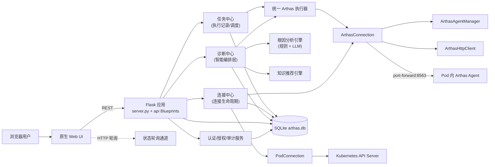
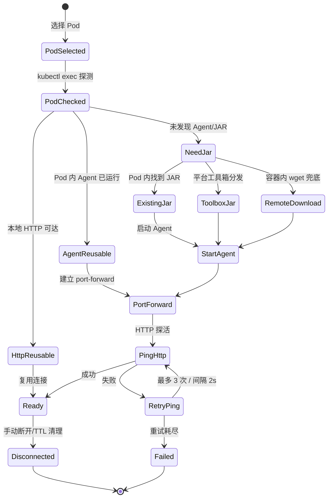

# K8s Arthas 智能诊断平台 — 统一架构设计文档

> 综合 5 份设计文档，以诊断中心 v2.0 为权威，吸收架构评审改进方案

**文档版本**: v2.0  
**创建日期**: 2026-05-06  
**综合来源**:
- [连接交互重构设计](./2026-04-18-connection-management-design.md)（2026-04-18）— 保留
- [Arthas K8s 平台系统设计](./2026-05-02-arthas-k8s-platform-system-design.md)（2026-05-02）— 保留
---

## 目录

1. [背景与目标](#1-背景与目标)
2. [系统总架构](#2-系统总架构)
3. [连接中心](#3-连接中心)
4. [诊断中心](#4-诊断中心)
5. [任务中心](#5-任务中心)
6. [工具箱](#6-工具箱)
7. [数据模型](#7-数据模型)
8. [API 设计](#8-api-设计)
9. [前端交互设计](#9-前端交互设计)
10. [安全与审计](#10-安全与审计)
11. [现有架构迁移方案](#11-现有架构迁移方案)
12. [实施规划](#12-实施规划)
13. [风险与成功指标](#13-风险与成功指标)

---

## 1. 背景与目标

### 1.1 背景

Java 服务运行在 Kubernetes Pod 中后，线上性能诊断面临以下问题：

- 直接进入 Pod 执行 `jstack`、`jmap`、`jstat`、Arthas 命令门槛高，且缺少审计与权限控制。
- 生产环境中临时安装 Arthas、建立端口转发、下载采样产物等步骤容易出错，排障耗时长。
- 多人同时对同一 Pod 执行 `watch`、`trace`、`heapdump`、`profiler` 等操作时，缺少会话隔离和互斥保护。
- 诊断能力分散在多个菜单入口（console/diagnosis-cap/性能诊断），用户心智混乱。
- 诊断结果依赖人工分析，历史案例无法沉淀复用。

当前工程已具备 Flask REST API、kubectl 执行、Arthas 连接、性能采样、Pod 监控、文件下载、多用户认证和审计基础。本设计在现有工程上演进。

### 1.2 产品目标

- **统一诊断入口**：所有诊断能力集中在"诊断中心"，消除多菜单混淆。
- **异常自动感知**：持续监控 Pod 指标，异常自动触发诊断。
- **AI 根因分析**：结合规则引擎 + LLM 自动生成诊断报告。
- **知识沉淀复用**：历史诊断案例库，相似问题智能推荐。
- **连接是工作上下文**：所有诊断能力绑定明确的连接上下文，避免误操作。
- **轻量部署优先**：Flask + SQLite + kubectl + 原生前端，无额外中间件依赖。

### 1.3 产品定位与设计原则

**产品定位**：面向 Java 开发工程师、SRE、性能测试和平台管理员的 Kubernetes 在线诊断工作台，以连接上下文为中心，将 Arthas、kubectl、Pod 运维、采样分析、任务编排、AI 辅助和审计治理整合为一站式平台。

**设计原则**：

1. **连接是工作上下文**：所有诊断操作必须绑定 `cluster / namespace / pod / container / java_pid`。
2. **管理和使用分离**：连接管理负责建立、复用、断开和状态治理；诊断中心负责使用连接执行诊断。
3. **先安全后便利**：高风险命令必须分级、确认、审计。
4. **轻量部署优先**：当前阶段坚持 Flask + SQLite + kubectl + 原生前端。
5. **渐进式产品化**：先完成手动/半自动诊断闭环，再引入异常自动检测和 AI 辅助。

### 1.4 诊断闭环

```text
发现异常 → 初步定位 → 深度诊断 → 修复验证 → 回归确认 → 归档审计
```

### 1.5 v2.0 解决的问题

| 问题 | 现状 | v2.0 解决 |
|------|------|----------|
| 菜单分散 | console/diag/diagnosis-cap 三个入口 | 统一到诊断中心 |
| 依赖人工触发 | 用户手动选择能力执行 | 异常自动检测 + 主动推荐 |
| 诊断门槛高 | 需了解 Arthas 命令 | AI 自动生成诊断方案 |
| 结果解读难 | 原始数据需人工分析 | AI 生成结构化报告 |
| 经验难复用 | 诊断案例分散 | 知识库统一管理 |
| 连接状态混乱 | 连接信息高密度侧栏，入口分散 | 连接中心独立管理，列表→详情→工作页 |

---

## 2. 系统总架构

### 2.1 代码结构映射

| 层级 | 模块 | 职责 |
|------|------|------|
| 前端入口 | `static/index.html`、`static/js/app-ui.js`、`static/css/app.css` | 诊断工作台、连接面板、监控页、终端 |
| Flask 主应用 | `server.py` | REST API、静态页路由、认证 |
| Blueprint API | `api/*.py` | 登录、用户、集群、审计、AI、MCP、性能诊断、任务中心 |
| 核心执行层 | `backend/core/kubectl.py` | kubectl exec/cp/port-forward |
| Arthas 连接层 | `backend/core/arthas_agent.py`、`backend/core/arthas_client.py`、`backend/core/connection.py`、`backend/core/pod_connection.py` | Agent 生命周期、HTTP API、Pod 连接、连接复用 |
| 连接状态管理 | `backend/core/connection_state.py` | 连接状态机、TTL 清理、健康检查 |
| 诊断能力 | `backend/core/diagnosis_capabilities.py`、`backend/core/arthas_executor.py` | 能力目录、统一执行器 |
| 采样工作流 | `backend/core/profiler.py` | profiler/JFR/thread dump/heap dump |
| Pod 监控 | `backend/pod_monitor.py` | CPU/内存/进程/网络采集 |
| 认证授权 | `models/user.py`、`services/auth_service.py`、`services/authorization_service.py`、`services/audit_service.py` | 用户、角色、集群授权、审计 |
| 数据库 | `arthas.db`、`models/db.py` | SQLite 本地元数据 |

### 2.2 总体架构图



### 2.3 模块边界与职责

| 模块 | 负责 | 不负责 |
|------|------|--------|
| **连接中心** | Pod/Arthas 连接建立、健康探测、连接快照、状态事件 | 执行诊断方案、生成报告 |
| **诊断中心** | 异常识别、能力推荐、诊断方案编排、AI RCA、报告生成、案例沉淀 | 直接管理 port-forward、直接执行 kubectl、直接维护连接生命周期 |
| **任务中心** | `task_logs` 运行记录、日志/产物归档、状态流转、定时/异步调度 | 判断根因、维护 AI 对话上下文 |
| **工具箱** | 工具包管理、分发、Tunnel Server 启停 | 执行诊断方案 |
| **Arthas 执行器** | `trace/watch/thread/dashboard/profiler/jad/redefine` 命令封装 | 管理诊断能力目录和异常规则 |
| **AI 助手** | 对话式解释、工具调用编排、用户意图澄清 | 绕过诊断中心直接拼接高危命令 |

### 2.4 菜单架构

```
🔗 连接中心
└── 连接管理

🧠 诊断中心（整合 console + diag + diagnosis-cap）
├── ⚡ 快捷工具（Level 1）
│   ├── JVM Dashboard
│   ├── 线程快照
│   └── GC 统计
├── 🔍 诊断模板（Level 2）
│   ├── Trace 调用链分析
│   ├── Watch 方法监控
│   └── Profiler CPU 分析
├── 📋 场景方案（Level 3）
│   ├── 接口响应慢诊断
│   └── CPU 飙升排查
├── 🤖 AI 诊断（Level 4）
│   ├── CPU 性能瓶颈分析
│   └── 内存泄漏检测
├── 🔔 异常告警
│   ├── 实时告警
│   └── 告警规则
├── 📊 执行历史
│   └── 诊断记录
└── ⚙️ 能力管理（管理员）
    ├── 能力配置
    ├── 规则配置
    └── 知识库

📦 任务中心
├── 任务定义
├── 执行日志
└── 定时任务

🛠️ 工具箱
├── 在线修复
├── 采样工具
├── 终端
├── Pod 监控
└── 文件下载

🤖 AI 助手（全局入口，不占一级菜单）

⚙️ 系统管理
├── 用户管理
├── 审计日志
├── 模型配置
└── MCP 接入
```

---

## 3. 连接中心

### 3.1 设计目标

连接中心是所有诊断能力的基础。它回答三个核心问题：

1. 当前有哪些可用连接？
2. 每个连接的状态和层级是什么？
3. 从连接能进入哪些诊断能力？

### 3.2 分层连接模型

平台明确区分 Pod 级连接和 Arthas 级连接：

| 连接层级 | `connections.level` | 依赖 | 典型能力 | 生命周期 |
|----------|---------------------|------|----------|----------|
| Pod 连接 | `pod` | kubeconfig、kubectl、Pod 可访问 | exec、文件浏览、日志、GC 日志、Pod 监控 | 随用户选择 Pod 建立，可长期复用 |
| Arthas 连接 | `arthas` | Pod 连接 + Java PID + Arthas Agent + port-forward + HTTP API | trace、watch、profiler、jad、redefine | 按需建立，支持健康检查和 TTL 清理 |

### 3.3 连接状态机



### 3.4 状态与数据库映射

| 状态机状态 | `connections.status` | `connections.level` | 前端颜色 |
|-----------|---------------------|---------------------|----------|
| `PodSelected` | `connecting` | `pod` | 蓝色 |
| `PodChecked` | `connecting` | `pod` | 绿色 |
| `HttpReusable` | `ready` | `arthas` | 绿色 |
| `AgentReusable` | `connecting` | `arthas` | 黄色 |
| `NeedJar` | `waiting_user` | `arthas` | 橙色 |
| `StartAgent` | `connecting` | `arthas` | 橙色 |
| `PortForward` / `PingHttp` / `RetryPing` | `connecting` | `arthas` | 黄色 |
| `Ready` | `ready` | `arthas` | 绿色 |
| `Failed` | `failed` | `arthas` | 红色 |
| `Disconnected` | `disconnected` | `pod` 或 `arthas` | 灰色 |

### 3.5 短路复用策略

```text
优先级 1: HTTP 已可达 → 直接复用（0 额外开销）
优先级 2: Agent 已运行 → 仅补建 port-forward
优先级 3: Pod 内有 JAR → 启动 Agent + port-forward + HTTP 探活
优先级 4: 平台工具箱分发 JAR → 启动 Agent + port-forward + HTTP 探活
优先级 5: 容器内 wget 官方 JAR → 启动 Agent + port-forward + HTTP 探活
```

### 3.6 状态管理器与执行器协作

| 组件 | 职责 | 不做什么 |
|------|------|---------|
| `ConnectionStateManager` | 状态元数据管理、状态转换校验、TTL 清理调度、重连触发 | 不持有连接实例、不执行 kubectl/HTTP 操作 |
| `PodConnection` | Pod 级连接操作（exec/cp/文件/日志） | 不管理 Arthas Agent |
| `ArthasConnection` | Arthas 级连接操作（Agent 启动/HTTP API/命令执行） | 不管理 TTL |
| `KubectlExecutor` | kubectl 命令执行封装 | 不感知连接状态 |

**调用关系**：

```python
# 状态管理器仅编排状态，不执行实际操作
class ConnectionStateManager:
    def get_connection_state(connection_id) -> ConnectionState
    def transition_state(connection_id, from_state, to_state)
    def schedule_ttl_cleanup()
    def request_reconnect(connection_id)

# 执行器负责实际操作，通过回调通知状态变化
class ArthasConnection:
    def connect(on_state_change)  # Agent + port-forward + ping
    def disconnect(on_state_change)  # 释放 port-forward
    def ping() -> bool  # HTTP 探活
```

**状态更新策略**：

- **中间状态**（PodSelected/StartAgent/PortForward/PingHttp）：仅内存缓存 + 轮询实时推送
- **稳定状态**（Ready/Failed/Disconnected）：写入数据库
- **等待用户状态**（NeedJar）：写入数据库，等待用户确认

### 3.7 连接页面设计

#### 连接列表页

用于查看全部连接、筛选、新建、清理失效连接、进入连接详情。

| 字段 | 作用 |
|------|------|
| Pod | 主标识 |
| Namespace | 基础定位 |
| 集群 | 所属集群 |
| 连接层级 | Pod / Arthas |
| 状态 | 正常 / 异常 / 失效 |
| 运行时 | Java / Node / Python |
| 最近检查 | 最后健康检查时间 |
| 操作 | 查看详情、健康检查、删除 |

#### 连接详情页

连接详情页回答：这个连接是谁、当前状态如何、当前层级、可用能力、下一步操作。

**操作区根据状态动态展示**：

| 状态 | 可用操作 |
|------|---------|
| 未连接 | 建立 Pod 连接 |
| Pod 已连接 + Java | 升级到 Arthas、健康检查、删除 |
| Pod 已连接 + 非 Java | 健康检查、删除 |
| Arthas 已连接 | 健康检查、重新连接、删除 |

**能力入口区**（连接详情页底部）：

- 基础操作：🖥️ 终端、📊 Pod 监控、📂 文件下载
- 诊断分析：🔬 性能诊断、⚡ Arthas 命令、🔥 采样工具

### 3.8 连接上下文条

全局顶部轻量展示：

- 当前连接：cluster / namespace / pod
- 当前层级：未连接 / Pod / Arthas
- runtime 摘要
- 查看详情按钮

不做批量操作、升级主入口、删除或复杂状态解释。

### 3.9 连接有效期（TTL）

用户建连时可指定连接有效期（按小时），到期后自动断开释放资源。

| 字段 | 含义 | 默认值 |
|------|------|--------|
| `connections.ttl_hours` | 连接有效期（小时） | `0`（不自动过期） |
| `connections.last_active_at` | 最后活跃时间（每次执行命令时更新） | 建连时写入 |

**TTL 清理逻辑**（`ConnectionStateManager._run_ttl_cleanup`，每 30 分钟执行一次）：
- `ttl_hours = 0`：不清理，连接保持到手动断开
- `ttl_hours > 0`：当 `now > last_active_at + ttl_hours` 时自动标记为 `disconnected`

**前端交互**：建连表单增加"连接有效期"下拉框，选项：不限 / 1小时 / 2小时 / 4小时 / 8小时 / 12小时 / 24小时。

### 3.10 关键约束

- 同一用户同一 Pod 允许复用连接；多用户并发互斥策略作为 P2 TODO。
- port-forward 端口使用本地动态分配，必须释放已断开端口。
- Agent 启动日志通过 `/tmp/arthas_start.log` 暴露为排障入口。
- Arthas JAR 分发顺序：Pod 内已有 → 平台工具箱分发 → 容器内 wget 兜底。
- 分发前先执行 `java -version`，按 JDK 版本选择兼容工具包。
- 容器内远程下载兜底命令：`kubectl exec -it <pod> --container <c> -- /bin/bash -c "wget https://arthas.aliyun.com/arthas-boot.jar && java -jar arthas-boot.jar"`

---

## 4. 诊断中心

### 4.1 核心定位

诊断中心 v2.0 是**统一的 Arthas 在线诊断平台**，整合所有诊断能力：

```
v1.0（分散）              v2.0（统一诊断中心）        v3.0（自治系统）
                                                                        
console + diag +        ──→    诊断中心（统一入口）  ──→    自主诊断决策
diagnosis-cap                      ├─ 快捷工具
                                   ├─ 诊断模板
                                   ├─ 场景方案
                                   ├─ AI 诊断
                                   ├─ 异常告警
                                   └─ 执行历史
```

### 4.2 架构分层

```
┌─────────────────────────────────────────────────────────┐
│                     交互层                                │
│  诊断中心（统一入口）: 能力卡片/参数表单/告警/历史/报告     │
└─────────────────────────────────────────────────────────┘
                          ↓
┌─────────────────────────────────────────────────────────┐
│                     智能层                                │
│  异常检测引擎 │ 根因分析引擎 │ 知识推荐引擎                 │
└─────────────────────────────────────────────────────────┘
                          ↓
┌─────────────────────────────────────────────────────────┐
│                     能力层                                │
│  诊断能力平台: 能力注册中心 │ 统一执行引擎 │ 执行日志管理    │
└─────────────────────────────────────────────────────────┘
                          ↓
┌─────────────────────────────────────────────────────────┐
│                     数据层                                │
│  诊断案例库 │ 解决方案库 │ 指标历史库                       │
└─────────────────────────────────────────────────────────┘
```

### 4.3 诊断能力模型

系统采用 **1 张扁平主表** 的架构，通过 `category` 字段区分能力类型。扩展表（`arthas_command_templates`、`diagnosis_scenario_steps`、`ai_diagnosis_handlers`）已预建但当前未作为主要数据源——能力特定数据（`arthas_command`、`steps_json`、`handler`）直接存储在主表中，种子数据也直接写入主表。

| 表名 | 用途 | 关键字段 |
|------|------|---------|
| **diagnosis_capabilities** | 诊断能力元数据（主表） | name, category, level, arthas_command, steps_json, handler, parameters_schema |
| **script_templates** | 脚本模板扩展（预留） | capability_id, runtime, script_body |
| **arthas_command_templates** | Arthas 命令模板扩展（预留） | capability_id, arthas_command |
| **diagnosis_scenario_steps** | 场景方案步骤扩展（预留） | capability_id, step_order, command, timeout_ms |
| **ai_diagnosis_handlers** | AI 诊断处理器扩展（预留） | capability_id, handler |

**能力类型与执行模式**（基于 `category` 字段）：

| 能力类型 | `category` | 执行方式 | 层级 |
|---------|------------|---------|------|
| 快捷工具 | `quick` | 单条命令直接执行 | Level 1 |
| 诊断模板 | `tool` | 参数化命令模板 | Level 2 |
| 场景方案 | `scenario` | 多步骤批量执行 | Level 3 |
| 智能诊断 | `ai` | 处理器动态加载 | Level 4 |

### 4.4 统一 Arthas 命令执行器

当前系统有 4 个地方在执行 Arthas 命令（server.py / performance_diagnose.py / ai_chat.py / task_center.py），逻辑重复。统一为 `ArthasCommandExecutor`：

```python
class ArthasCommandExecutor:
    """统一的 Arthas 命令执行器"""

    @staticmethod
    def execute(connection, command, timeout_ms=None, skip_audit=False, 
                skip_history=False, confirmed=False):
        """执行单条 Arthas 命令
        
        功能：高危命令检查 → 自动超时 → 执行 → 脱敏 → 命令历史 → 审计日志
        """

    @staticmethod
    def execute_batch(connection, commands, timeout_ms=None, fail_fast=True):
        """批量执行（场景方案使用）"""
```

**命令分类与超时配置**：

| 类别 | 命令示例 | 默认超时 |
|------|---------|---------|
| 快捷查询 | dashboard, thread | 15-30s |
| 方法诊断 | trace, watch | 60s |
| 采样与 Dump | profiler, heapdump | 120s |

**高危命令**：`redefine`、`retransform`、`heapdump`、`profiler`、`logger`

### 4.5 执行引擎

诊断中心发起任何诊断执行时，必须创建 `task_logs` 运行记录，写入 `run_type`、`capability_id`、`anomaly_event_id`、`connection_snapshot_json` 和 `ai_analysis_result`。

```python
def execute_task_run(task_def, connection=None):
    """统一执行入口"""
    capability = load_capability(task_def['capability_id'])
    category = capability['category']

    if category in ('quick', 'tool'):
        return execute_arthas_command(capability, task_def, connection)
    elif category == 'scenario':
        return execute_scenario(capability, task_def, connection)
    elif category == 'ai':
        return execute_ai_diagnosis(capability, task_def, connection)
```

#### 场景方案执行（异步 + HTTP 轮询）

场景方案采用异步执行 + HTTP 轮询机制（非 WebSocket），因为当前系统无 WebSocket 基础设施：

```python
class ScenarioExecutor:
    def execute_async(self, capability_id, params, user_id, connection):
        """异步执行，返回 execution_id，前端通过轮询查询进度"""
        execution_id = str(uuid4())
        # 创建 task_logs 记录
        # 启动后台线程执行
        return {'ok': True, 'execution_id': execution_id}
```

前端每 2 秒轮询 `GET /api/diagnosis/executions/{execution_id}/status`，获取进度和结果。

#### AI 诊断处理器（数据库驱动注册表）

**架构评审改进**：原硬编码白名单改为数据库驱动的处理器注册表，新增能力无需修改代码。

```python
class HandlerRegistry:
    """诊断处理器注册表（数据库驱动）"""

    @classmethod
    def execute(cls, handler_path, **kwargs):
        registry = cls.load_handlers()  # 从 ai_diagnosis_handlers 表加载
        # 1. 检查是否注册
        # 2. 检查是否启用
        # 3. 模块路径限制（仅允许 performance_diagnose 模块）
        # 4. 动态加载
        # 5. 执行
```

### 4.6 异常检测引擎

#### 检测策略

```python
DETECTION_STRATEGIES = {
    'threshold': '阈值检测（CPU > 80%）',
    'baseline': '基线偏离（当前 vs 历史）',
    'trend': '趋势预测（容量预警）',
    'pattern': '模式识别（GC 频繁）',
}
```

#### 异常规则表

```sql
CREATE TABLE anomaly_rules (
    id INTEGER PRIMARY KEY AUTOINCREMENT,
    name TEXT NOT NULL UNIQUE,
    metric TEXT NOT NULL,                -- cpu/memory/gc/thread
    operator TEXT NOT NULL,              -- >/</>=/<=/==
    threshold REAL NOT NULL,
    duration_seconds INTEGER DEFAULT 60,
    cooldown_seconds INTEGER DEFAULT 300, -- 静默期：同一规则触发后多长时间不重复告警
    severity TEXT DEFAULT 'warning',     -- info/warning/critical
    enabled INTEGER DEFAULT 1,
    description TEXT,
    created_at TIMESTAMP DEFAULT CURRENT_TIMESTAMP
);

CREATE TABLE anomaly_events (
    id INTEGER PRIMARY KEY AUTOINCREMENT,
    rule_id INTEGER NOT NULL,
    pod_id TEXT NOT NULL,
    metric_value REAL NOT NULL,
    threshold REAL NOT NULL,
    severity TEXT NOT NULL,
    status TEXT DEFAULT 'open',          -- open/diagnosing/resolved/ignored
    root_event_id INTEGER,               -- 去重关联
    diagnosis_id TEXT,
    started_at TIMESTAMP,
    resolved_at TIMESTAMP,
    FOREIGN KEY (rule_id) REFERENCES anomaly_rules(id)
);

CREATE TABLE metric_baselines (
    id INTEGER PRIMARY KEY AUTOINCREMENT,
    pod_id TEXT NOT NULL,
    metric TEXT NOT NULL,
    time_window TEXT NOT NULL,           -- 1h/6h/24h/7d
    avg_value REAL,
    p50_value REAL, p95_value REAL, p99_value REAL,
    stddev REAL,
    updated_at TIMESTAMP DEFAULT CURRENT_TIMESTAMP,
    UNIQUE(pod_id, metric, time_window)
);
```

#### 预制异常规则

```sql
INSERT INTO anomaly_rules (name, metric, operator, threshold, duration_seconds, severity, description) VALUES
('CPU 使用率过高', 'cpu', '>', 80, 300, 'critical', 'CPU 使用率超过 80% 持续 5 分钟'),
('Old 区内存过高', 'old_gen_mb', '>', 800, 180, 'warning', 'Old 区内存超过 800MB 持续 3 分钟'),
('BLOCKED 线程过多', 'blocked_threads', '>=', 3, 60, 'critical', 'BLOCKED 线程数 >= 3 持续 1 分钟'),
('FGC 频繁', 'fgc_count_per_min', '>', 2, 120, 'warning', 'Full GC 频率超过 2 次/分钟 持续 2 分钟'),
('响应时间过长', 'response_time_ms', '>', 2000, 60, 'warning', '接口响应时间超过 2s 持续 1 分钟');
```

### 4.7 根因分析引擎（RCA）

```python
class RootCauseAnalyzer:
    async def analyze(pod_id, anomalies, context) -> DiagnosisResult:
        # 1. 根据异常类型选择诊断能力
        capabilities = select_capabilities(anomalies)
        # 2. 执行诊断能力
        diagnosis_data = execute_diagnosis(pod_id, capabilities)
        # 3. 规则预筛
        rule_result = rule_engine.evaluate(diagnosis_data)
        # 4. 检索历史案例
        similar_cases = find_similar_cases(anomalies, diagnosis_data)
        # 5. LLM 推理（三级降级策略）
        llm_result = llm_analyze(anomalies, diagnosis_data, rule_result, similar_cases)
        # 6. 生成诊断报告
        return generate_report(llm_result, similar_cases)
```

**异常→能力映射**：

| 异常类型 | 推荐诊断能力 |
|---------|-------------|
| high_cpu | thread_analysis, profiler_cpu |
| high_memory | heap_analysis, gc_analysis |
| thread_blocked | thread_deadlock, thread_dump |
| slow_api | trace_analysis, profiler_cpu |
| gc_frequent | gc_analysis, heap_histogram |

### 4.8 知识推荐引擎

#### 案例库

```sql
CREATE TABLE diagnosis_cases (
    id INTEGER PRIMARY KEY AUTOINCREMENT,
    title TEXT NOT NULL,
    problem_description TEXT NOT NULL,
    symptoms_json TEXT NOT NULL,
    root_cause TEXT,
    solution TEXT,
    diagnosis_capability_ids TEXT,
    execution_log_ids TEXT,
    confidence REAL,
    verified INTEGER DEFAULT 0,
    success_count INTEGER DEFAULT 0,
    failure_count INTEGER DEFAULT 0,
    tags TEXT,
    created_by INTEGER,
    created_at TIMESTAMP DEFAULT CURRENT_TIMESTAMP,
    updated_at TIMESTAMP DEFAULT CURRENT_TIMESTAMP,
    FOREIGN KEY (created_by) REFERENCES users(id)
);

CREATE TABLE solution_playbooks (
    id INTEGER PRIMARY KEY AUTOINCREMENT,
    name TEXT NOT NULL UNIQUE,
    problem_pattern TEXT NOT NULL,
    description TEXT,
    steps_json TEXT NOT NULL,
    estimated_time_minutes INTEGER,
    risk_level TEXT DEFAULT 'medium',
    success_rate REAL,
    requires_restart INTEGER DEFAULT 0,
    rollback_plan TEXT,
    tags TEXT,
    created_by INTEGER,
    created_at TIMESTAMP DEFAULT CURRENT_TIMESTAMP,
    updated_at TIMESTAMP DEFAULT CURRENT_TIMESTAMP,
    FOREIGN KEY (created_by) REFERENCES users(id)
);
```

#### 案例匹配算法

匹配策略：症状匹配（40%）+ 标签匹配（20%）+ 时间衰减（10%）+ 成功率（30%）。

使用 SQLite FTS5 做初筛，限制候选集大小后再内存精排。

### 4.9 LLM 分析引擎

#### 三级降级策略

| 场景 | 行为 |
|------|------|
| LLM 正常 | 完整 AI 诊断报告（根因 + 证据 + 建议 + 相似案例） |
| LLM 超时 | 规则引擎结果 + 文本摘要 |
| LLM 不可用 | 纯规则引擎结果 + 历史案例推荐 |

#### AI 工具调用安全边界

| 调用来源 | 允许能力 | 约束 |
|---------|---------|------|
| AI RCA | 只读诊断能力、短时 trace/watch/thread/dashboard | 必须绑定 run_id 和连接快照 |
| AI 对话 | 能力目录中的允许列表能力 | 用户确认后执行 |
| MCP | MCP token 绑定连接和用户权限内的能力 | 不能绕过诊断中心直接调用 |
| 在线修复建议 | 只生成建议和验证清单 | redefine 必须由用户二次确认 |

LLM 输出必须按 JSON Schema 解析，解析失败时降级为文本摘要。AI 只能通过能力 ID 或 handler key 调用诊断能力，**不允许让 LLM 直接生成任意 Arthas 命令后执行**。

### 4.10 诊断报告

```
┌─────────────────────────────────────────────────────────┐
│  诊断报告                                                 │
│  Pod: udc-7cc5-abc123 | 2026-05-04 10:30                │
├─────────────────────────────────────────────────────────┤
│  🔍 根因定位                                              │
│  OrderService.createOrder() 方法慢                        │
│  平均耗时: 1.2s（正常 200ms）                              │
│  根因: 数据库慢查询（user_orders 表缺索引）                 │
│  置信度: 87%                                              │
│                                                         │
│  📈 影响面                                                │
│  直接影响: 订单创建接口                                    │
│  间接影响: 支付流程、库存扣减                               │
│                                                         │
│  💡 修复建议                                              │
│  1. 为 user_orders.user_id 添加索引 [生成 SQL] [执行]     │
│  2. 优化 SQL: SELECT * → SELECT id, status               │
│                                                         │
│  📚 相似案例                                              │
│  - 2026-04-20: payment 表缺索引（已解决）                  │
│                                                         │
│  [导出 PDF] [导出 Markdown] [归档案例]                     │
└─────────────────────────────────────────────────────────┘
```

---

## 5. 任务中心

### 5.1 设计目标

- 即时诊断直接执行，无需创建 task_definition
- 定时任务保留 task_definitions
- **统一日志表**：所有执行日志统一使用 `task_logs`，通过 `execution_mode` 区分

### 5.2 执行模式

**即时诊断**：
```
diagnosis_capabilities → task_logs (execution_mode='immediate') → arthas_command_logs
```

**定时任务**：
```
task_definitions → task_logs (execution_mode='scheduled') → arthas_command_logs
```

**通用任务**：
```
task_definitions → task_logs (execution_mode='manual'|'scheduled')
```

### 5.3 定时任务调度

定时任务不支持 Arthas 连接模式（依赖 port-forward，用户断开后进程退出），只支持 `node` 和 `pod` 模式。

**适合定时的任务**：定时 thread dump、定时 JVM 指标采集、定时健康检查脚本。

**Cron 表达式支持**：标准 5 位 Cron 格式，支持固定间隔和一次性任务。

### 5.4 场景方案步骤数据传递

```python
def resolve_step_references(command_template, params, previous_outputs):
    """解析步骤间引用
    
    支持语法：
    1. ${param} - 直接替换参数
    2. ${stepN.field} - 引用第N步的字段
    3. ${stepN} - 引用第N步的完整输出（JSON字符串）
    """
```

---

## 6. 工具箱

### 6.1 工具包管理

| 工具类型 | 用途 | 分发方式 |
|---------|------|---------|
| `arthas` | Arthas Agent JAR | kubectl cp / wget |
| `arthas-tunnel-server` | Tunnel Server JAR | 本地启动 |
| `async-profiler` | CPU/内存采样 | kubectl cp |

工具箱采用"列表 + 详情页"管理，支持兼容性检查（JDK 版本、CPU 架构）、SHA256 校验和健康检查。

### 6.2 Arthas JAR 分发兼容

| 检查点 | 规则 | 失败处理 |
|--------|------|---------|
| JDK 版本 | java -version 解析主版本 | 提示不兼容，允许选择其他版本 |
| CPU 架构 | uname -m 识别 | 没有匹配包时禁止分发 |
| 文件完整性 | SHA256 校验 | 最多重试 3 次 |

### 6.3 Tunnel Server

- 本地启动 `arthas-tunnel-server.jar`，展示可访问 IP 和端口
- Agent attach 时可勾选注册远程
- 同一平台实例默认只运行一个进程
- 异常退出时更新状态并提示重启

### 6.4 在线修复

使用 Arthas `jad → mc → redefine` 链路实现轻量热更新闭环：

```text
用户选择目标 → jad 查看源码 → 在线编辑/上传 .java/.class → mc 编译 → redefine 生效 → 验证
```

**redefine 技术限制**：不能增减方法参数/字段、不能修改继承关系、JDK 17+ 可能受限、Spring Bean 不更新代理。

**验证自动化**：

| 层级 | 内容 | P1 策略 |
|------|------|---------|
| L0 目标确认 | 展示连接/PID/类名/SHA256/风险提示 | 必做 |
| L1 技术验证 | redefine 后自动 jad 确认代码变化 | 必做 |
| L2 诊断验证 | 用户选择 trace/watch 模板验证 | 建议做 |
| L3 业务验证 | 调用业务接口比对结果 | P2 |

---

## 7. 数据模型

### 7.1 核心表清单

| 表 | 用途 | 来源 |
|----|------|------|
| `users` | 用户账号、密码哈希、角色、启停状态 | 已有 |
| `user_clusters` | 用户与集群授权关系 | 已有 |
| `connections` | Pod/Arthas 连接记录 | 已有，需扩展 |
| `arthas_commands` | Arthas 命令执行历史 | 已有，需扩展 |
| `audit_logs` | 操作审计 | 已有 |
| `profiler_tasks` | 采样任务历史 | 已有，需扩展 |
| `profiler_logs` | 采样运行日志 | 已有 |

### 7.2 新增表

#### P0 必做表

| 表名 | 用途 | 说明 |
|------|------|------|
| `diagnosis_capabilities` | 诊断能力元数据（核心表） | 支持 4 层能力分类 |
| `arthas_command_templates` | Arthas 命令模板扩展 | 与 capabilities 一对一 |
| `diagnosis_scenario_steps` | 场景方案步骤扩展 | 与 capabilities 一对多 |
| `ai_diagnosis_handlers` | AI 诊断处理器扩展 | 与 capabilities 一对一 |
| `tool_packages` | 工具包管理 | Arthas JAR 管理 |

#### P1 可推迟表

| 表名 | 用途 | 所属业务 | 推迟原因 |
|------|------|---------|---------|
| `anomaly_rules` | 异常检测规则 | 异常自动感知 | 当前先做手动触发诊断 |
| `anomaly_events` | 异常事件记录 | 异常自动感知 | 依赖 anomaly_rules |
| `metric_baselines` | 指标基线数据 | 异常自动感知 | 需大量历史数据积累 |
| `diagnosis_cases` | 诊断案例库 | 知识沉淀 | 诊断能力跑通后才有案例可沉淀 |
| `solution_playbooks` | 解决方案库 | 知识沉淀 | 配套 diagnosis_cases |
| `diagnosis_reports` | 诊断报告 | 报告生成 | 依赖 LLM 集成 |
| `capability_versions` | 能力版本历史 | 能力版本管理 | 初期能力固定不变 |
| `schema_version` | 数据库迁移版本 | 迁移管理 | 当前 try/except 方式够用 |
| `tool_runtime_processes` | 本地工具运行进程 | Tunnel Server | 可选增强 |
| `external_menu_links` | 外部系统链接 | 外部资源入口 | 可选增强 |

### 7.3 统一执行日志表（关键决策）

**架构评审改进**：废弃 `diagnosis_execution_logs`，统一使用 `task_logs`。

```sql
-- 重命名原 task_runs 为 task_logs
ALTER TABLE task_runs RENAME TO task_logs;

-- 扩展字段
ALTER TABLE task_logs ADD COLUMN capability_id INTEGER REFERENCES diagnosis_capabilities(id);
ALTER TABLE task_logs ADD COLUMN execution_type TEXT;  -- diagnosis | script | pod_exec | node_exec
ALTER TABLE task_logs ADD COLUMN capability_name TEXT;  -- 冗余，防止能力被删除后丢失
ALTER TABLE task_logs ADD COLUMN rendered_command TEXT;  -- 参数替换后的实际命令
ALTER TABLE task_logs ADD COLUMN run_type TEXT DEFAULT 'script';
ALTER TABLE task_logs ADD COLUMN anomaly_event_id INTEGER REFERENCES anomaly_events(id);
ALTER TABLE task_logs ADD COLUMN connection_snapshot_json TEXT;
ALTER TABLE task_logs ADD COLUMN capability_snapshot_json TEXT;
ALTER TABLE task_logs ADD COLUMN ai_analysis_result TEXT;  -- JSON

-- 索引
CREATE INDEX idx_task_logs_capability_id ON task_logs(capability_id);
CREATE INDEX idx_task_logs_execution_mode ON task_logs(execution_mode);
CREATE INDEX idx_task_logs_execution_type ON task_logs(execution_type);
CREATE INDEX idx_task_logs_cluster_ns_pod ON task_logs(cluster_name, namespace, pod_name);
```

**执行模式统一**：

| 执行来源 | execution_mode | capability_id | task_id |
|---------|----------------|---------------|---------|
| 即时诊断 | `immediate` | ✅ 有 | ❌ NULL |
| 定时任务 | `scheduled` | 可选 | ✅ 有 |
| 手动任务 | `manual` | ❌ NULL | ✅ 有 |

### 7.4 现有表扩展

| 表 | 新增字段 | 目的 |
|----|---------|------|
| `connections` | `container_name`, `java_pid`, `arthas_version`, `last_ping_at` | 多容器、多进程、健康检查 |
| `arthas_commands` | `template_type`, `risk_level`, `duration_ms`, `exit_status`, `masked_output`, `run_id` | 模板检索、风险审计、脱敏、串联场景步骤 |
| `profiler_tasks` | `artifact_size`, `artifact_sha256`, `max_duration`, `cancel_reason` | 产物完整性和任务治理 |
| `script_templates` | `capability_id` | 关联诊断能力 |

### 7.5 表关系图

```
diagnosis_capabilities (扁平主表，category 字段区分类型)
├── category='quick'/'tool'  → arthas_command + parameters_schema
├── category='scenario'      → steps_json + parameters_schema
└── category='ai'            → handler + parameters_schema

task_logs (统一执行日志)
├── capability_id → diagnosis_capabilities.id
└── task_id → task_definitions.id (可选)

arthas_command_logs.run_id → task_logs.id (串联场景步骤命令)

anomaly_events.rule_id → anomaly_rules.id
anomaly_events.diagnosis_id → task_logs.id

diagnosis_cases (知识库，独立)
solution_playbooks (方案库，独立)
```

### 7.6 数据初始化策略

所有诊断能力通过管理员后台配置，预制数据包括：

- 5 个快捷工具（JVM Dashboard、线程清单、死锁检测、VM 参数、类信息）
- 5 个诊断模板（Trace、Watch、Stack、Monitor、Jad）
- 3 个场景方案（接口响应慢、CPU 飙升、OOM 内存泄漏）
- 1 个 AI 诊断（一键性能诊断）

---

## 8. API 设计

### 8.1 现有接口（保留）

| 域 | 典型接口 |
|----|---------|
| 健康检查 | `GET /api/health` |
| 集群 | `/api/clusters/*` |
| Arthas | `/api/arthas/connect`、`/api/arthas/exec` |
| 采样 | `/api/profile/start`、`/api/profile/<task_id>` |
| 监控 | `/api/monitor/*` |
| Pod | `/api/pod/exec`、`/api/pod/files*` |
| 管理 | `/api/auth/*`、`/api/users/*`、`/api/audit/*` |

### 8.2 诊断中心 API

```python
# 能力目录查询
GET /api/tasks/capabilities?type=arthas_command&category=tool&level=2

# 即时执行诊断能力
POST /api/diagnosis/capabilities/{capability_id}/execute
{
  "connection_id": "cluster/default/pod/arthas",
  "params": {"class": "com.example.OrderService", "method": "createOrder"},
  "source": "manual|anomaly|ai-chat|mcp"
}

# 查询运行结果
GET /api/diagnosis/runs/{run_id}

# 取消运行
POST /api/diagnosis/runs/{run_id}/cancel

# 查询执行状态（前端轮询）
GET /api/diagnosis/executions/{execution_id}/status
```

### 8.3 异常检测 API

```python
GET  /api/diagnosis/anomalies?pod_id=xxx&status=open
POST /api/diagnosis/anomalies/{id}/acknowledge
POST /api/diagnosis/anomalies/{id}/ignore
POST /api/diagnosis/anomalies/{id}/diagnose
POST /api/diagnosis/rca                    # 执行根因分析
GET  /api/diagnosis/rca/{diagnosis_id}     # 查询分析结果
```

### 8.4 知识库 API

```python
GET  /api/diagnosis/cases/similar?symptoms=high_cpu,slow_api&top_k=5
POST /api/diagnosis/cases                  # 创建案例
POST /api/diagnosis/cases/{id}/verify      # 验证案例
POST /api/diagnosis/reports/generate       # 生成诊断报告
GET  /api/diagnosis/reports/{id}/download  # 下载报告
```

### 8.5 连接中心 API

```python
POST /api/arthas/connections/{id}/ping     # 主动探活
GET  /api/arthas/connections?status=ready&level=arthas  # 查询可用连接
```

### 8.6 工具箱 API

```python
GET  /api/tools/packages                   # 工具包列表
GET  /api/tools/packages/{id}              # 工具包详情
POST /api/tools/packages/sync              # 同步官方源
POST /api/tools/arthas/install             # 分发 JAR 到 Pod
POST /api/tools/arthas/bootstrap           # 兜底启动
POST /api/tools/tunnel-server/start        # 启动 Tunnel Server
GET  /api/tools/tunnel-server/status       # 查询状态
POST /api/tools/tunnel-server/stop         # 停止

POST /api/hotfix/jad                       # 一键查看源码
POST /api/hotfix/upload                    # 上传 .java/.class
POST /api/hotfix/compile                   # mc 编译
POST /api/hotfix/redefine                  # redefine 生效
GET  /api/hotfix/artifacts                 # 查看产物
```

### 8.7 外部链接 API

```python
GET  /api/external-menu/groups             # 查询启用的外部链接菜单
POST /api/admin/external-menu/links        # 管理员新增链接
PUT  /api/admin/external-menu/links/{id}   # 管理员编辑链接
DELETE /api/admin/external-menu/links/{id} # 管理员删除链接
POST /api/admin/external-menu/links/{id}/toggle  # 启停
```

### 8.8 WebSocket 演进

短期保持轮询；当命令输出体验成为瓶颈时引入 WebSocket：

```text
/ws/arthas/session/{session_id}    Arthas 长命令输出
/ws/profile/tasks/{task_id}        采样任务日志
/ws/pod/terminal/{session_id}      Pod 终端交互
```

降级策略：浏览器不支持 WebSocket 时回退到每 3 秒轮询。

---

## 9. 前端交互设计

### 9.1 侧边栏菜单结构

```html
<div class="side-nav-group">
  <div class="side-nav-group-title">🔗 连接管理</div>
  <button class="side-nav-item" data-tab="connections">连接中心</button>
</div>

<div class="side-nav-group">
  <div class="side-nav-group-title">🧠 诊断</div>
  <button class="side-nav-item" data-tab="diagnosis-center">诊断中心</button>
</div>

<div class="side-nav-group">
  <div class="side-nav-group-title">📦 任务</div>
  <button class="side-nav-item" data-tab="task-center">任务中心</button>
</div>

<div class="side-nav-group">
  <div class="side-nav-group-title">🛠️ 工具</div>
  <button class="side-nav-item" data-tab="hotfix">在线修复</button>
  <button class="side-nav-item" data-tab="profiler">采样工具</button>
  <button class="side-nav-item" data-tab="terminal">终端</button>
  <button class="side-nav-item" data-tab="monitor">Pod 监控</button>
  <button class="side-nav-item" data-tab="filebrowser">文件下载</button>
</div>

<div class="side-nav-group">
  <div class="side-nav-group-title">🤖 AI</div>
  <button class="side-nav-item" data-tab="ai">AI 助手</button>
</div>

<div class="side-nav-group admin-only">
  <div class="side-nav-group-title">⚙️ 系统</div>
  <button class="side-nav-item" data-tab="toolchain-center">工具箱</button>
  <button class="side-nav-item" data-tab="user-management">用户管理</button>
  <button class="side-nav-item" data-tab="audit-logs">审计日志</button>
  <button class="side-nav-item" data-tab="model-config">模型配置</button>
  <button class="side-nav-item" data-tab="mcp-center">MCP 接入</button>
</div>
```

### 9.2 诊断中心内部布局

```
┌────────────────────────────────────────────────────────────┐
│  🧠 诊断中心                                                │
├────────────────────────────────────────────────────────────┤
│  左侧导航（子菜单）          │  右侧内容区                   │
│  ┌──────────────────┐       │                              │
│  │ ⚡ 快捷工具       │       │  [选中快捷工具时]             │
│  │ 🔍 诊断模板       │  ←─── │  ┌──────────────────────┐   │
│  │ 📋 场景方案       │       │  │ JVM Dashboard        │   │
│  │ 🤖 AI 诊断       │       │  │ [执行] [查看帮助]     │   │
│  │ 🔔 异常告警       │       │  └──────────────────────┘   │
│  │ 📊 执行历史       │       │                              │
│  │ ⚙️ 能力管理       │       │  [选中场景方案时]             │
│  └──────────────────┘       │  ┌──────────────────────┐   │
│                              │  │ 接口响应慢诊断        │   │
│                              │  │ Step1: trace          │   │
│                              │  │ Step2: watch          │   │
│                              │  │ Step3: profiler       │   │
│                              │  │ [执行] [查看帮助]     │   │
│                              │  └──────────────────────┘   │
└────────────────────────────────────────────────────────────┘
```

### 9.3 连接选择器

诊断中心支持多连接，但一次诊断执行绑定一个明确目标。

| 能力类型 | 连接要求 | 选择器行为 |
|---------|---------|-----------|
| Pod 只读诊断 | `level=pod` 或 `level=arthas` | 展示所有可访问连接 |
| Arthas 命令诊断 | `level=arthas` 且 HTTP Ready | 只展示 Ready 连接；Pod-only 展示"升级" |
| profiler/JFR/dump | Arthas Ready、PID 已确认 | 展示风险和预计耗时 |
| 在线修复/redefine | Arthas Ready + 二次确认 | 强制确认连接摘要 |

**交互规则**：

- 只有一个连接时自动选中，但展示连接信息
- 多个连接时弹出选择器，支持过滤
- 无连接时展示快捷入口
- 执行开始后生成 `run_id` 并固化 `connection_snapshot_json`
- 页面顶部增加"运行中诊断"区域

### 9.4 前端状态管理

**架构评审改进**：引入 `DiagnosisContext` 管理共享状态。

```javascript
const DiagnosisContext = {
  currentConnection: null,
  activeExecutions: new Map(),  // executionId → {status, capabilityId, startTime}
  listeners: new Set(),

  onConnectionChange(newConn) {
    // 连接切换，取消所有正在执行的诊断
    // 通知所有监听器
  },

  registerExecution(executionId, capabilityId) { ... },
  updateExecution(executionId, status) { ... },
  cancelExecution(executionId) { ... },
};
```

### 9.5 交互式诊断对话

AI 诊断助手以对话形式引导用户：

```
🤖 AI: 检测到 CPU 使用率异常升高到 95%，是否开始诊断？
👤 用户: 是的
🤖 AI: 正在执行诊断...
     ✅ Step 1: 采集 Dashboard
     ✅ Step 2: 分析线程状态
     ✅ Step 3: Trace 慢方法
     🔍 根因: OrderService.createOrder() 方法慢，置信度 87%
     [查看完整报告] [深入分析] [执行修复]
```

---

## 10. 安全与审计

### 10.1 权限模型

| 角色 | 权限范围 |
|------|---------|
| `admin` | 用户管理、集群管理、全部数据、审计查看、能力管理 |
| `user` | 仅访问授权集群和自身操作记录 |

### 10.2 危险命令分级

| 风险等级 | 命令示例 | P0/P1 策略 |
|---------|---------|-----------|
| 高危 | redefine, heapdump, vmtool, 无限制 watch | 二次确认、影响面提示、超时、审计 |
| 中危 | 无条件 trace、展开深度 > 3 的 watch | 次数/时长限制、参数校验、审计 |
| 低危 | thread, dashboard, jad, 只读文件查看 | 基础审计、授权校验 |

### 10.3 二次确认交互

| 风险等级 | 确认方式 | 有效期 |
|---------|---------|--------|
| 高危 | 弹窗 + 输入 CONFIRM | 2 分钟 |
| 中危 | 弹窗 + 勾选"我了解影响范围" | 5 分钟 |
| 低危 | 无需确认 | - |

### 10.4 敏感信息脱敏

- 后端通过 `SensitiveDataMasker` 统一处理命令输出
- 默认脱敏规则：Bearer Token、password、token、secret、authorization
- 结构化输出优先做结构化脱敏，无法解析时退回正则脱敏
- 脱敏失败不阻断诊断，但前端显示警告

### 10.5 审计事件

- 登录、登出、创建/禁用用户、分配集群
- Arthas connect/disconnect/exec 操作
- profiler start/stop/cancel/download
- Pod exec、文件读取/下载
- redefine 执行（含 class SHA256、执行人、审计信息）

### 10.6 外部链接安全

- URL 仅允许 http/https 协议
- 打开新窗口使用 `noopener,noreferrer`
- iframe 内嵌默认关闭
- 管理员可配置上下文参数注入（`{cluster}`、`{namespace}`、`{pod}`）

---

## 11. 现有架构迁移方案

### 11.1 迁移原则

```
保留核心逻辑，重构组织方式
├── 性能诊断逻辑 → 注册为 AI 诊断能力（Level 4）
├── AI 工具函数 → 复用诊断能力执行引擎
├── MCP 工具 → 转发到诊断能力平台
└── 规则引擎 → 增强后供 v2.0 使用
```

### 11.2 需改造模块

| 模块 | 文件 | 问题 | 改造方式 |
|------|------|------|---------|
| 性能诊断 | `api/performance_diagnose.py` | 硬编码流程 | 注册为 AI 诊断能力 |
| AI 对话 | `api/ai_chat.py` | 工具定义分散 | 统一到 diagnosis_capabilities |
| MCP 代理 | `api/mcp_proxy.py` | 重复实现诊断逻辑 | 转发到诊断能力平台 |
| 规则引擎 | `backend/core/rule_engine.py` | 仅支持基础阈值 | 增强支持复杂规则 |

### 11.3 迁移路径

```
Phase 0（1 周）：准备
  ├─ 创建 v2.0 数据库表
  ├─ 搭建新架构框架
  └─ 编写迁移测试

Phase 1（2 周）：性能诊断迁移
  ├─ 将 _run_diagnosis() 注册为能力
  ├─ 定义 parameters_schema
  └─ 测试新旧接口并行

Phase 2（2 周）：AI 工具整合
  ├─ 迁移 ai_chat.py 工具函数
  ├─ 统一工具定义到 diagnosis_capabilities
  └─ 删除重复代码

Phase 3（1 周）：MCP 工具适配
  ├─ mcp_proxy.py 转发到诊断能力平台
  └─ 删除重复实现

Phase 4（1 周）：规则引擎增强
  ├─ 支持复杂规则
  ├─ 集成异常检测引擎
  └─ 性能优化

Phase 5（1 周）：下线旧接口
  ├─ 前端切换到新架构
  ├─ 旧接口标记 deprecated
  └─ 完全移除旧代码
```

### 11.4 回滚方案

- 迁移前备份 `arthas.db` 到 `arthas.db.bak-{yyyyMMddHHmmss}`
- 恢复旧 API 路由
- 禁用新能力：`UPDATE diagnosis_capabilities SET enabled = 0`
- `git revert <migration_commit>`

---

## 12. 实施规划

### 12.1 P0 收敛范围

P0 只交付"可用、可审计、可解释"的手动/半自动诊断闭环：

| 能力 | P0 范围 | 推迟内容 |
|------|---------|---------|
| 诊断入口 | 统一菜单、能力卡片、参数表单、连接选择器 | 能力市场、拖拽编排 |
| 执行记录 | 复用 task_logs，固化连接快照 | 新建独立日志体系 |
| AI 分析 | 对已有诊断结果做摘要和建议 | 自动执行高危命令 |
| 异常感知 | 支持人工从指标触发诊断 | 持续巡检和自动触发 |
| 知识沉淀 | 手动归档案例 | 自动学习和置信度更新 |

### 12.2 分阶段实施

| 阶段 | 模块 | 工期 | 核心交付 |
|------|------|------|---------|
| Phase 0 | 数据库迁移 + 框架搭建 | 1 周 | 统一 task_logs、诊断能力表、预制数据 |
| Phase 1 | 诊断能力（后端） | 2 周 | 能力框架 + 统一执行器 + 连接选择器 |
| Phase 2 | 诊断能力（前端） | 2 周 | 能力卡片 + 参数表单 + 执行记录 |
| Phase 3 | 连接中心增强 | 2 周 | 连接详情页 + 健康检查 + TTL 清理 |
| Phase 4 | 异常检测 + 简单告警 | 2 周 | 阈值检测 + 告警卡片 |
| Phase 5 | 现有模块迁移 | 2 周 | 性能诊断/AI 工具/MCP 转发到能力平台 |
| Phase 6 | AI 辅助分析 | 2 周 | LLM 集成 + 降级策略 + 诊断报告 |
| Phase 7 | 知识沉淀 | 2 周 | 案例库 + 匹配算法 + 反馈学习 |

**总计**：约 15 周（~4 个月）

### 12.3 迁移验证清单

**功能验证**：
- [ ] 诊断能力 API 正常工作
- [ ] AI 对话工具调用正常
- [ ] MCP 工具调用正常
- [ ] 异常检测引擎正常触发
- [ ] 根因分析生成正确报告
- [ ] 相似案例推荐准确

**兼容性验证**：
- [ ] 旧 API 仍可访问（标记 deprecated）
- [ ] 前端无缝切换到新能力卡片
- [ ] 历史诊断数据可查询

**性能验证**：
- [ ] 诊断执行耗时 < 30s
- [ ] 异常检测延迟 < 1min
- [ ] LLM 调用超时处理正常

---

## 13. 风险与成功指标

### 13.1 风险评估

| 风险 | 影响 | 概率 | 缓解措施 |
|------|------|------|---------|
| LLM 输出不稳定 | 高 | 中 | 低温度 + JSON Schema + 后处理验证 |
| 误报率高 | 中 | 高 | 基线学习 + 持续时间检测 + 用户反馈 |
| 案例库冷启动 | 中 | 高 | 预制案例 + 手动导入历史数据 |
| 数据模型冲突 | 高 | 中 | 统一 task_logs + 迁移脚本幂等 |
| 连接状态隔离 | 中 | 中 | ConnectionStateManager 仅编排状态 |

### 13.2 成功指标

| 指标 | 目标 | 测量方式 |
|------|------|---------|
| 异常检测准确率 | > 85% | 误报率/漏报率统计 |
| 根因定位准确率 | > 80% | 用户验证反馈 |
| 诊断耗时 | < 30s | 执行日志统计 |
| 案例复用率 | > 30% | 案例匹配成功次数 |
| 用户满意度 | > 4.0/5.0 | 用户评分 |

---

## 附录 A: 并发控制与生命周期管理

### A.1 并发控制模型（P0）

多用户同时执行诊断能力时，需防止系统过载和 Pod 命令冲突：

```python
class DiagnosisExecutorPool:
    """诊断执行器线程池（并发控制）"""

    def __init__(self):
        self.global_pool = ThreadPoolExecutor(max_workers=10)  # 最多 10 个并发诊断
        self.pod_locks = defaultdict(threading.Lock)  # Pod 级别锁

    def execute(self, connection, capability, params, user_id):
        # 1. 检查全局并发数
        if self.global_pool._work_queue.qsize() >= 10:
            raise ConcurrencyError('系统繁忙，请稍后重试')
        # 2. 获取 Pod 级别锁
        pod_key = f"{connection.cluster_name}/{connection.namespace}/{connection.pod_name}"
        pod_lock = self.pod_locks[pod_key]
        if not pod_lock.acquire(blocking=False):
            raise ConcurrencyError(f'Pod {pod_key} 正在被诊断，请稍后')
        # 3. 提交到线程池
        ...
```

| 决策点 | 方案 | 理由 |
|--------|------|------|
| 全局并发数 | 10 | Arthas HTTP API 单 Pod 并发能力有限 |
| Pod 级别锁 | 互斥锁 | 防止多用户同时操作同一 Pod 导致命令冲突 |
| 超时控制 | 单步骤 60s | 防止慢命令阻塞线程池 |

### A.2 连接生命周期管理（P0）

诊断执行过程中连接断开的处理：

```python
class ConnectionAwareExecutor:
    def execute_with_connection_guard(self, connection, capability, params):
        execution_id = str(uuid4())

        def on_connection_lost():
            db.update('task_logs', {
                'status': 'failed',
                'error_message': 'Arthas 连接已断开',
                'finished_at': datetime.now(),
            }, {'id': execution_id})
            if capability['category'] == 'scenario':
                self._rollback_scenario_steps(execution_id)

        ConnectionManager.register_listener(connection.id, on_connection_lost)
        try:
            return self._execute(connection, capability, params)
        finally:
            ConnectionManager.unregister_listener(connection.id, on_connection_lost)
```

前端连接断开时弹出对话框，引导用户重新建立连接。

### A.3 能力版本管理（P1）

管理员修改诊断能力后，历史执行记录可追溯：

```sql
ALTER TABLE diagnosis_capabilities ADD COLUMN version INTEGER DEFAULT 1;
ALTER TABLE task_logs ADD COLUMN capability_version INTEGER;

CREATE TABLE capability_versions (
    id INTEGER PRIMARY KEY AUTOINCREMENT,
    capability_id INTEGER NOT NULL,
    version INTEGER NOT NULL,
    parameters_schema TEXT,
    extension_snapshot TEXT,
    changed_by INTEGER,
    changed_at TIMESTAMP DEFAULT CURRENT_TIMESTAMP,
    FOREIGN KEY (capability_id) REFERENCES diagnosis_capabilities(id),
    UNIQUE(capability_id, version)
);
```

更新能力时自动创建版本快照，版本号 +1。

### A.4 权限模型与数据隔离（P0）

```sql
-- 能力可见性控制
ALTER TABLE diagnosis_capabilities ADD COLUMN visibility TEXT DEFAULT 'public';
-- public: 所有用户可见 | private: 仅创建者可见 | group: 特定用户组可见
```

权限隔离规则：

| 维度 | admin | user |
|------|-------|------|
| 诊断能力 | 全部可见 + 可管理 | 按 visibility 和集群授权过滤 |
| 执行记录 | 全部可查 | 仅自身记录 |
| 异常事件 | 全部可查 | 仅自身集群 |
| 案例库 | 全部可管理 | 仅 verified 案例 |

---

## 附录 B: 完整数据字典

### B.1 表变更清单

#### 新增的表（5 张核心 + 7 张扩展）

| 序号 | 表名 | 用途 | 优先级 |
|------|------|------|--------|
| 1 | diagnosis_capabilities | 诊断能力元数据（核心表） | P0 |
| 2 | arthas_command_templates | Arthas 命令模板扩展 | P0 |
| 3 | diagnosis_scenario_steps | 场景方案步骤扩展 | P0 |
| 4 | ai_diagnosis_handlers | AI 诊断处理器扩展 | P0 |
| 5 | anomaly_rules | 异常检测规则 | P1 |
| 6 | anomaly_events | 异常事件记录 | P1 |
| 7 | metric_baselines | 指标基线数据 | P1 |
| 8 | diagnosis_cases | 诊断案例库 | P1 |
| 9 | solution_playbooks | 解决方案库 | P1 |
| 10 | diagnosis_reports | 诊断报告 | P1 |
| 11 | capability_versions | 能力版本历史 | P1 |
| 12 | schema_version | 数据库迁移版本 | P0 |

#### 修改的表（3 张）

| 表名 | 修改内容 |
|------|---------|
| script_templates | 新增 `capability_id` 字段 |
| arthas_commands | 重命名为 `arthas_command_logs`，扩展 `template_id`, `step_order`, `command_type` |
| task_runs | 重命名为 `task_logs` + 扩展字段 |

#### 保留的表

| 表名 | 用途 |
|------|------|
| task_definitions | 任务定义（仅用于定时任务/通用任务） |
| task_artifacts | 任务产物 |
| task_schedules | 定时调度 |
| tool_packages | 工具包管理 |

### B.2 核心表数据字典

#### diagnosis_capabilities

| 字段名 | 类型 | 约束 | 默认值 | 说明 |
|--------|------|------|--------|------|
| id | INTEGER | PK AUTO | - | 能力 ID |
| name | TEXT | NOT NULL | - | 能力名称 |
| category | TEXT | NOT NULL | - | quick / tool / scenario / ai |
| level | INTEGER | NOT NULL | 1 | 1=快捷工具 2=诊断模板 3=场景方案 4=智能诊断 |
| description | TEXT | - | NULL | 能力描述 |
| arthas_command | TEXT | - | NULL | Arthas 命令模板（支持 `${param}` 参数替换） |
| parameters_schema | TEXT | - | '{}' | 参数 Schema（JSON 数组） |
| risk_level | TEXT | - | 'low' | low / medium / high |
| estimated_duration | INTEGER | - | 10 | 预计执行时长（秒） |
| prerequisites | TEXT | - | '[]' | 前置条件 |
| related_capabilities | TEXT | - | '[]' | 关联能力 ID |
| steps_json | TEXT | - | NULL | 场景方案步骤（category=scenario 时使用） |
| handler | TEXT | - | NULL | AI 处理器路径（category=ai 时使用） |
| confirm_required | INTEGER | - | 0 | 是否需要二次确认 |
| visibility | TEXT | - | 'public' | public / private / group |
| version | INTEGER | - | 1 | 版本号 |
| created_by | INTEGER | FK → users | NULL | 创建人 |
| created_at | TIMESTAMP | - | CURRENT_TIMESTAMP | - |
| updated_at | TIMESTAMP | - | CURRENT_TIMESTAMP | - |

索引：`idx_diag_caps_category_level(category, level)`

#### task_logs（统一执行日志）

| 字段名 | 类型 | 约束 | 默认值 | 说明 |
|--------|------|------|--------|------|
| id | TEXT | PK (UUID) | - | 执行日志 ID |
| task_id | INTEGER | FK → task_definitions | NULL | 即时诊断时为 NULL |
| capability_id | INTEGER | FK → diagnosis_capabilities | NULL | 即时诊断时不为 NULL |
| user_id | INTEGER | FK → users | NULL | 执行人 |
| execution_mode | TEXT | NOT NULL | - | immediate / scheduled / manual |
| execution_type | TEXT | NOT NULL | - | diagnosis / script / pod_exec / node_exec |
| capability_name | TEXT | - | NULL | 冗余，防能力删除后丢失 |
| rendered_command | TEXT | - | NULL | 参数替换后的实际命令 |
| run_type | TEXT | - | 'script' | diagnosis / script / tool-distribution / online-fix |
| anomaly_event_id | INTEGER | FK → anomaly_events | NULL | 关联异常事件 |
| connection_snapshot_json | TEXT | - | NULL | 执行开始时的连接快照 |
| capability_snapshot_json | TEXT | - | NULL | 执行开始时的能力快照 |
| ai_analysis_result | TEXT | - | NULL | AI 分析结果（JSON） |
| capability_version | INTEGER | - | NULL | 能力版本号 |
| target_json | TEXT | - | '{}' | 目标配置 |
| params_json | TEXT | - | '{}' | 执行参数 |
| status | TEXT | NOT NULL | 'pending' | pending / running / success / failed / cancelled |
| stdout | TEXT | - | NULL | 标准输出 |
| stderr | TEXT | - | NULL | 标准错误 |
| exit_code | INTEGER | - | NULL | 退出码 |
| result_json | TEXT | - | NULL | 结构化结果 |
| error_message | TEXT | - | NULL | 错误信息 |
| duration_ms | INTEGER | - | NULL | 执行时长 |
| log_path | TEXT | - | NULL | 日志文件路径 |
| retention_days | INTEGER | - | 30 | 保留天数 |
| is_archived | INTEGER | - | 0 | 是否已归档 |
| started_at | TIMESTAMP | - | NULL | - |
| finished_at | TIMESTAMP | - | NULL | - |
| created_at | TIMESTAMP | - | CURRENT_TIMESTAMP | - |

索引：task_id, capability_id, user_id, execution_mode, status, started_at, (cluster_name, namespace, pod_name)

#### arthas_command_templates

| 字段名 | 类型 | 约束 | 默认值 | 说明 |
|--------|------|------|--------|------|
| id | INTEGER | PK AUTO | - | 模板 ID |
| capability_id | INTEGER | NOT NULL UNIQUE FK | - | 一对一关联 |
| command_name | TEXT | NOT NULL | - | 命令名称（trace/watch/profiler 等） |
| command_category | TEXT | - | NULL | diagnostic / profiling / monitoring / jit / classloader |
| arthas_command | TEXT | NOT NULL | - | 命令模板，支持 `${param}` |
| syntax | TEXT | - | NULL | 命令语法 |
| description | TEXT | - | NULL | 命令描述 |
| params_json | TEXT | - | '[]' | 参数定义 |
| options_json | TEXT | - | '[]' | 选项定义 |
| examples | TEXT | - | NULL | 使用示例 |
| doc_url | TEXT | - | NULL | 官网文档链接 |
| min_version | TEXT | - | NULL | 最低 Arthas 版本 |
| tags | TEXT | - | NULL | 标签 |
| created_at / updated_at | TIMESTAMP | - | CURRENT_TIMESTAMP | - |

索引：command_name, command_category

#### diagnosis_scenario_steps

| 字段名 | 类型 | 约束 | 默认值 | 说明 |
|--------|------|------|--------|------|
| id | INTEGER | PK AUTO | - | 步骤 ID |
| capability_id | INTEGER | NOT NULL FK | - | 一对多关联 |
| step_order | INTEGER | NOT NULL | - | 步骤顺序（从 1 开始） |
| command | TEXT | NOT NULL | - | Arthas 命令模板 |
| desc | TEXT | - | NULL | 步骤说明 |
| timeout_ms | INTEGER | - | 60000 | 超时时间 |
| fail_fast | INTEGER | - | 1 | 1=失败停止，0=继续 |
| created_at | TIMESTAMP | - | CURRENT_TIMESTAMP | - |

唯一约束：UNIQUE(capability_id, step_order)

#### ai_diagnosis_handlers

| 字段名 | 类型 | 约束 | 默认值 | 说明 |
|--------|------|------|--------|------|
| id | INTEGER | PK AUTO | - | 记录 ID |
| capability_id | INTEGER | NOT NULL UNIQUE FK | - | 一对一关联 |
| handler | TEXT | NOT NULL | - | 处理器路径（如 `performance_diagnose.run_diagnosis`） |
| created_at | TIMESTAMP | - | CURRENT_TIMESTAMP | - |

检查约束：`CHECK(handler LIKE 'performance_diagnose.%')`

#### anomaly_rules

| 字段名 | 类型 | 约束 | 默认值 | 说明 |
|--------|------|------|--------|------|
| id | INTEGER | PK AUTO | - | 规则 ID |
| name | TEXT | NOT NULL UNIQUE | - | 规则名称 |
| metric | TEXT | NOT NULL | - | cpu / memory / gc / thread |
| operator | TEXT | NOT NULL | - | > / < / >= / <= / == |
| threshold | REAL | NOT NULL | - | 阈值 |
| duration_seconds | INTEGER | - | 60 | 持续时间 |
| cooldown_seconds | INTEGER | - | 300 | 静默期 |
| severity | TEXT | - | 'warning' | info / warning / critical |
| enabled | INTEGER | - | 1 | 是否启用 |
| description | TEXT | - | NULL | 规则描述 |
| created_at | TIMESTAMP | - | CURRENT_TIMESTAMP | - |

#### anomaly_events

| 字段名 | 类型 | 约束 | 默认值 | 说明 |
|--------|------|------|--------|------|
| id | INTEGER | PK AUTO | - | 事件 ID |
| rule_id | INTEGER | NOT NULL FK | - | 触发的规则 |
| pod_id | TEXT | NOT NULL | - | Pod 标识 |
| metric_value | REAL | NOT NULL | - | 实际指标值 |
| threshold | REAL | NOT NULL | - | 阈值 |
| severity | TEXT | NOT NULL | - | 严重级别 |
| status | TEXT | - | 'open' | open / diagnosing / resolved / ignored |
| root_event_id | INTEGER | - | NULL | 去重关联 |
| diagnosis_id | TEXT | - | NULL | 关联诊断记录 |
| started_at | TIMESTAMP | - | NULL | - |
| resolved_at | TIMESTAMP | - | NULL | - |

#### diagnosis_cases

| 字段名 | 类型 | 约束 | 默认值 | 说明 |
|--------|------|------|--------|------|
| id | INTEGER | PK AUTO | - | 案例 ID |
| title | TEXT | NOT NULL | - | 案例标题 |
| problem_description | TEXT | NOT NULL | - | 问题描述 |
| symptoms_json | TEXT | NOT NULL | - | 症状（JSON 数组） |
| root_cause | TEXT | - | NULL | 根因 |
| solution | TEXT | - | NULL | 解决方案 |
| diagnosis_capability_ids | TEXT | - | NULL | 使用的诊断能力 |
| execution_log_ids | TEXT | - | NULL | 执行日志 ID |
| confidence | REAL | - | NULL | 诊断置信度（0-1） |
| verified | INTEGER | - | 0 | 是否已验证 |
| success_count | INTEGER | - | 0 | 成功次数 |
| failure_count | INTEGER | - | 0 | 失败次数 |
| tags | TEXT | - | NULL | 标签 |
| created_by | INTEGER | FK → users | NULL | - |
| created_at / updated_at | TIMESTAMP | - | CURRENT_TIMESTAMP | - |

索引：tags, verified

### B.3 表关系图

```
diagnosis_capabilities (扁平主表，category 字段区分类型)
├── category='quick'        → arthas_command 字段存储命令
├── category='tool'         → arthas_command + parameters_schema
├── category='scenario'     → steps_json + parameters_schema
└── category='ai'           → handler + parameters_schema

扩展表（预留，当前未作为主要数据源）：
├── arthas_command_templates (capability_id → diagnosis_capabilities)
├── diagnosis_scenario_steps (capability_id → diagnosis_capabilities)
└── ai_diagnosis_handlers   (capability_id → diagnosis_capabilities)

task_logs (统一执行日志)
├── execution_mode='immediate' → capability_id → diagnosis_capabilities
├── execution_mode='scheduled' → task_id → task_definitions
└── execution_mode='manual'    → task_id → task_definitions

capability_versions → diagnosis_capabilities (版本历史)
task_schedules → task_definitions
task_artifacts → task_logs

anomaly_events → anomaly_rules
anomaly_events → task_logs (diagnosis_id)
diagnosis_cases (独立知识库)
solution_playbooks (独立方案库)
```

---

## 附录 C: 架构决策记录（ADR）

| 决策点 | 决策 | 来源 | 理由 |
|--------|------|------|------|
| 执行记录模型 | 统一为 task_logs | 架构评审改进 | 避免双表并存，统一查询 |
| 场景方案执行 | HTTP 轮询（非 WebSocket） | 架构评审改进 | 当前无 WebSocket 基础设施 |
| AI 处理器安全 | 数据库驱动注册表 | 架构评审改进 | 新增能力无需改代码 |
| 前端状态管理 | DiagnosisContext | 架构评审改进 | 管理共享状态，连接切换取消执行 |
| 步骤数据传递 | 解析引擎支持 ${stepN.field} | 架构评审改进 | 明确步骤间引用机制 |
| 连接层级 | Pod 连接 / Arthas 连接分层 | 系统设计 | 避免 Pod 运维被迫启动 Arthas |
| 连接管理 | 独立一级模块 | 连接交互重构 | 解耦侧栏，列表→详情→工作页 |
| 菜单架构 | 连接中心 + 诊断中心 + 任务中心 + 工具箱 | 诊断中心 v2.0 | 统一入口，管理和使用分离 |
| 定时任务限制 | 不支持 Arthas 连接模式 | 任务中心重构 | port-forward 依赖用户在线 |

## 附录 D: 诊断能力清单示例

### 快捷工具（Level 1，5 个）

| 名称 | 命令 | 风险 |
|------|------|------|
| JVM Dashboard | `dashboard -n 1` | low |
| 线程清单 | `thread -n 15` | low |
| 死锁检测 | `thread -b` | low |
| VM 参数 | `vmoption` | low |
| 类信息 | `sc -d ${class}` | low |

### 诊断模板（Level 2，5 个）

| 名称 | 命令 | 风险 |
|------|------|------|
| Trace 调用链分析 | `trace ${class} ${method} -n 10 '#cost > .5'` | medium |
| Watch 方法观测 | `watch ${class} ${method} '{params,returnObj,throwExp}' -x 3 -n 5` | medium |
| Stack 调用栈定位 | `stack ${class} ${method} -n 5` | low |
| Jad 反编译 | `jad --source-only ${class}` | low |
| Monitor 方法统计 | `monitor ${class} ${method} -c 5` | low |

### 场景方案（Level 3，3 个）

| 名称 | 步骤 | 风险 |
|------|------|------|
| 接口响应慢诊断 | trace → watch → profiler | medium |
| CPU 100% 排查 | thread → profiler → thread | low |
| OOM 内存泄漏排查 | dashboard → heapdump → vmoption | high |

### AI 诊断（Level 4，1 个）

| 名称 | Handler | 风险 |
|------|---------|------|
| 一键性能诊断 | `performance_diagnose.run_diagnosis` | low |

---

**文档结束**
